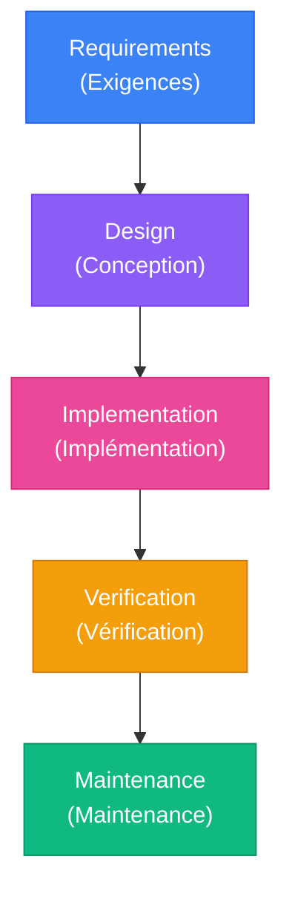
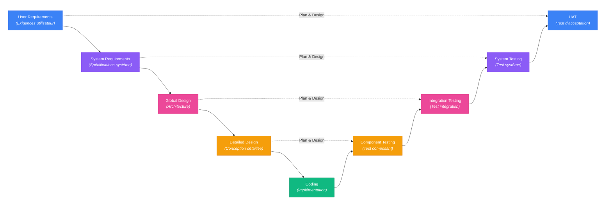
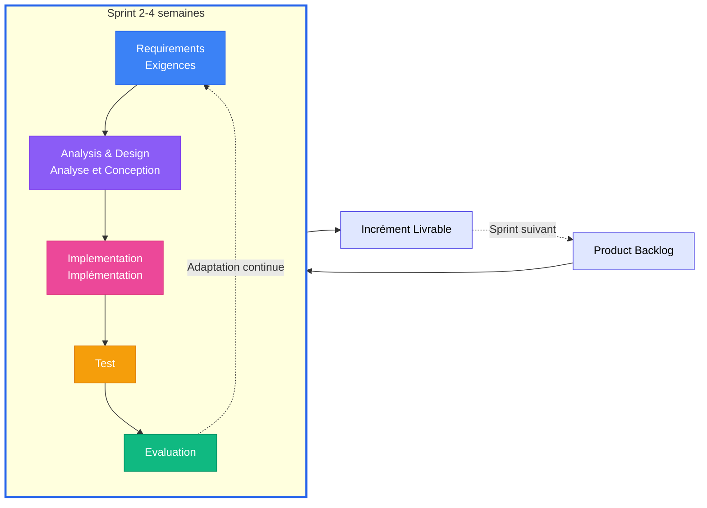

Chap1 - Mooc.md
# Chapitre 1 

## Notes - 1 Introduction et objectifs de l'Automatisation des tests (45 minutes - K2)

### Objectifs

Dans ce chapitre vous en apprendrez plus sur :
- **Les objectifs de l'Automatisation des tests**
  - Que ce soit les avantages ou les inconvénients de l'Automatisation des tests (*TAE-1.1.1 (K2)*)
- **L'Automatisation des tests dans les différents modèles de cycle de vie du développement logiciel**
  - Comment l'Automatisation des tests est appliquée dans les différents modèles de cycle de vie du développement logiciel (*TAE-1.2.1 (K2)*)
  - Comment sélectionner les outils d'Automatisation des tests appropriés pour un "système sous test" (*SUT - System Under Test*) donné (*TAE-1.2.2 (K2)*)

### Mots-clés

| **Mot** | **Définition** |
|---------------|-----------------|
| **Système sous test**   (*SUT - System Under Test*) | Système qui est testé pour un fonctionnement correct. Selon ISTQB, il s'agit de l'objet de test. |
| **Automatisation des tests**   (*TA - Test Automation*) | Utilisation de logiciels pour effectuer ou soutenir les activités de test, par exemple la gestion des tests, la conception des tests, l'exécution des tests et la vérification des résultats. |
| **Ingénieur en Automatisation des tests**   (*TAE - Test Automation Engineer*) | Professionnel spécialisé dans la conception, le développement et la maintenance de solutions d'automatisation des tests. |

### 1.1 Objectif de l'Automatisation des tests

#### **TAE-1.1.1 (K2)** : Expliquer les avantages et les inconvénients de l'Automatisation des tests

L'Automatisation des tests implique :

- Le contrôle et la mise en place de suites de test par l'utilisation d'outils logiciels,
- L'exécution automatisée de ces tests, sans intervention manuelle,
- La comparaison automatique des résultats réels aux résultats attendus.

Dans le but :

- D'accroître l'efficacité des tests (*volume accru, temps d'exécution réduit, déclenchement automatique via CI/CD, etc.*),
- De contenir les coûts de test (*coûts optimisés, réduction des ressources humaines requises*),
- D'augmenter la fiabilité des tests (*réduction des erreurs d'exécution, couverture accrue des tests*),
- De réaliser des tests qui sont non-réalisables manuellement (*test de performance, de charge, etc.*).

Et est réalisé par un **ingénieur en Automatisation des tests** (*TAE - Test Automation Engineer*), dont la responsabilité couvre :

- La conception,
- Le développement et
- La maintenance des solutions d'Automatisation des tests (*TAS - Test Automation Solution*).

Les avantages et inconvénients de l'Automatisation des tests sont les suivants :

| **AVANTAGES** | **Description** | **Exemple** |
|---------------|-----------------|-------------------|
| **Efficience accrue** | Capacité d'exécuter un volume massif de tests par build | Passage de 50 tests manuels/jour à des milliers de tests en quelques minutes |
| **Tester l'impossible** | Exécution de tests non réalisables manuellement | Tests de charge (1000 utilisateurs simultanés), de latence (temps de réponses en millisecondes), de support (exécution multi-dispositifs/-sites) |
| **Scénarios complexes** | Création et exécution de cas de test sophistiqués | Flux métier multi-systèmes avec nombreuses conditions et variations |
| **Rapidité d'exécution** | Vitesse d'exécution largement supérieure aux tests manuels | Test exécuté en quelques secondes au lieu de 5 minutes manuellement |
| **Élimination des erreurs humaines** | Exécution identique à chaque itération, sans oubli ni distraction | Saisie de milliers de combinaisons de données sans erreur de frappe |
| **Rentabilité à long terme** | Investissement initial élevé mais coût réduit dans la durée | Coûts récurrents diminués par rapport aux tests manuels répétés |
| **Cohérence et fiabilité** | Exécution standardisée sans fatigue ni variation | Même séquence de 200 étapes exécutée identiquement à chaque fois, 24h/7j |

| **INCONVÉNIENTS** | **Description** | **Exemple** |
|-------------------|-----------------|------------|
| **Investissement initial élevé** | Coûts importants de démarrage (TAE spécialisés, outils, matériel, formation) | Recrutement d'ingénieurs automation, achat de licences d'outils, formation de l'équipe existante |
| **Temps de mise en place** | Construction d'un framework robuste nécessite patience et temps | Création des fondations (architecture, bibliothèques, standards) avant l'automatisation effective |
| **Maintenance continue** | Les scripts de test nécessitent une maintenance régulière | Mise à jour des tests à chaque évolution de l'application pour maintenir leur validité |
| **Rigidité face aux changements** | Sensibilité aux modifications fréquentes de l'application | Petits changements d'UI causant l'échec de tests même si la fonctionnalité est correcte |
| **Introduction de nouveaux défauts** | Les scripts d'automatisation peuvent contenir des bugs | Faux positifs/négatifs dus à des erreurs dans le code de test, feedback erroné aux équipes |

Toutefois, l'Automatisation des tests présente également des limites :
| **LIMITES** | **Description** | **Exemple** |
|-------------|-----------------|--------------|
| **Automatisation partielle** | Tests nécessitant un jugement humain sont non-automatisables | Évaluation de l'intuitivité d'une interface utilisateur, ressenti utilisateur global |
| **Portée restreinte** | Chaque test vérifie uniquement le scénario spécifique pour lequel il est conçu | Nombreuses zones à vérifier mais test limité à un scénario précis, laissant d'autres scénarios non-vérifiés |
| **Interprétation limitée** | Vérification limitée à ce que la machine peut interpréter techniquement | Incapacité à juger si un élément "paraît correct" ou "semble agréable" à l'utilisateur |
| **Oracle de test complexe** | Difficulté à définir automatiquement les critères de succès/échec | Situations avec plusieurs réponses valides possibles, ou données changeant en temps réel (ex: disponibilité de vols) |

**En conclusion :**

L'automatisation des tests est un outil puissant, mais ce n'est pas une solution magique. La clé du succès réside dans l'**équilibre approprié entre tests automatisés et tests manuels**, adapté au contexte spécifique de chaque projet.

Une automatisation efficace agit comme un **collaborateur fiable** qui prend en charge les tâches répétitives, libérant ainsi les testeurs humains pour se concentrer sur des activités à plus forte valeur ajoutée : tests exploratoires, évaluation de l'expérience utilisateur, et analyse critique nécessitant le jugement humain.

### 1.2 L'Automatisation des tests dans le cycle de vie du développement logiciel

#### **TAE-1.2.1 (K2)** : Expliquer comment l'Automatisation des tests est appliquée dans les différents modèles de cycle de vie du développement logiciel

L'implémentation de l'automatisation varie selon le modèle de cycle de vie du développement logiciel (*SDLC - Software Development Life Cycle*) utilisé. Chaque approche présente des caractéristiques spécifiques qui influencent la stratégie d'automatisation.

##### 1.2.1.1 Modèle en Cascade (*Waterfall*)

**Principe :**

> Le développement en cascade se déroule dans un ordre séquentiel spécifique, où il faut d'abord compléter une phase avant de passer à la phase suivante (ex. construction d'une maison).

<table>
<tr>
<td width="20%">

</td>
<td>

| **Phase** | **Description** | **Analogie (maison)** |
|-----------|-----------------|----------------------|
| **Requirements (Exigences)** | Collecte et analyse des exigences | Définir les attentes : pièces, normes, budget, délais |
| **Design (Conception)** | Conception détaillée du système | Réaliser les plans architecturaux et techniques |
| **Implementation (Implémentation)** | Développement du code | Construire la maison selon les plans |
| **Verification (Vérification)** | Tests et validation du système | Inspecter la conformité aux normes et exigences |
| **Maintenance (Maintenance)** | Corrections et améliorations | Entretenir : peinture, filtres, désherbage |

</td>
</tr>
</table>

**Implémentation et exécution de l'automatisation :**

- **Implémentation** : Pendant ou après la phase d'implémentation
- **Exécution** : Uniquement pendant la phase de vérification

L'automatisation intervient **tardivement** car on ne peut tester un système qu'une fois qu'il est développé (comme une voiture qui ne peut être testée qu'une fois assemblée). Cette approche retarde la détection des défauts, les rendant plus coûteux à corriger.

**Avantages et inconvénients :**

|  | ✅ **Avantages** | ❌ **Inconvénients** |  |
|-----------------|------------------|----------------------|-----------------|
| Permet de développer des tests automatisés complets sans se soucier de changements constants | **Stabilité des exigences** | **Retours tardifs** | Les défauts détectés tardivement (phase de vérification) sont coûteux à corriger |
| Une documentation complète facilite la conception de tests détaillés et précis | **Documentation exhaustive** | **Structure rigide** | Difficulté de mettre à jour le code et les tests une fois les phases précédentes validées |

**💡 Exemple concret : Système de traitement des taxes**

Dans un projet de système de traitement des taxes utilisant le modèle Cascade, les contraintes suivantes ont été rencontrées :

**Contraintes du modèle :**

- Possibilité d'exécution des tests automatisés seulement à partir du **4ème mois** (après l'implémentation)
- Tous les tests automatisés exécutés **par gros morceaux** pendant la phase de vérification
- Documentation complète obligatoire, **chaque phase nécessitait une validation formelle** avant de passer à la suivante

**Problématique majeure :**

Tout défaut majeur découvert en phase de vérification nécessitant une réparation, impose de **revenir à la phase d'origine du défaut** (Requirements, Design ou Implementation) puis de **re-valider toutes les phases suivantes**. Plus le défaut est précoce, plus l'impact est important.

> 💭 *Ex. un vice majeur dans les fondations d'une maison construite, nécessitant de démolir tout ou en partie la maison; Pour ensuite réaliser les réparations, avant de pouvoir continuer la construction. L'impact est donc très important en temps et en coût.*

##### 1.2.1.2 Modèle en V (*V-Model*)

**Principe :**

> Le modèle en V est une approche séquentielle où chaque phase de développement (descendante) est associée à une phase de test correspondante (ascendante), formant un "V". Les tests sont **planifiés dès le début** de chaque phase de développement.

| **Développement** | **Testing** | **Description** |
|-------------------|-------------|-----------------|
| **User Requirements** (*Exigences utilisateur*) | **UAT** (*Test d'acceptation*) | Validation que le système répond aux besoins utilisateur |
| **System Requirements** (*Spécifications système*) | **System Testing** (*Test système*) | Validation des fonctionnalités complètes du système |
| **Global Design** (*Architecture*) | **Integration Testing** (*Test d'intégration*) | Validation de la combinaison des composants |
| **Detailed Design** (*Conception détaillée*) | **Component Testing** (*Test de composant*) | Validation de chaque composant individuel |
| **Coding** (*Implémentation*) | | Base du V - Développement du code |

**Implémentation et exécution :**

**Implémentation (côté descendant) :**
- À **chaque phase de développement** correspond une phase de test avec son propre TAF
- Planification et conception des tests réalisées en parallèle du développement
- Ex : Phase "User Requirements" → Planification et conception du TAF pour les tests d'acceptation

**Exécution (côté ascendant) :**
- Exécution successive de **tous les niveaux de test** avec leurs frameworks respectifs
- Progression : Tests de composant → Tests d'intégration → Tests système → Tests d'acceptation

**💡 Exemple concret : Appareil médical - TAF multi-niveaux**

Dans un projet d'appareil médical développé en modèle en V, **quatre frameworks d'automatisation distincts** ont été mis en place :

| **Niveau de test** | **Framework TAF** | **Objectif** |
|-------------------|-------------------|--------------|
| Composant | Tests unitaires automatisés | Valider chaque composant individuel |
| Intégration | Tests d'intégration automatisés | Valider la combinaison des composants |
| Système | Tests système automatisés | Valider l'ensemble de l'appareil |
| Acceptation | Tests semi-automatisés | Assurer la conformité réglementaire |

> 💭 *Chaque TAF est spécialisé pour son niveau : les outils de test unitaire diffèrent des outils de test système, adaptés à leur complexité respective.*

**Avantages et inconvénients :**

|  | ✅ **Avantages** | ❌ **Inconvénients** |  |
|-----------------|------------------|----------------------|-----------------|
| Aligner les tests aux phases de développement détecte les problèmes plus tôt | **Détection précoce des défauts** | **Effort de planification accrue** | Coordonner développement et tests demande plus de planification en amont |
| Cartographie claire entre développement et phases de test aide à organiser l'effort de test | **Approche structurée** | **Redondance potentielle** | Les tests automatisés peuvent se chevaucher entre niveaux, créant de la duplication |

##### 1.2.1.3 Modèle Agile (*Agile/Scrum*)

**Principe :**

> Le modèle Agile privilégie l'**adaptation et l'improvisation tout en cherchant à maintenir la qualité**. Le développement se fait par cycles courts appelés "sprints" (2-4 semaines), produisant un incrément fonctionnel potentiellement livrable.

**Implémentation et exécution :**

**Implémentation :**

- **Automatisation interne au sprint** : Tests développés dans le même sprint que les fonctionnalités
- **Collaboration cross-fonctionnelle** : Tout le monde collabore ensemble (développeurs, testeurs, analystes, etc.), ce qui élimine les silos
- **Pratiques collaboratives** : Revues de code et programmation en binôme

**Exécution :**

- **Test automatisé continu** : Tests exécutés automatiquement en continu
- **Feedback immédiat** : Détection rapide des régressions
- **Livraisons fréquentes** : Déploiements multiples par jour possibles

**💡 Exemple concret : Projet e-commerce**

- Les développeurs écrivent les tests unitaires en même temps que le code
- Les ingénieurs automatisation de test (TAE - Test Automation Engineer) créent les tests UI pour les nouvelles fonctionnalités
- Les tests sont exécutés automatiquement pendant la nuit
- Chaque matin, l'équipe vérifie les résultats et corrige les échecs détectés
- **Résultat** : Capacité à déployer en production plusieurs fois par jour

**Avantages et inconvénients:**

| | ✅ **Avantages** | ❌ **Inconvénients** | |
|-----------------|------------------|----------------------|-----------------|
| Tests automatisés identifient rapidement les problèmes permettant des corrections immédiates | **Feedback immédiat** | **Maintenance élevée** | Changements fréquents du code cassent régulièrement les tests |
| Framework peut s'adapter aux exigences changeantes et mises à jour fréquentes | **Flexibilité** | **Ressources intensives** | Nécessite testeurs avec solides compétences en programmation et temps suffisant alloué |
| Élimination des silos fait de la qualité un effort d'équipe partagé | **Collaboration** | | |

##### Conclusion

- **Pas d'approche universelle** : Chaque modèle de développement nécessite une stratégie d'automatisation adaptée
- **Compréhension du modèle essentielle** : Identifier les contraintes et opportunités (séquentiel vs itératif, rigidité vs flexibilité)
- **Timing et stratégie déterminants** : Le moment et l'approche d'automatisation impactent directement le succès
- **Implémentation réfléchie** : L'automatisation doit être mise en œuvre de manière réfléchie, pas systématique

##### Tableau comparatif récapitulatif

| **Modèle** | **Implémentation** | **Exécution** | **Caractéristiques** |
|------------|-------------------|--------------|---------------------|
| **en Cascade** | Pendant/après implémentation | Phase de vérification uniquement | Documentation exhaustive, feedback tardif, changements coûteux |
| **en V** | Planifiée dès la conception | À chaque niveau de test | TAF multi-niveaux, couverture structurée, maintenance complexe |
| **Agile** | Intégrée dans chaque sprint | Continue (CI/CD) | Feedback rapide, shift-left, collaboration étroite, pression temporelle |

#### **TAE-1.2.2 (K2)** : Sélectionner les outils d'Automatisation des tests appropriés pour un système sous test donné

**Principe** : La sélection d'un outil adapté est cruciale pour le succès à long terme et la pérennité d'un projet. Une erreur de choix coûte cher : temps perdu, maintenance difficile, équipe démotivée. Il est impératif de comprendre le contexte global (ce qu'on teste, les contraintes projet, les compétences équipe) avant d'évaluer les outils, puis de valider par un pilote concret. Dans certains cas, un ensemble d'outils spécialisés est préférable à un outil généraliste.

**Exemple** : Acheter un outil UI sophistiqué alors que 80% des tests portent sur des API.

---

**Démarche de sélection** : `Où suis-je ? → Quelles solutions existent ? → Que choisir ?`

---

### Étape 1 : Où suis-je ? (Analyse du contexte)

**Questions clés à se poser :**

#### 1.1 L'existant : Qu'est-ce qui existe ? (SUT)

| **Question** | **Explication** | **Exemples** |
|--------------|-----------------|--------------|
| Nature du système ? | Identifier la catégorie d'outil nécessaire | Web app, API REST, Application desktop, Services web |
| Plateformes ? | Identifier les plateformes à couvrir | Web, iOS, Android, Windows, Linux, macOS |
| Technologies utilisées ? | Clarifier les compatibilités nécessaires | Java, React, Python, .NET, Angular, Node.js |
| Architecture ? | Déterminer l'approche et la stratégie d'outillage | Monolithe, Microservices, Architecture hybride |

#### 1.2 Les attentes : Qu'est-ce qu'on veut faire ? (Projet)

| **Question** | **Explication** | **Exemples** |
|--------------|-----------------|--------------|
| Types de tests visés ? | Identifier les types d'outils nécessaires | UI, API, Performance, Sécurité, Intégration |
| Couverture attendue ? | Estimer l'effort et la complexité | 50% des tests, Smoke tests uniquement, Régression complète |
| Quel délai ? | Évaluer le temps d'apprentissage acceptable | 3 mois, 1 an, Time-to-market agressif |
| Quel budget ? | Orienter vers commercial ou open source | 0€ (open source), 10K€, 100K€+ |
| Contraintes réglementaires ? | Identifier exigences certification et traçabilité | HIPAA (santé), RGPD (données), ISO 26262 (automobile) |

**💡 Exemple : Projet santé**

- Exigences: supporter du web et du mobile, de vérifier des calculs complexes, d'assurer la conformité HIPAA (Healthcare Insureance Portability and Accountatability Act) et intégrer avec plusieurs systèmes tiers. 
- Utilisation de plusieurs outils : Selenium pour les tests UI web, Appium pour les tests mobile, Postman pour les tests API et plusieurs scripts personnalisés pour la vérification des calculs.

#### 1.3 Les aptitudes : Qu'est-ce qu'on est capable de faire ? (Équipe)

| **Question** | **Explication** | **Exemples** |
|--------------|-----------------|--------------|
| Niveau technique ? | Orienter vers des outils adaptés aux aptitudes de l'équipe | Débutant (GUI requis), Intermédiaire, Expert (scripts complexes) |
| Langages maîtrisés ? | Limiter le temps de formation et maximiser les personnes implicables | Java, Python, JavaScript, C#, Aucun (testeurs manuels) |

**1. Gestion du niveau technique**

Pour une équipe présentant :

- **Un faible niveau technique** : Privilégier des solutions low-code/no-code avec interface graphique, fonctionnalités de record-and-playback et peu de code à écrire.
- **Un haut niveau technique** : Choisir des outils alignés avec le langage de l'application, offrant une bonne documentation API et une extensibilité du framework.

**2. Alignement des langages**

Aligner le langage de l'outil et du SUT présente les avantages suivants : les développeurs peuvent aider au débogage des tests d'automatisation, économisant du temps de résolution et améliorant la collaboration dev/test.

Exemples :
- Application Java → JUnit/TestNG
- Application JavaScript → Cypress/Playwright
- Application Python → pytest/Robot Framework

**💡 Exemple : Startup**

Une startup a sélectionné TestCafé pour sa courbe d'apprentissage facile, ses fonctionnalités de record-and-playback, la possibilité d'écrire du code personnalisé quand nécessaire et sa documentation claire. Bien que Cypress et Playwright soient d'excellents outils, ils sont mieux adaptés pour des équipes techniques. TestCafé représentait la meilleure approche pour le contexte de cette équipe.

---

### Étape 2 : Quelles solutions existent ? (Évaluation des outils)

#### 2.1 Types de solutions disponibles

| **Type** | **Description** | **Avantage** | **Inconvénient** |
|----------|-----------------|--------------|------------------|
| Commercial (COTS) | Logiciel acheté "sur étagère" | Clé en main, support inclus | Coût initial élevé |
| Open Source | Logiciel gratuit, communauté | Pas de licence à payer | Intégration et maintenance à gérer |
| Personnalisé | Développé en interne | Sur mesure pour besoins spécifiques | Long à développer, expertise requise |

#### 2.2 Processus d'évaluation

**Méthode de comparaison :**

1. **Créer une matrice de comparaison** : 
    - Lister les critères dans les lignes 
    - les outils candidats en colonnes, 
    - puis noter comment chaque outil répond à chaque critère.

    **Exemple:**

    | **Critère** | **Selenium** | **Cypress** | **Playwright** |
    |-------------|--------------|-------------|----------------|
    | Tests UI web | Bon (large compatibilité) | Très bon (moderne uniquement) | Excellent (moderne + stable) |
    | Tests API | Faible (pas sa spécialité) | Moyen (via interception) | Moyen (via contexte) |
    | Apprentissage | Difficile (setup complexe) | Facile (minimal config) | Moyen (setup simple) |
    | Support navigateurs | Excellent (tous + legacy) | Limité (Chrome/Edge/Firefox) | Très bon (Chromium/Firefox/WebKit) |
    | Langages supportés | Excellent (multi-langages) | Limité (JavaScript uniquement) | Bon (JS/TS principalement) |

2. **Lancer un projet pilote**

    Les promesses annoncées ne correspondent pas toujours à la mise en application. Il est donc essentiel de réaliser des projets pilotes afin de valider les outils en conditions réelles. Pour ce faire :
    - Testez les 2-3 outils finalistes sur un petit projet représentatif
    - Recueillez les retours de l'équipe
    - Vérifiez les besoins de maintenance

#### 2.3 Conseils

**Pour les outils Open Source :**

- Vérifier l'activité de la communauté
- Consulter la date de dernière release
- Examiner les issues ouvertes
- Évaluer la qualité de la documentation

**Pour les outils commerciaux :**

- Demander des périodes d'essai étendues
- Obtenir des devis de formation
- Vérifier les temps de réponse du support
- Clarifier les modèles de licence

---

### Étape 3 : Que choisir ? (Décision)

#### Pièges à éviter

**1. Le piège du couteau suisse**

Des outils prétendent tout faire (UI, API, performance, mobile) mais le font moins efficacement que des outils spécialisés. Privilégier plusieurs outils spécialisés qui excellent dans leur domaine.

**2. Suivre la foule**

Choisir un outil parce que tout le monde l'utilise, sans évaluer vos besoins réels. Exemple : Des équipes non-techniques ont adopté Selenium (outil populaire) et ont lutté pendant 4 mois pour créer 20 tests avant d'abandonner. Un outil plus simple aurait mieux convenu.

**3. L'aveuglement budgétaire**

Sélectionner l'option la moins chère sans considérer les coûts totaux. L'option "gratuite" peut devenir la plus coûteuse à long terme en raison de la maintenance et des limitations. Calculer le coût total de possession (TCO) : licences + formation + maintenance.

---

### Conclusion

La sélection d'outils appropriés est cruciale pour le succès à long terme. Mieux vaut investir du temps maintenant dans l'analyse et la validation que de regretter un mauvais choix plus tard.