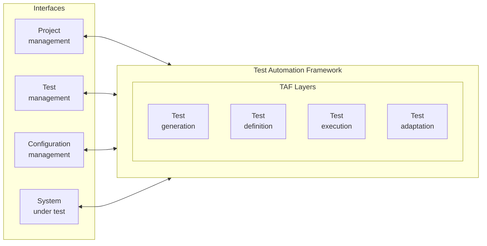
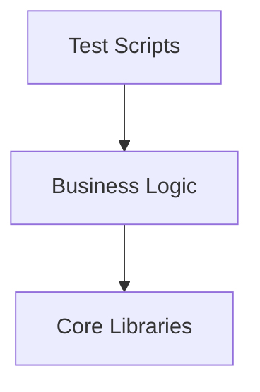
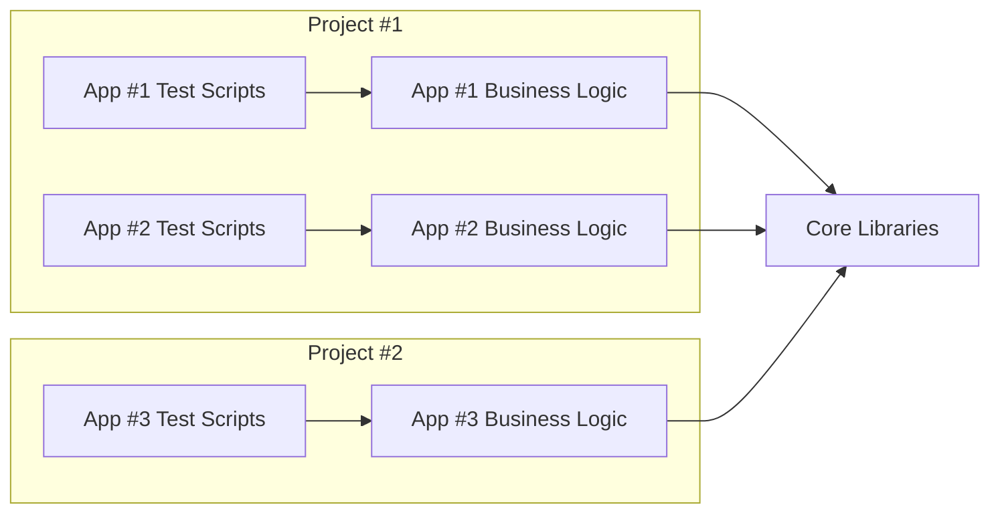

# Notes

## Test Automation Architecture - Introduction

This chapter explores architecture concepts of Test Automation Implementation, such as:

- gTAA (Generic Test Automation Architecture)
*and major capabilities. Provide a high-level framework on how test automation communicates with other systems*
- TAS (Test Automation Solution) Design
*Based on functional, non-functional and technical requirements*
- TAF (Test Automation Framework) Layering
*To organize code into layers, each with a specific responsibility (test scripts, business logic, libraries)*
- Approaches to Automate Test Cases
*From capture/replay, Linear Scripting to Structured Scripting, DDT (Data-Driven Testing) and BDD (Behavior-Driven Development).*
- Design principles and patterns
*to professionalize code writing*

## TAE-3.1.1 (K2) : Explain the Major Capabilities in a Test Automation Architecture

### gTAA (Generic Test Automation Architecture)

gTAA (Generic Test Automation Architecture) is a high-level design concept that gives an abstract view of how test automation communicates with other systems. (It shows the big picture of how everything is connected together)

Ex. Designing a TAA (Test Automation Architecture) for a banking application. It helps to understand how automation interacts with the banking application, but also the test management system, CI/CD pipeline and our configuration management system. It helps to visualize those connections and plan accordingly.

**Figure 1: gTAA diagram**



gTAA represents multiple interfaces interacting with the test automation framework.

### The interfaces of gTAA

- SUT interface: It connects the framework to the system being tested (ex. web elements, APIs). Ex. for a banking application, this interface defines how automation interacts with web elements of a web application (frontend), and API calls (backend).
- Project management interface: Tracks automation progress (ex. Jira integration)
- Test management interface: Maps manual test cases to automated tests. It helps to maintain relationships between initial manual test cases after automation is implemented.
- Configuration management interface: Manages CI/CD pipelines, environments, and versioning. It helps to manage versioning and deployment for automation code. Ex. project where the test management interface is not properly defined. Tracing automated tests with manual test cases becomes difficult, wasting weeks to reconcile the information.

### Layers of the TAF (Test Automation Framework)

Capabilities provided by test automation tools and libraries:

- Test generation capability: Automatically designs test cases from models (e.g., model-based testing — approach modeling the system behavior to generate automatically test cases from the model with a tool. Like asking a computer to find all the paths for a given map. Ex. telecommunication project where hundreds of test cases were generated from a state model of how calls should be routed for a complex call routing system, saving weeks of work and covering all possible scenarios. Test generation is optional because not all projects require this level of sophistication)
- Test definition capability: Supports definition and implementation of test cases and/or test suites (ex. separation of test definition and SUT/tools). This capability separates the definition from the SUT and/or test tools (define what we want to test). It separates high-level tests (ex. login, logout) from low-level tests (ex. enter username, password, etc.). It creates the blueprint for automation (it's like a recipe to follow to create the automated test). Ex. healthcare project, comprehensive test definition layers allowing BA (Business Analyst) to define tests in Excel using a keyword-driven approach, which the Test Automation Framework translates into executable code. This separation allows non-technical team members to contribute to the test definition process.
- Test execution capability: It provides execution tools to support running tests and recording results, such as scheduling running tests at a specific time, running parallel tests to save time, handling test dependencies to execute specific tests first, managing test data, reporting test results in a meaningful way, etc. Ex. e-commerce project, where the execution capability of the tool allows running 500+ tests nightly, in 2 hrs, by executing in parallel multiple tests across multiple browsers and environments.
- Test adaptation capability: Adapts tests to different components/interfaces of the SUT (ex. adapters for different APIs, protocols, services). Ex. SUT with both a web interface and a mobile app, the test adaptation layer will provide components to interact with both interfaces, using different tools or libraries for each. It is the difference between a brittle solution breaking at every UI change and a robust solution withstanding frequent changes to the SUT. Ex. Healthcare project, test adaptation layer abstracting the means of interacting with the system, allowing to only update the adaptation layer after a complete UI redesign, while test definition remained unchanged.

Ex. Building a TAS (Test Automation Solution) for an online banking application:

- Test Generation: use of a model-based testing tool to generate test cases for complex workflows (ex. funds transfers between accounts).
- Test Definition: Define test cases in a structured way using keyword-driven or data-driven approach, specifying what needs to be tested.
- Test Execution: Setting up framework to execute tests automatically, as part of the nightly build process and generate reports.
- Test Adaptation: Adapters creation allowing tests to interact with web interface, mobile app and APIs of the banking application.

Implementing these capabilities creates a comprehensive TAS, able to test all aspects of the banking application.

### Conclusion

1. gTAA provides an abstract view of communication between automation and connected systems.
2. Four key interfaces:
    - SUT interface
    - Project management interface
    - Test management interface
    - Configuration management interface
3. Core capabilities:
    - Test generation
    - Test definition
    - Test execution
    - Test adaptation

Understanding these capabilities is crucial for designing effective TAS, able to scale with the project, and adapt to changes in the SUT.

## TAE-3.1.2 (K2) : Explain How to Design a Test Automation Solution

### What is a TAS (Test Automation Solution)?

Is the complete package / everything you need for automating testing activities (beyond just tools/scripts) and defined by 3 types of requirements:

1. Functional requirements of SUT
2. Non-functional requirements of SUT
3. Technical requirements

Ex. healthcare application,

- functional requirements are like "users must be able to schedule appointment" and "doctors must be able to view patient records"
- non-functional requirements are like "security: must be compliant with HIPAA" and "performance: must handle 10 000 concurrent users"
- technical requirements are like "compatibility: support specific browsers and operating systems"

### Implementing a TAS

- Tool Options:
  - Commercial tools (paid)
  - Open-source tools (free)
  - Combination of both (most common - no single tool can cover all testing activities needs)

Ex. healthcare project, used 2 tools: Tricentis Tosca (UI testing - strong support for healthcare industry regulations), JMeter (performance testing - good at simulating heavy user loads)

Note: Always need to develop some custom components or adapters specific to your SUT. (Every application has its unique characteristics. Off-the-shelf tools won't perfectly address all your needs)

### Role of TAA (Test Automation Architecture)

Defines the technical design for the automation solution (like blueprint/master plan for automation efforts).

TAA must address the following key aspects:

- Selecting tools/libraries
- Developing plugins/components
- Identifying connectivity/interfaces requirements
- Connecting to test/defect management tools
- Utilizing version control

#### Selecting tools/libraries

Most critical decision.

Ex. A project, tool selected based on team familiarity, tool was not adapted for API testing representing a major part of the testing effort. Ended up by switching to another tool mid-project, costing a lot of time and effort.

When selecting, consider:

- Application type (web, mobile, API, etc.)
- Testing needs (UI, API, performance, security, etc.)
- Team skills
- Budget
- Integration capabilities

Ex. For testing React frontend and REST API, you may select:

- Selenium and RestAssured, if the team is familiar with Java
- Cypress and Postman, if the team is familiar with JavaScript

#### Developing plugins/components

Project may require to develop custom plugins/components to extend the tool functionality and capabilities to cover specific SUT needs. Pretty common, no off-the-shelf solution can cover all specific needs of SUT.

Ex. E-commerce project, application had unique checkout process, selected testing tool unable to properly interact with those processes, was forced to develop a custom component understanding the specific DOM structure of the checkout page to reliably interact with.

### Identifying connectivity/interfaces requirements

Often overlooked until it's too late. Have to identify all connectivity and interfaces requirements from the get-go for TAS.

Includes:

- Firewall configurations (does testing require access to systems across firewall?)
- Database connections (does automation need to verify data in database?)
- URL/endpoints (what endpoints does automation need to access?)
- Mocks/stubs (Do you need to simulate unavailable components?)
- Message queues (is system using asynchronous messaging?)
- Protocols (What communication protocols does SUT use?)

Ex. setting up TAF (Test Automation Framework), some of the connections were blocked by firewall, had to redesign part of the TAS to comply with customer security constraints.

### Connecting to test/defect management tools

TAS doesn't exist in isolation, have to connect to test management (TestRail) and defect management (Jira) tools.

Ex. On test failures, auto-create Jira tickets with screenshots/logs AND/OR update test cases status in TestRail. (save time and increase testing reliability)

### Utilizing version control

Have to consider how to manage automation code (like development), which implies selecting:

- version control system (Git, SVN, etc.)
- organized repository structure
- Establishing branching strategy (feature, release, hotfix)
- defining processes for code reviews, merges, and releases

Ex. Project where repository structure was badly planned, ended up with unwieldy monolithic repository, problem increased as the project grew, had to refactor into multiple repositories organized by test level, unit, API and UI.

### Real world example

E-commerce website automation:

- Requirements:
  - Functional: Browse products, checkout
  - Non-functional: Holiday traffic, <2sec load time
  - Technical: Chrome/Firefox/Safari, Mobile
- Tools:
  - Selenium WebDriver (UI testing)
  - JMeter (performance testing)
  - RestAssured (API testing)
  - BrowserStack (cross-browser testing)
- Custom components:
  - Shopping cart wrapper
  - Custom reporting (aggregate results from different test types)
- Connectivity requirements:
  - DB access (verify order placement)
  - Mock payment gateway (checkout testing)
  - API endpoint (product catalog testing)
- Tool integration:
  - Jira (tickets manager to manage defects)
  - TestRail (test manager to manage test cases)
- Version control:
  - Git (repository organized by test type)
  - Jenkins (CI/CD pipeline for continuous integration)
  - Docker (create controlled environments)

### Common pitfalls to avoid

1. Tool-first approach - selection based on tool usage rather than testing needs
2. Ignoring maintainability - Bad TAS architecture planning making it unmaintainable and hard to scale
3. Insufficient abstraction - Granular tests creation, limiting test reuse and maintainability. Break with every UI change.
4. Neglecting reporting - minimal investment limiting reporting capabilities and increasing difficulty to interpret test results.
5. Siloed approach - TAS development not integrated with development process / SDLC.

### Conclusion

TAS design is more than selecting tools and writing scripts. It requires:

* Understanding SUT requirements
* Right mix of tools + custom components
* Comprehensive connectivity planning
* Integration with testing/dev ecosystem
* Proper code management

Test Automation is a journey, not a destination (evolve with the application, emergence of new techniques, etc.)

## TAE-3.1.3 (K3) : Apply Layering of Test Automation Frameworks

### What is a TAF (Test Automation Framework)?

TAF (Test Automation Framework) is the frame of a TAS (Test Automation Solution). It's like a house's blueprint determining the placement and the function of each room. It includes:

- Test harness/runner - is the component executing the tests (like the conductor of an orchestra telling when to start and coordinating everything)
- Test libraries - are the collection of reusable code, that help to perform common actions of the tests (ex. fill a field, click a button, etc.). You may have several libraries to handle different types of actions, like interacting with a database, or for handling complex UI components.
- Test scripts - are the automated tests (step-by-step instructions verifying the application works as expected)
- Test suites - are the collection of test scripts, that are run together.

Layering avoids monolithic test scripts (ex. 2000-line script), promoting maintainability and reusability of test code.

### The Three Main Layers

#### TAF layers



Layers are distinct borders for code with similar purposes (like organizing a kitchen where plates, glasses and utensils are stored separately). The goal is to organize test automation code by similar functions to improve maintainability and reusability of code. The industry standard is to use 3 main layers (Keep it simple), which are:

- Test scripts layer - Sits at the top of the framework. Focus on WHAT to test. Its purpose is to provide a repository of SUT test cases and organize them into test suites. It contains test scripts verifying specific functionality of the application. (Ex. testing e-commerce site, test script for login functionality, product search, adding items to cart, checkout process, etc.). Must call the services of the business logic layer to perform the tests, never the core libraries layer.

```python
def test_valid_login():
  # This calls methods from business logic layer
  login_page.enter_username("test@example.com")
  login_page.enter_password("password")
  login_page.click_login_button()

  # Verify the result
  assert dashboard_page.is_displayed(), "Dashboard should be displayed after login"
```

- Business logic layer - Sits at the middle of the framework. Focus on HOW to test for the specific SUT. Contains all the libraries specific to the application, which inherit or use the core libraries, and are customized to the SUT. Layer also used to set up the TAF (Test Automation Framework) under specific SUT and handle specific configurations.

```python
class LoginPage(BasePage): # Inherits from a class in Core Libraries.
  def enter_username(self, username):
    self.find_element(By.ID, "username_field").send_keys(username)

  def enter_password(self, password):
    self.find_element(By.ID, "password_field").send_keys(password)

  def click_login_button(self):
    self.find_element(By.ID, "login_button").click()
```

- Core libraries layer - Sits at the base of the framework. Contains all the libraries independent/non-specific to any SUT. Are the generic reusable components usable in any project with the same technology stack (SUT-agnostic tools. Ex. WebDriver, API clients.). May have several specific libraries for specific uses and needs (interacting with web browser, making API calls, working with database, or logging test results, etc.).

```python
class BasePage:
  def __init__(self, driver):
    self.driver = driver

  def find_element(self, by, value):
    return self.driver.find_element(by, value)

  def wait_for_element(self, by, value, timeout=10):
    # implement wait logic
    pass
```

### How these layers interact

- Test scripts layer defines WHAT to test (login process)
- Business logic layer defines HOW to test (enter username, password, click login button)
- Core libraries layer provide the tools to perform the actions (find element, enter text, click button, etc.)

This approach separates responsibilities, makes code more maintainable and flexible.
Ex. ID username change, only business logic must be updated. Test scripts and core libraries remain unchanged.

### Scaling test automation



Core libraries enable reuse across projects (ex. new project, instead of starting from scratch, they leverage the same core libraries).

Ex. Financial services company, centralize a test engineer team for all the organization maintaining a core library, each product team builds specific business logic and test scripts on top of these core libraries. Allow to get up and running test automation much faster for new projects.

### Real World Example: E-commerce testing

Building TAF for e-commerce website:

1) Scripting layer with test cases such as:

  - Test_search_functionality,
  - Test_add_to_cart,
  - Test_checkout_process,
  - Test_account_creation.

2) Business logic layer have classes specific to SUT:

- HomePage with methods such as:
  - search_for_product,
  - navigate_to_category,
  - etc.
- ProductPage with methods such as:
  - add_to_cart,
  - select_size,
  - etc.
- CartPage with methods such as:
  - Proceed_to_checkout,
  - Update_quantity,
  - etc.
- CheckoutPage with methods such as:
  - enter_shipping_info,
  - enter_payment_info,
  - etc.

3) Core libraries layer includes:

  - A WebDriver wrapper handling browser initialization, navigation, finding elements, etc.
  - A REST client for API testing.
  - A database connector for verifying data.
  - A Logging utility
  - A reporting utility

### Benefits of layering

- Maintainability: updates usually limited to one layer
- Reusability: Core libraries shared across projects
- Scalability: Easy to add new test scripts
- Readability: Test scripts focus on business logic
- Division of labor: Technical vs domain experts work on different layers.

### Challenges and best practices

#### Challenges

- Initial investment: higher upfront cost in time and money, but higher maintainability and scalability in the long term.
- Learning curve: higher complexity as team members have to understand layering concepts, and follow the patterns.
- Over-engineering: risk of creating too many layers or abstractions.

#### Best practices

- Start simple: Start small with the 3 layers discussed, and add more layers as needed.
- Document well: Assure team understand the purpose of each layer, and how they interact with each other.
- Use design patterns: such as Page Object Model, work well with layered approach.
- Code reviews: Ensure layering principles are followed correctly.

### Conclusion

1. Layering creates maintainable, reusable, and scalable automation.
2. 3 layers: Test scripts (what), Business logic (how), Core libraries (tools).
3. Saves long-term time despite upfront investment.

## TAE-3.1.4 (K3) : Apply Different Approaches to Automate Test Cases

Several approaches exist to automate test cases, beyond simple scripting. They represent a trade-off between simplicity to get started and long-term maintainability, and form an evolution from basic to more advanced techniques.

### Capture/Playback

Records manual actions performed on the SUT and replays them automatically (ex. Selenium IDE, Katalon Recorder). It comes in two flavors:

- No-code tools: record and replay actions without showing the generated script.
- Low-code tools: show the generated script, which can be modified if needed.

Ex. Client needing about 50 test cases automated quickly before a major release. A capture/playback tool recorded all the test cases in a couple of days, allowing the team to get up and running very fast. However, on the following release, UI changes broke almost all the recorded tests, requiring most of them to be re-recorded.

**Pros:**

- Incredibly easy to get started, just click "record" and test normally.
- No programming knowledge required.
- Automated tests created very quickly.

**Cons:**

- Tests are usually very fragile, breaking whenever the application changes.
- Hard to scale as the application grows.
- Difficult to understand why a test fails.
- Requires the application to be available and working when tests are created.

Good way to dip a toe into automation, or for very stable applications with few changes, but usually not a good long-term strategy.

### Linear Scripting

Step-by-step scripts written without any custom libraries or functions, like writing a story without chapters. Unlike capture/playback, the code is written manually, though it often starts as a modified capture/playback script.

```python
# Open the browser
driver = webdriver.Chrome()

# Go to the website
driver.get("https://www.example.com")

# Find the username field and type a username
username_field = driver.find_element_by_id("username")
username_field.send_keys("testuser")

# Find the password field and type a password
password_field = driver.find_element_by_id("password")
password_field.send_keys("password123")

# Click on the login button
login_button = driver.find_element_by_id("login_button")
login_button.click()

# Check if login was successful
assert "Welcome" in driver.page_source
```

Ex. Project inherited with about 200 linear scripts. When the login page was redesigned, the login sequence had to be manually updated in almost every single script, costing days of tedious work that a more structured approach would have avoided.

**Pros:**

- Relatively easy to get started.
- Scripts are straightforward to understand, following the test step by step.
- More control than capture/playback since the code is written by hand.

**Cons:**

- Lots of duplication (ex. every test needing a login copies the same code).
- Maintenance becomes a huge issue as the test suite grows.
- Application changes may require updates in multiple places.
- Requires some programming knowledge, though not advanced skills.

### Structured Scripting

Professional approach introducing reusable elements: test libraries, test steps and user journeys shared across multiple scripts. It requires more programming knowledge but produces much more maintainable code. Instead of writing the login sequence in every test, a reusable `login()` function is created and called by any test.

```python
def login(driver, username, password):
    username_field = driver.find_element_by_id("username")
    username_field.send_keys(username)

    password_field = driver.find_element_by_id("password")
    password_field.send_keys(password)

    login_button = driver.find_element_by_id("login_button")
    login_button.click()

# Now the test becomes:
driver = webdriver.Chrome()
driver.get("https://www.example.com")
login(driver, "testuser", "password123")
assert "Welcome" in driver.page_source
```

Ex. E-commerce project with dozens of tests needing to add products to the cart. Creating a reusable `add_to_cart` function saved countless hours of maintenance when the cart functionality was later updated. This is typically the minimum level of organization recommended for any serious test automation project.

**Pros:**

- Much better maintainability, changes only require an update in one place.
- Reusability across tests reduces duplication.
- Easier to understand and troubleshoot.
- More scalable as the test suite grows.

**Cons:**

- Requires solid programming knowledge.
- Initial time investment to set up the structure and libraries.
- More complex architecture for new team members to understand.

### TDD (Test-Driven Development)

Development approach (rather than strictly a test automation approach) that results in automated tests: tests are written before the code they test. Follows the **red, green, refactor** cycle:

- **Red**: Write a failing test for the functionality to develop.
- **Green**: Write the minimum code necessary to make the test pass.
- **Refactor**: Clean up the code while ensuring the test still passes.

```python
# Red phase - fails because validate_email doesn't exist yet
def test_email_validation():
    assert validate_email("test@example.com") == True
    assert validate_email("not-an-email") == False
    assert validate_email("") == False

# Green phase - simplest implementation making the test pass
def validate_email(email):
    if not email:
        return False
    return "@" in email and "." in email.split("@")[1]

# Refactor phase - more robust implementation
import re

def validate_email(email):
    if not email:
        return False
    pattern = r'^[a-zA-Z0-9._%+-]+@[a-zA-Z0-9.-]+\.[a-zA-Z]{2,}$'
    return bool(re.match(pattern, email))
```

Ex. Project developing a critical medication dosage calculator. Tests were written for all edge cases (pediatric doses, elderly patients, renal impairment adjustments) before any calculation logic, resulting in code far more robust because every scenario had already been considered.

**Pros:**

- Improves code quality and structure (writing tests first naturally leads to modular, testable code).
- Enhances testability from the start.
- Achieves better code coverage.
- Reduces defects propagating to higher test levels.
- Improves communication by forcing clarity about what the code should do.

**Cons:**

- Learning curve, the workflow feels backward at first.
- Can feel slower initially, though it often saves time later by reducing bugs.
- Risk of false confidence if tests don't cover important scenarios.

### DDT (Data-Driven Testing)

Separates test logic from test data, so the same test template runs with different data sets (like one exam template reused with different student names). Data typically comes from external sources: CSV files, spreadsheets, databases or XML files.

```python
import pytest

test_data = [
    ("testuser", "password123", "success"),
    ("testuser", "wrongpassword", "failure"),
    ("invaliduser", "password123", "failure"),
]

@pytest.mark.parametrize("username,password,expected_result", test_data)
def test_login(username, password, expected_result, setup_browser):
    driver = setup_browser
    driver.get("https://www.example.com/login")
    driver.find_element_by_id("username").send_keys(username)
    driver.find_element_by_id("password").send_keys(password)
    driver.find_element_by_id("login_button").click()

    if expected_result == "success":
        assert "Welcome" in driver.page_source
    else:
        assert "Error" in driver.page_source
```

In real scenarios, data is usually loaded from an external file rather than hard-coded:

```python
import csv

def load_test_data():
    data = []
    with open('login_test_data.csv', 'r') as f:
        reader = csv.reader(f)
        next(reader)  # Skip header row
        for row in reader:
            data.append(tuple(row))
    return data

@pytest.mark.parametrize("username,password,expected_result", load_test_data())
def test_login(username, password, expected_result, setup_browser):
    # Same test code as before
    ...
```

Ex. Mortgage calculator project needing to verify hundreds of loan scenarios (amounts, interest rates, terms, down payments). One test script fed by an Excel file replaced hundreds of separate tests; when the calculation formula changed due to a regulatory update, only that one script had to be updated, and new scenarios could be added by adding rows to the spreadsheet without touching the code.

**Pros:**

- Reduces code duplication, the test logic is written once and reused with different data.
- Makes test maintenance easier.
- Enables non-programmers to contribute by adding data to a spreadsheet.
- Improves test coverage without writing more code.
- Separates test logic and test data, following good software design principles.

**Cons:**

- Data management can become a project in itself.
- Setup complexity to build the data-driven framework.
- Debugging can be harder, since a failure needs to be traced back to the data set that caused it.

Tip: always include a descriptive test name or ID in each row of test data, to quickly identify which scenario failed.

### KDT (Keyword-Driven Testing)

Takes the separation of test logic and test data even further by defining high-level keywords representing actions or verifications (ex. `login`, `SearchProduct`, `AddToCart`), which tests then assemble as a sequence, like building with Lego blocks instead of sculpting from clay. Robot Framework is a popular open-source framework for this approach.

```robotframework
*** Settings ***
Library             SeleniumLibrary

*** Variables ***
${URL}             https://www.example.com
${BROWSER}         chrome

*** Test Cases ***
Valid Login Test
    Open Browser To Login Page
    Input Username    testuser
    Input Password    password123
    Submit Credentials
    Welcome Page Should Be Open
    [Teardown]  Close Browser

*** Keywords ***
Open Browser To Login Page
    Open Browser        ${URL}  ${BROWSER}
    Page Should Contain Element     id:login-form

Input Username
    [Arguments]     ${username}
    Input Text      id:username     ${username}

Input Password
    [Arguments]     ${password}
    Input Text      id:password     ${password}

Submit Credentials
    Click Button    id:login-button

Welcome Page Should Be Open
    Page Should Contain     Welcome to your account
```

The Settings section sets up needed libraries, Variables defines common values, Test Cases contains sequences of keywords, and Keywords defines the custom keywords used by the tests. Behind the scenes, a keyword is implemented either as a custom keyword or as a built-in keyword from a library (ex. `Open Browser` from SeleniumLibrary).

Ex. Insurance company where business analysts with no programming experience implemented KDT with Robot Framework, using a keyword library matching their business language, allowing them to write tests such as:

```robotframework
*** Test Cases ***
Customer Can Purchase Auto Insurance
    Login As        john.doe@example.com    password123
    Navigate To     Auto Insurance
    Select Coverage Type    Comprehensive
    Calculate Premium
    Complete Purchase
    Confirmation Should Be Displayed
```

**Pros:**

- Business-readable tests, expressed in language stakeholders understand.
- Reusable components across many test cases.
- Non-technical participation from business analysts and manual testers.
- Common language / framework for collaboration between technical and non-technical members.
- Separation of concerns: implementers focus on keywords, designers focus on test flows.

**Cons:**

- Initial setup effort to create a robust keyword library.
- Maintenance overhead as keywords need updating when the application changes.
- Finding the right granularity, too specific keywords aren't reusable, too general ones aren't meaningful.
- Learning curve for new team members to learn the available keywords.

Ex. Project that went overboard with keyword abstraction, ending up with hundreds of very specific keywords used only once or twice, making the framework hard to maintain. The lesson learned was to keep keywords at a consistent level of abstraction balancing reusability with clarity, starting with a small, well-designed set and growing it organically, with good documentation.

### BDD (Behavior-Driven Development)

Extension of TDD focusing on the behavior of the system from the user's perspective, using natural language "Given-When-Then" scenarios so non-technical stakeholders can understand them. Scenarios are stored in feature files, and tools such as Cucumber, SpecFlow or JBehave translate them into executable tests.

```gherkin
Feature: User Login
    As a registered user
    I want to log in to the application
    So that I can access my account

Scenario: Successful login with valid credentials
    Given I am on the login page
    When I enter "testuser" as username
    And I enter "password123" as password
    And I click the login button
    Then I should see the welcome message
```

```python
@given("I am on the login page")
def navigate_to_login_page(context):
    context.driver.get("https://www.example.com")

@when('I enter "{username}" as username')
def enter_username(context, username):
    context.driver.find_element_by_id("username").send_keys(username)

# And so on for the other steps
```

Ex. Weekly "Three Amigos" sessions where a developer, a tester and a business analyst wrote BDD scenarios together before development started, ensuring a shared understanding of requirements. The scenarios then became the acceptance criteria for the user stories.

**Pros:**

- Improves communication between technical and non-technical team members.
- Scenarios serve as both documentation and executable tests.
- Focuses on business value and user behavior.
- Works well with Agile methodologies.

**Cons:**

- Still need additional test cases for edge cases and negative scenarios.
- Often misunderstood as just a way to write tests in natural language.
- Implementing and maintaining step definitions can be complex.
- Debugging can be challenging when scenarios get complex.

### Comparing the approaches

- **Entry barrier** - Low: Capture/Playback, Linear Scripting. Medium: Structured Scripting, DDT. High: TDD, KDT, BDD.
- **Maintainability** - Low: Capture/Playback, Linear Scripting. Medium: Structured Scripting, DDT. High: TDD, KDT, BDD.
- **Scalability** - Low: Capture/Playback, Linear Scripting. Medium: Structured Scripting. High: DDT, TDD, KDT, BDD.
- **Business involvement** - Low: Capture/Playback, Linear Scripting, Structured Scripting. Medium: DDT, TDD. High: KDT, BDD.

### Evolution and combination of approaches

Each approach represents an evolution addressing the limitations of the previous one: structured scripting solves linear scripting's maintenance problems, DDT separates test data from test logic, and KDT makes tests accessible to non-programmers. Teams typically start with simpler approaches and gradually move to more sophisticated ones as their automation maturity grows.

The best strategy often combines several approaches based on the need at hand:

- **TDD** for unit tests on back-end services.
- **Structured scripting + DDT** for API tests.
- **KDT** for common UI workflows.
- **BDD** for critical, business-validated user journeys (ex. checkout flow).

Ex. E-commerce project combining TDD for back-end unit tests, structured scripting with DDT for API tests, KDT for the most common UI workflows, and BDD for critical user journeys such as checkout, leveraging the strengths of each approach where it made the most sense.

### Conclusion

1. There is no one-size-fits-all approach; the best strategy often combines several of them based on project needs, team skills and organizational culture.
2. Capture/playback: easy to start but hard to maintain.
3. Linear scripting: simple programming but prone to duplication.
4. Structured scripting: reusable components improve maintainability.
5. Test-Driven Development: write tests before code for better quality.
6. Data-Driven Testing: separate test logic from test data.
7. Keyword-Driven Testing: use high-level keywords for business-readable tests.
8. Behavior-Driven Development: natural language scenarios bridging technical and business worlds.

## TAE-3.1.5.0 (K3) : Object Oriented Programming Principles

## TAE-3.1.5.1 (K3) : Solid Principles

## TAE-3.1.5.2 (K3) : Design Patterns

## Test Automation Architecture Q&A
