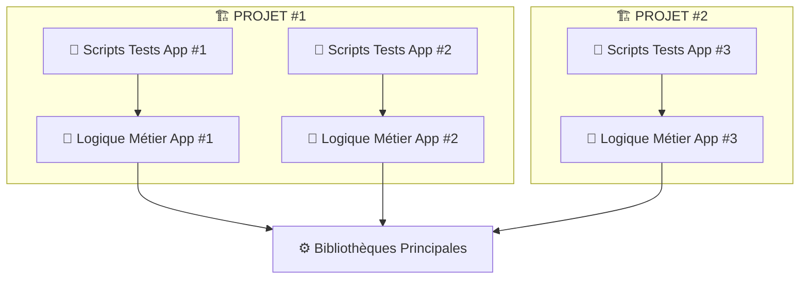

## Chapitre 3 : Architecture d'Automatisation des tests (210 minutes - K3)

### Objectifs

En apprendre plus sur :

- L'architecture d'Automatisation des tests et ses composants menant à une solution d'Automatisation des tests
- Les couches d'un framework d'Automatisation des tests et leur application
- Les approches d'utilisation des outils d'Automatisation des tests
- L'application des principes de conception et des canevas de conception à l'Automatisation des tests

### **Mots-clés**

| **Mot** | **Définition** |
|---------------|-----------------|
| **développement piloté par les comportements** | Approche collaborative de développement où l'équipe se concentre sur la livraison du comportement attendu d'un composant pour le client. |
| **capture/rejeux** | Approche d'automatisation des tests où les entrées vers l'objet de test sont enregistrées pendant les tests manuels pour générer des scripts automatisés. |
| **tests génériques d'Automatisation des tests** | Représentation des couches, composants et interfaces d'une architecture d'automatisation des tests, permettant une approche structurée et modulaire. |
| **architecture d'Automatisation des tests** | Structure organisationnelle et technique d'un système d'automatisation des tests, définissant les composants, leurs relations et les principes directeurs. |
| **tests pilotés par les mots-clés** | Technique de script qui utilise des fichiers de données contenant non seulement les données de test mais aussi des mots-clés liés à l'application testée. |
| **scripting linéaire** | Technique de script simple sans structure de contrôle dans les scripts de test. |
| **tests basés sur des modèles** | Tests basés sur ou impliquant des modèles du système ou de ses composants. |
| **scripting structuré** | Technique de script qui utilise des structures de contrôle et une organisation hiérarchique pour améliorer la maintenabilité. |
| **couche d'adaptation des tests** | Couche dans une architecture d'automatisation des tests qui fournit les interfaces nécessaires pour interagir avec le système sous test. |
| **harnais de tests** | Collection d'outils logiciels et de données de test configurés pour tester un programme en simulant l'environnement d'exécution. |
| **test piloté par les données** | Technique de script qui stocke les données de test et les résultats attendus dans un tableau, permettant à un script de contrôle d'exécuter tous les tests. |
| **étape de test** | Action individuelle la plus petite dans un script de test ou un cas de test. |
| **solution d'Automatisation des tests** | Ensemble complet d'outils, de processus et de ressources mis en place pour automatiser les activités de test dans un contexte donné. |
| **développement piloté par les tests** | Pratique de développement où les tests sont écrits avant le code de production. |
| **script de test** | Séquence d'instructions qui peut être exécutée par un outil d'exécution de test. |

### 3.1 Concepts de conception utilisés dans l'Automatisation des tests

#### **TAE-3.1.1 (K2)** : Expliquer les principales fonctionnalités d'une architecture d'Automatisation des tests

**Architecture générique d'Automatisation des tests (gTAA)**

La gTAA est un concept de conception de haut niveau qui fournit une vue abstraite de la communication entre l'automatisation des tests et les systèmes connectés. Elle définit les capacités nécessaires lors de la conception d'une architecture d'automatisation des tests (TAA).

**Interfaces de la gTAA :**

| **Interface** | **Description** | **Fonction** |
|---------------|-----------------|--------------|
| **Interface SUT** | Connectivité entre le SUT et le TAF | Communication directe avec le système testé |
| **Interface gestion projet** | Avancement du développement de l'automatisation | Reporting et suivi de progression |
| **Interface gestion tests** | Cartographie des définitions et cas de test automatisés | Traçabilité entre tests manuels et automatisés |
| **Interface gestion configuration** | Pipelines CI/CD, environnements et testware | Déploiement et versioning |

**Diagramme de l'Architecture générique d'Automatisation des tests (gTAA) :**

```
                           🏢 Gestion de projet
                           (Interface gestion projet)
                                     ↕
    ⚙️ Gestion de              ╔═══════════════════════════╗              📋 Gestion des tests
       configuration    ←→     ║  Framework d'automatisation ║     ←→    (Interface gestion tests)
    (Interface gestion         ║        des tests           ║
     configuration)            ║                            ║
                               ║  🔄 Génération des tests   ║
                               ║  📝 Définition des tests   ║
                               ║  ▶️  Exécution des tests   ║
                               ║  🔧 Adaptation des tests   ║
                               ╚═══════════════════════════╝
                                          ↕
                              🖥️ Système sous test
                                 (Interface SUT)
```

**Capacités principales du Framework d'Automatisation des tests :**

| **Capacité** | **Description** | **Caractéristiques** |
|--------------|-----------------|---------------------|
| **Génération des tests** | Conception automatisée des cas de tests basés sur des modèles | • Capacité optionnelle<br>• Utilise les tests basés sur modèles (MBT)<br>• Référence : Syllabus CT-MBT ISTQB |
| **Définition des tests** | Implémentation des cas de test et/ou suites de tests | • Séparation définition/SUT/outils<br>• Tests haut et bas niveau<br>• Gestion données/cas/bibliothèques |
| **Exécution des tests** | Exécution automatique et logging | • Outil d'exécution automatique<br>• Composant de logging<br>• Reporting des résultats |
| **Adaptation des tests** | Adaptation aux différents composants/interfaces du SUT | • Adaptateurs multiples<br>• Connexion via API, protocoles, services<br>• Flexibilité d'intégration |

#### **TAE-3.1.2 (K2)** : Expliquer comment concevoir une solution d'Automatisation des tests

**Définition d'une Solution d'Automatisation des tests (TAS)**

Une TAS est définie par la compréhension des exigences fonctionnelles, non fonctionnelles et techniques du SUT, ainsi que des outils existants ou requis pour l'implémentation.

**Éléments de conception de l'Architecture d'Automatisation des tests (TAA) :**

| **Élément** | **Description** | **Considérations techniques** |
|-------------|-----------------|------------------------------|
| **Spécification d'outils** | Outils d'automatisation et bibliothèques spécifiques | Compatibilité, licences, support |
| **Extensions et composants** | Développement de composants personnalisés | Réutilisabilité, maintenance, documentation |
| **Connectivité et interfaces** | Exigences de connexion système | Pare-feu, BD, URLs, mocks/stubs, files d'attente, protocoles |
| **Intégration outils** | Connexion aux outils de gestion | Tests, défauts, traçabilité |
| **Contrôle de version** | Système de versioning et référentiels | Git, SVN, gestion des branches, releases |

**Implémentation TAS :**
- **Outils commerciaux** : Solutions clé en main, support inclus
- **Outils open-source** : Flexibilité, coût réduit, maintenance interne
- **Adaptateurs spécifiques** : Développement sur mesure selon SUT

#### **TAE-3.1.3 (K3)** : Appliquer la stratification des frameworks d'Automatisation des tests

**Framework d'Automatisation des tests (TAF)**

Le TAF constitue la base d'une TAS et comprend souvent un harnais de test (également appelé test runner), des bibliothèques de test, des scripts de test et des suites de tests.

**Couches du TAF (TAF Layers)**

Les couches TAF définissent une frontière distincte de classes ayant des objectifs similaires tels que :
- Cas de test
- Reporting de tests  
- Logging de tests
- Chiffrement
- Harnais de test

En introduisant une couche pour chaque objectif unique, la conception peut devenir compliquée. Il est donc recommandé de **garder le nombre de couches TAF faible**.

**Diagramme des Couches du Framework d'Automatisation des tests (TAF) :**

```
    ╔═══════════════════════════════════════════════════════════════════════════════════╗
    ║                            📝 SCRIPTS DE TESTS                                   ║
    ║                                                                                   ║
    ║  • Référentiel cas de test du SUT      • Annotations suites                      ║
    ║  • Appels services logique métier      • Étapes de test, flux utilisateur, API  ║
    ║  ⚠️ Aucun appel direct aux bibliothèques principales                             ║
    ╚═══════════════════════════════════════════════════════════════════════════════════╝
                                           ↕ Appels services
    ╔═══════════════════════════════════════════════════════════════════════════════════╗
    ║                            🔧 LOGIQUE MÉTIER                                     ║
    ║                                                                                   ║
    ║  • Bibliothèques dépendantes SUT       • Configuration TAF                       ║
    ║  • Interface entre couches             • Héritage/façades des bibliothèques      ║
    ║  • Configuration TAF pour SUT          • Configurations supplémentaires           ║
    ╚═══════════════════════════════════════════════════════════════════════════════════╝
                                         ↕ Héritage/Façades
    ╔═══════════════════════════════════════════════════════════════════════════════════╗
    ║                         ⚙️ BIBLIOTHÈQUES PRINCIPALES                             ║
    ║                                                                                   ║
    ║  • Bibliothèques indépendantes SUT     • Composants réutilisables                ║
    ║  • Base commune multiple TAF           • Pile développement partagée             ║
    ║  • Réutilisables dans tout projet partageant la même pile de développement      ║
    ╚═══════════════════════════════════════════════════════════════════════════════════╝
```

**Architecture en couches du TAF :**

| **Couche** | **Responsabilité** | **Contenu** | **Interactions** |
|------------|-------------------|-------------|------------------|
| **Scripts de tests** | Référentiel de cas de test du SUT et annotations suites | • Cas de test<br>• Annotations suites<br>• Appels services logique métier<br>• Étapes de test, flux utilisateur, API | ⚠️ **Aucun appel direct aux bibliothèques principales** |
| **Logique métier** | Bibliothèques dépendantes du SUT | • Configuration TAF pour SUT<br>• Héritage/façades des bibliothèques principales<br>• Configurations supplémentaires<br>• Configuration TAF pour exécution contre SUT | Interface entre scripts et bibliothèques |
| **Bibliothèques principales** | Bibliothèques indépendantes du SUT | • Composants réutilisables<br>• Base commune pour multiple TAF<br>• Pile de développement partagée<br>• Réutilisables dans tout projet partageant la même pile de développement | Fondation technique réutilisable |

**Mise à l'échelle de l'automatisation :**

**Diagramme d'Application des bibliothèques principales à des TAFs multiples :**



Les bibliothèques principales fournissent une base réutilisable pour plusieurs TAF :
- **Projet #1** : 2 TAF (App #1, App #2) construits sur les mêmes bibliothèques principales
- **Projet #2** : 1 TAF (App #3) réutilisant les bibliothèques principales existantes
- **Avantages** : Réduction coûts, standardisation, maintenance centralisée

**Organisation des TAE :**
- **Un TAE** construit les TAFs pour le Projet #1
- **Un second TAE** construit le TAF pour le Projet #2

#### **TAE-3.1.4 (K3)** : Appliquer différentes approches pour l'automatisation des cas de test

**Approches de développement pour cas de tests automatisés :**

| **Approche** | **Description** | **Avantages** | **Inconvénients** |
|--------------|-----------------|---------------|-------------------|
| **Capture/rejeu** | Capture interactions manuelles pour générer scripts | • Facile à mettre en place<br>• Aucune programmation | • Difficile à maintenir/évoluer<br>• SUT doit être disponible<br>• Périmètre restreint<br>• Forte dépendance version SUT |
| **Scripting linéaire** | Programmation simple sans bibliothèques personnalisées | • Facile démarrage<br>• Scripts modifiables vs capture/rejeu | • Difficile maintenance/évolution<br>• Périmètre restreint<br>• Connaissances programmation requises |
| **Scripting structuré** | Bibliothèques avec éléments réutilisables | • Maintenabilité élevée<br>• Évolutivité<br>• Séparation logique métier | • Connaissances programmation requises<br>• Investissement initial important |
| **TDD (Test-Driven Development)** | Tests définis avant implémentation ("red, green, refactor") | • Qualité code améliorée<br>• Testabilité renforcée<br>• Communication équipe | • Temps adaptation initial<br>• Risque fausse confiance si mal appliqué |
| **DDT (Data-Driven Testing)** | Scripts alimentés par données externes (.csv, .xlsx, BD) | • Extension rapide cas de test<br>• Coût ajout réduit<br>• Autonomie analystes test | • Gestion données complexe |
| **KDT (Keyword-Driven Testing)** | Liste/tableau d'étapes dérivées de mots-clés utilisateur | • Implication analystes métier<br>• Utilisable tests manuels<br>• Référence ISO/IEC/IEEE 29119-5 | • Implémentation/maintenance complexe<br>• Effort considérable petits systèmes |
| **BDD (Behavior-Driven Development)** | Format langage naturel (Given, When, Then) stocké en fichiers features | • Communication équipe améliorée<br>• Couverture spécifications<br>• Multi-niveaux pyramide tests | • Cas limites à définir séparément<br>• Confusion avec simple langage naturel<br>• Implémentation/maintenance complexe |

#### **TAE-3.1.5 (K3)** : Appliquer les principes et les modèles de conception dans l'Automatisation des tests

**Principes de programmation orientée objet :**

| **Principe** | **Définition** | **Application en automatisation** |
|--------------|----------------|-----------------------------------|
| **Encapsulation** | Masquage des détails d'implémentation | Classes de test avec méthodes privées/publiques |
| **Abstraction** | Simplification de concepts complexes | Interfaces génériques pour interactions SUT |
| **Héritage** | Réutilisation de code via classes parentes | Bibliothèques de base étendues par projets |
| **Polymorphisme** | Comportements différents pour même interface | Adaptateurs multiples pour différents SUT |

**Principes SOLID :**

| **Principe** | **Acronyme** | **Bénéfice** |
|--------------|--------------|--------------|
| **S** - Single Responsibility | Une classe = une responsabilité | Lisibilité code |
| **O** - Open-Closed | Ouvert extension, fermé modification | Maintenabilité |
| **L** - Liskov Substitution | Substituabilité objets dérivés | Évolutivité |
| **I** - Interface Segregation | Interfaces spécialisées vs générales | Modularité |
| **D** - Dependency Inversion | Dépendance abstractions vs concrétions | Flexibilité |

**Patterns de conception essentiels :**

| **Pattern** | **Objectif** | **Application TAE** | **Avantages** |
|-------------|--------------|---------------------|---------------|
| **Façade** | Masquer détails implémentation | Interface simplifiée pour testeurs | Abstraction, facilité utilisation |
| **Singleton** | Instance unique | Un seul driver communication SUT | Cohérence, gestion ressources |
| **Page Object Model** | Encapsulation éléments page | Classe par page, localisateurs centralisés | Maintenance centralisée, réutilisabilité |
| **Flow Model** | Extension Page Object | Façade supplémentaire pour actions utilisateur | Double abstraction, réutilisabilité étapes |

**Architecture Flow Model :**
```
Scripts de test → Flow Model (actions utilisateur) → Page Object Model (éléments page) → SUT
```

Cette architecture à double façade améliore l'abstraction et la maintenabilité en permettant la réutilisation des étapes de test dans plusieurs scripts.