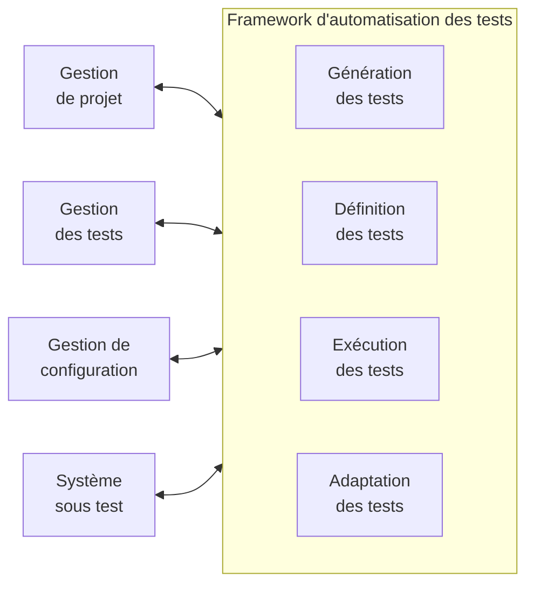
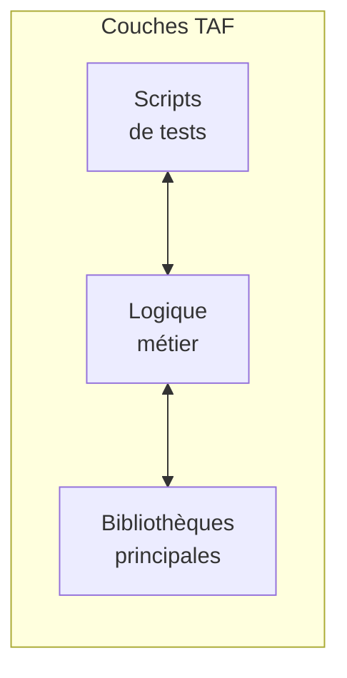
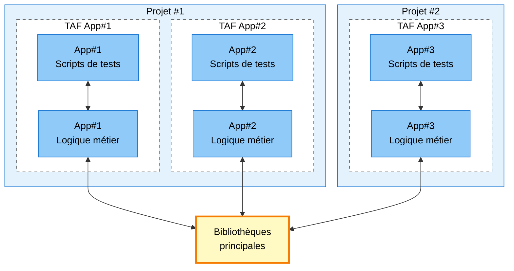

# Syllabus

## Chapitre 3 : Architecture d'Automatisation des tests (210 minutes - K3)

### Mots clés

Développement piloté par les comportements, capture/rejeux, tests génériques d'Automatisation des tests, architecture d'Automatisation des tests, tests pilotés par les mots-clés, scripting linéaire, tests basés sur des modèles, scripting structuré, couche d'adaptation des tests, architecture d'Automatisation des tests, harnais de tests, test piloté par les données, étape de test, solution d'Automatisation des tests, développement piloté par les tests, script de test

---

### Objectifs d'apprentissage

#### 3.1 Concepts de conception utilisés dans l'Automatisation des tests

- **TAE-3.1.1 (K2)** : Expliquer les principales fonctionnalités d'une architecture d'Automatisation des tests.
- **TAE-3.1.2 (K2)** : Expliquer comment concevoir une solution d'Automatisation des tests.
- **TAE-3.1.3 (K3)** : Appliquer la stratification des frameworks d'Automatisation des tests.
- **TAE-3.1.4 (K3)** : Appliquer différentes approches pour l'automatisation des cas de test.
- **TAE-3.1.5 (K3)** : Appliquer les principes et les modèles de conception dans l'Automatisation des tests.

---

## 3.1 Concepts de conception exploités dans l'automatisation des tests

### TAE-3.1.1 (K2) : Expliquer les principales capacités d'une architecture d'Automatisation des tests

#### Architecture générique d'Automatisation des tests (gTAA)

La gTAA est un concept de conception de haut niveau qui fournit une vue abstraite de la communication entre l'Automatisation des tests et les systèmes auxquels l'Automatisation des tests est connectée : le SUT, la gestion de projet, la gestion des tests et la gestion de la configuration. Il fournit également les capacités qu'il est nécessaire de couvrir lors de la conception d'une architecture d'Automatisation des tests (TAA).

**Figure 1 : diagramme gTAA**

Les interfaces de gTAA décrivent les éléments suivants :

- **Interface SUT** : Décrit la connectivité entre le SUT et le TAF (voir la section 3.1.3 concernant le framework d'Automatisation des tests).
- **Interface de gestion du projet** : Décrit l'avancement du développement de l'Automatisation des tests.
- **Interface de management des tests** : Décrit la cartographie des définitions de cas de test et des cas de test automatisés.
- **Interface de gestion de la configuration** : Décrit les pipelines CI/CD, les environnements et le testware.

#### Capacités offertes par les outils et bibliothèques d'Automatisation des tests

Les principales capacités d'Automatisation des tests doivent être identifiées et sélectionnées parmi les outils disponibles en fonction des exigences d'un projet donné.

**Génération de tests**

Soutient la conception automatisée des cas de tests basés sur des modèles de tests. Les tests basés sur des modèles peuvent être utilisés dans le processus de génération (voir le syllabus CT-MBT de l'ISTQB). La génération de tests est une capacité optionnelle.

**Définition des tests**

Soutient la définition et l'implémentation des cas de test et/ou des suites de tests, qui peuvent éventuellement être dérivés d'un modèle de test. Elle sépare la définition du test du SUT et/ou des outils de test. Elle contient les moyens de définir des tests de haut niveau et de bas niveau, qui sont traités dans les données de test, les cas de test et les composants de la bibliothèque de test ou des combinaisons de ceux-ci.

**Exécution des tests**

Soutient l'exécution du test et le logging des tests. Il fournit un outil d'exécution des tests pour exécuter automatiquement les tests sélectionnés, ainsi qu'un composant de logging des tests et de reporting des tests.

**Adaptation des tests**

Fournit la fonctionnalité nécessaire pour adapter les tests automatisés aux différents composants ou interfaces du SUT. Il fournit différents adaptateurs pour se connecter au SUT via des API, des protocoles et des services.

---

### TAE-3.1.2 (K2) : Expliquer comment concevoir une solution d'Automatisation des tests

Une solution d'Automatisation des tests (TAS) est définie par une compréhension des exigences fonctionnelles, non fonctionnelles et techniques du SUT, des outils existants ou requis qui sont nécessaires pour implémenter une solution. Une solution d'Automatisation des tests est implémentée avec des outils commerciaux ou open-source et peut nécessiter des adaptateurs supplémentaires spécifiques au SUT.

Le TAA définit la conception technique de l'ensemble du TAS. Elle doit aborder :

- La spécification des outils d'Automatisation des tests et des bibliothèques spécifiques aux outils.
- Le développement d'extensions et/ou de composants.
- L'identification des exigences en matière de connectivité et d'interface (par exemple, pare-feu, base de données, localisateurs de ressources uniformes (URL)/connexions, mocks/stubs, files d'attente de messages et protocoles).
- La connexion aux outils de gestion des tests et des défauts.
- L'utilisation d'un système de contrôle de version et de référentiels.

---

### TAE-3.1.3 (K3) : Appliquer une superposition dans les frameworks d'Automatisation des tests

#### Le framework d'Automatisation des tests (TAF)

Le TAF est la base d'un TAS. Il comprend souvent un harnais de test (également connu sous le nom de lanceur de test), ainsi que des bibliothèques de test, des scripts de test et des suites de tests.

#### Couches du TAF

Les couches du TAF définissent une frontière distincte de classes qui ont des objectifs similaires tels que les cas de test, le reporting des tests, le logging des tests, le cryptage et les harnais de test.

**Recommandation** : En introduisant une couche pour chaque objectif unique, la conception peut devenir compliquée. Il est donc recommandé de limiter le nombre de couches du TAF.

**Figure 2 : Couches du TAF**

#### Structure en couches

**Scripts de test**

L'objectif de cette couche est de fournir un référentiel de cas de test du SUT et des annotations de la suite de tests. Elle appelle les services de la couche logique métier, ce qui peut impliquer des étapes de test, des flux d'utilisateurs ou des appels d'API. Toutefois, aucun appel direct aux bibliothèques principales ne doit être effectué à partir des scripts de test.

**Logique métier**

Toutes les bibliothèques dépendantes du SUT sont stockées dans cette couche. Ces bibliothèques hériteront des fichiers de classe des bibliothèques principales ou utiliseront les façades fournies par celles-ci (voir la section 3.1.5 concernant l'héritage et les façades). La couche de logique métier est utilisée pour configurer le TAF afin qu'il s'exécute au regard du SUT et les configurations supplémentaires.

**Bibliothèques principales**

Toutes les bibliothèques indépendantes de tout SUT sont stockées dans cette couche. Ces bibliothèques principales peuvent être réutilisées dans n'importe quel type de projet partageant la même pile de développement.

#### Mise à l'échelle de l'Automatisation des tests

L'exemple suivant (figure 3) montre comment les bibliothèques principales fournissent une base réutilisable pour plusieurs TAF. Dans le projet #1, il y a deux TAFs construits au-dessus des bibliothèques principales, et un projet séparé utilise les bibliothèques principales déjà existantes pour construire son TAF afin de tester l'application #3. Un TAE construit les TAFs pour le projet #1, tandis qu'un second TAE construit le TAF pour le projet #2.

**Figure 3 : Application des bibliothèques principales à des TAFs multiples**

---

### TAE-3.1.4 (K3) : Appliquer différentes approches pour automatiser les cas de tests

Il existe plusieurs approches de développement que les équipes peuvent choisir pour produire des cas de tests automatisés. Il peut s'agir de langages de script interactifs ou de langages de programmation compilés. Les différentes approches offrent des avantages différents en matière d'automatisation et peuvent être exploitées dans des circonstances différentes.

**Note** : Bien que le développement piloté par les tests (TDD) et le développement piloté par le comportement (BDD) soient des méthodologies de développement, si elles sont suivies correctement, elles ont pour résultat le développement automatisé de cas de test.

---

#### Capture/rejeux

La capture/rejeux est une approche qui capture les interactions avec le SUT pendant qu'une séquence d'actions est exécutée manuellement. Ces outils produisent des scripts de test pendant la capture, et selon l'outil utilisé, le code d'Automatisation des tests peut être modifiable.

- **Automatisation no-code** : Outils qui n'exposent pas de code
- **Automatisation low-code** : Outils exposant du code

**Avantages**
- Initialement facile à mettre en place et à utiliser

**Inconvénients**
- Difficile à maintenir, à mettre à l'échelle et à faire évoluer.
- Le SUT doit être disponible lors de la capture d'un cas de test.
- Uniquement réalisable pour un périmètre restreint et un SUT qui change rarement.
- L'exécution du SUT capturé dépend fortement de la version du SUT à partir de laquelle la capture a été effectuée.
- Enregistrer chaque cas de test individuel au lieu de réutiliser les blocs de construction existants prend du temps.

---

#### Scripting linéaire

Le script linéaire est une activité de programmation qui ne nécessite pas de bibliothèques de test personnalisées réalisées par un TAE et qui est utilisée pour écrire et exécuter les scripts de test. Un TAE peut s'appuyer sur des scripts de test enregistrés par un outil de capture/rejeux, qu'il peut ensuite modifier.

**Avantages**
- Facile à mettre en place et à commencer à écrire des scripts de test.
- Par rapport à la capture/rejeux, les scripts de test peuvent être modifiés plus facilement.

**Inconvénients**
- Difficile d'assurer la maintenance, la mise à l'échelle et l'évolution.
- L'utilisateur final doit être disponible lors de la capture d'un cas de test.
- Uniquement réalisable pour un petit périmètre et un SUT qui change rarement.
- Par rapport à la capture/rejeux, certaines connaissances en programmation sont nécessaires.

---

#### Scripting structuré

Des bibliothèques de test sont introduites avec des éléments réutilisables, des étapes de test et/ou des parcours utilisateurs. Des connaissances en programmation sont nécessaires pour la création et la maintenance des scripts de test dans cette approche.

**Avantages**
- Facilité de maintenabilité, de mise à l'échelle, de portage, d'adaptation et d'évolution.
- La logique métier peut être séparée des scripts de test.

**Inconvénients**
- Des connaissances en programmation sont nécessaires.
- L'investissement initial dans le développement du TAF et la définition du testware prend du temps.

---

#### Développement piloté par les tests (TDD)

Les cas de test sont définis dans le cadre du processus de développement avant qu'une nouvelle caractéristique du SUT ne soit implémentée. L'approche de développement piloté par les tests consiste à tester, coder et refactoriser, aussi connu sous le nom de "red, green, and refactor" (rouge, vert et refactoriser).

**Cycle TDD** :
1. Un développeur identifie et crée un cas de test qui échouera (rouge).
2. Il développe ensuite une fonctionnalité qui satisfera le cas de test (vert).
3. Le code est ensuite refactorisé afin de l'optimiser et de respecter les principes du code propre.
4. Le processus se poursuit avec le test suivant et l'incrément de fonctionnalité suivant.

**Avantages**
- Simplifie le développement des cas de test au niveau des composants.
- Améliore la qualité et la structure du code.
- Améliore la testabilité.
- Facilite l'obtention de la couverture de code souhaitée.
- Réduit la propagation des défauts à des niveaux de test plus élevés.
- Améliore la communication entre les développeurs, les représentants des métiers et les testeurs.
- Les User Stories qui ne sont pas vérifiées à l'aide des tests de l'interface graphique et des tests de l'API peuvent rapidement atteindre les critères de sortie en suivant la méthode TDD.

**Inconvénients**
- Au départ, il faut plus de temps pour s'habituer au TDD.
- Ne pas suivre correctement le TDD peut entraîner une fausse confiance dans la qualité du code.

---

#### Tests pilotés par les données (DDT)

Les tests pilotés par les données (DDT) s'appuient sur l'approche du scripting structuré. Les scripts de test sont fournis avec des données de test (par exemple, des fichiers .csv, .xlsx et des vidages de base de données). Cela permet d'exécuter plusieurs fois les mêmes scripts de test avec des données de test différentes.

**Avantages**
- Permet d'étendre rapidement et facilement les cas de test grâce à des flux de données.
- Le coût de l'ajout de nouveaux tests automatisés peut être considérablement réduit.
- Les analystes de test peuvent spécifier des tests automatisés en alimentant un ou plusieurs fichiers de données de test qui décrivent les tests. Les analystes de test disposent ainsi d'une plus grande liberté pour spécifier des tests automatisés en dépendant moins des analystes techniques de test.

**Inconvénients**
- Une bonne gestion des données de test peut s'avérer nécessaire.

---

#### Tests pilotés par les mots-clés (KDT)

Les tests pilotés par les mots-clés (KDT) sont une liste ou un tableau d'étapes de test dérivées de mots-clés et des données de test sur lesquelles les mots-clés opèrent. Les mots-clés sont définis du point de vue de l'utilisateur. Cette technique est souvent basée sur le DDT.

**Avantages**
- Les analystes de test et les analystes métier peuvent être impliqués dans la création de cas de test automatisés en suivant l'approche du KDT.
- Les KDT peuvent également être utilisés pour les tests manuels indépendamment de l'Automatisation des tests (voir la norme ISO/IEC/IEEE 29119-5 concernant les tests pilotés par les mots-clés).

**Inconvénients**
- L'implémentation et la maintenabilité des mots-clés est une tâche complexe que les TAE doivent couvrir, ce qui peut devenir un défi lorsque le périmètre s'élargit.
- Cela engendre un effort considérable pour les systèmes de petite taille.

---

#### Développement piloté par le comportement (BDD)

BDD exploite un format de langage naturel (c.-à-d., étant donné, quand, alors (given, when, then)) pour formuler des critères d'acceptation qui peuvent être utilisés comme cas de tests automatisés et stockés dans des fichiers de caractéristiques. Un outil BDD peut alors comprendre le langage et exécuter les cas de test.

**Avantages**
- Améliore la communication entre les développeurs, les représentants du métier et les testeurs.
- Les scénarios BDD automatisés font office de cas de tests et assurent la couverture des spécifications.
- BDD peut être mis à profit pour produire plusieurs types de tests à différents niveaux de la pyramide des tests.

**Inconvénients**
- Des cas de test supplémentaires, généralement des conditions de test négatives et des cas limites doivent encore être définis par l'équipe, typiquement par un analyste de test ou un TAE.
- De nombreuses équipes confondent le BDD avec un simple moyen d'écrire des cas de test dans un langage naturel, et n'impliquent pas les représentants des métiers et les développeurs dans l'ensemble de l'approche.
- L'implémentation et la maintenance des étapes de test en langage naturel est une tâche complexe à couvrir pour les TAE.
- Des étapes de test trop complexes transformeront le débogage en une activité difficile et coûteuse.

---

### TAE-3.1.5 (K3) : Appliquer les principes et les canevas de conception à l'Automatisation des tests

L'Automatisation des tests est une activité de développement logiciel. Par conséquent, les principes et les canevas de conception sont tout aussi importants pour un TAE que pour un développeur de logiciels.

#### Principes de programmation orientée objet

Il existe quatre grands principes de programmation orientée objet : l'encapsulation, l'abstraction, l'héritage et le polymorphisme.

#### Principes SOLID

Il s'agit d'un acronyme de la **r**e**S**ponsabilité unique, de l'**O**uverture-fermeture, de la substitution de **L**iskov, de la substitution d'**I**nterface et de l'inversion de **D**épendance (de l'anglais Single responsibility, Open-closed, Liskov substitution, Interface substitution and Dependency inversion). Ces principes améliorent la lisibilité du code, la maintenabilité et l'évolutivité.

#### Canevas de conception

Parmi les nombreux canevas de conception, trois sont plus importants pour les TAE.

**Modèle de façade**

Le modèle de façade masque les détails de l'implémentation pour n'exposer que ce que les testeurs doivent créer dans les cas de test.

**Canevas de singleton**

Le canevas de singleton est souvent utilisé pour s'assurer qu'il n'y a qu'un seul pilote qui communique avec le SUT.

**Modèle objet page (Page Object Model)**

Dans le modèle objet page, un fichier de classe est créé et appelé modèle de page. Chaque fois que la structure du SUT change, le TAE devra faire des mises à jour à un seul endroit, le localisateur à l'intérieur d'un modèle de page, au lieu de mettre à jour les localisateurs dans chaque cas de test.

**Canevas de modèle de flux (Flow Model Pattern)**

Le canevas de modèle de flux est une extension du modèle d'objet de page. Il introduit une façade supplémentaire au-dessus des modèles d'objets de page, qui stocke toutes les actions de l'utilisateur qui interagissent avec les objets de page. En introduisant une conception à double façade, le canevas de modèle de flux améliore l'abstraction et la maintenabilité, car les étapes de test peuvent être réutilisées dans plusieurs scripts de test.

---

*Annotations*

- **Modèle de façade** : Exposer des méthodes métier (ex. « se connecter », « ajouter au panier ») au lieu des éléments de page ; les tests restent lisibles et moins sensibles aux changements internes.
- **Canevas de singleton** : Une seule instance du driver (ex. WebDriver) pour tout le framework ; en parallèle, utiliser un singleton par thread (Thread-Local).
- **Modèle objet page** : Une classe par page qui regroupe localisateurs et actions ; si l'UI change, on ne modifie que cette classe.
- **Modèle de flux** : Couche au-dessus des Page Objects qui regroupe des enchaînements métier (ex. « parcours achat complet ») ; double façade = Page Objects + couche Flux.
- **Modèle vs canevas** : Dans le syllabus, « canevas » = design pattern ; « modèle » = abstraction ou reprise du terme anglais *model*. Tous sont des patterns à appliquer en automatisation.