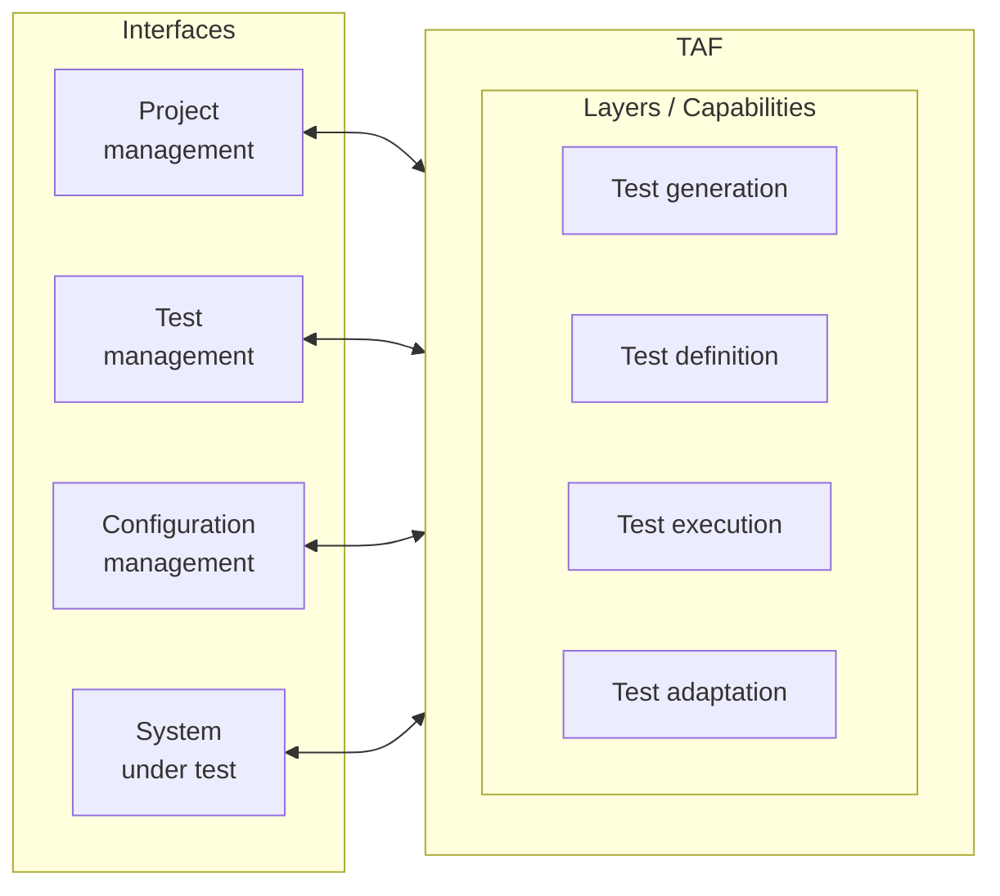
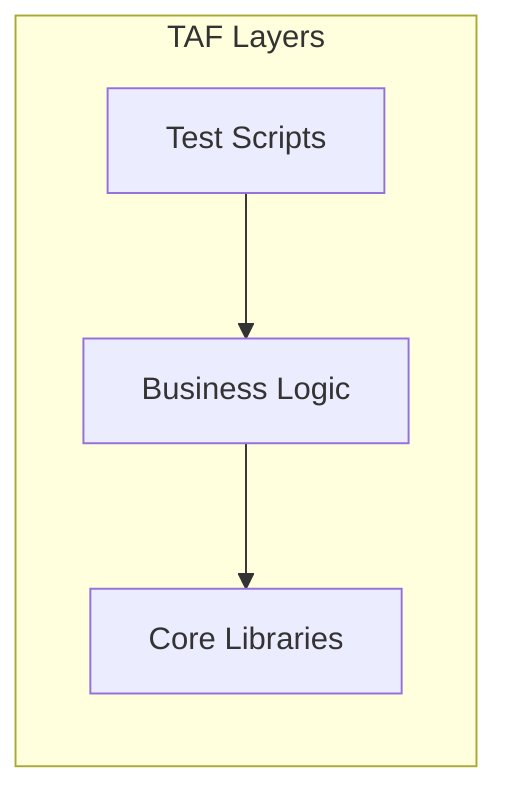
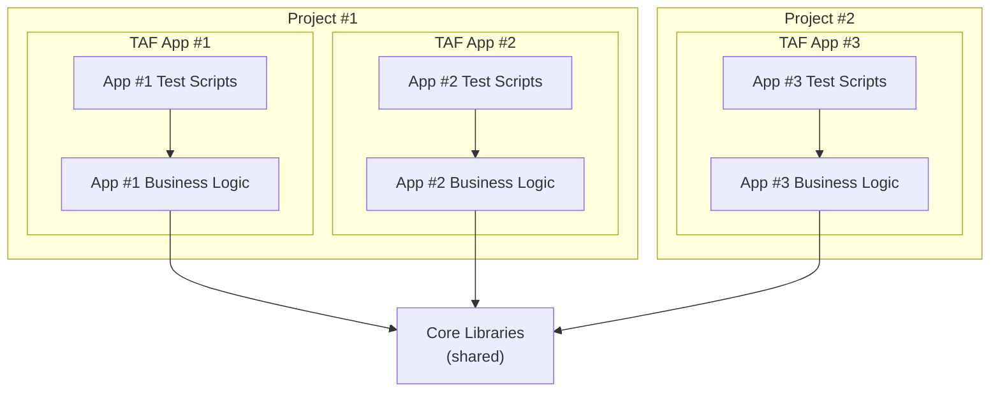

# Synthesis

## Test Automation Architecture - Introduction

This chapter explores architecture concepts of Test Automation Implementation, such as:

- gTAA (Generic Test Automation Architecture)
*and major capabilities. Provide a high-level framework on how test automation communicates with other systems*
- TAS (Test Automation Solution) Design
*Based on functional, non-functional and technical requirements*
- TAF (Test Automation Framework) Layering
*To organize code into layers, each with a specific responsibility (test scripts, business logic, libraries)*
- Approaches to Automate Test Cases
*From capture/replay, Linear Scripting to Structured Scripting, DDT (Data-Driven Testing) and BDD (Behavior-Driven Development).*
- Design principles and patterns
*to professionalize code writing*

## TAE-3.1.1 (K2) : Explain the Major Capabilities in a Test Automation Architecture

### gTAA (Generic Test Automation Architecture)

gTAA (Generic Test Automation Architecture) is a high-level design concept that gives an abstract view of how test automation communicates with connected systems — like an aerial photo of the ecosystem showing how everything connects together (SUT, project management, test management, configuration management). It also provides the capabilities that need to be covered when designing a TAA.

Ex. Designing a TAA (Test Automation Architecture) for a banking application. It helps to understand how automation interacts with the banking application, but also the test management system, CI/CD pipeline and our configuration management system. It helps to visualize those connections and plan accordingly.

**Figure 1: gTAA diagram**



gTAA represents multiple interfaces interacting with the TAF, whose internal layers provide the core automation capabilities.

### The interfaces of gTAA

- **SUT interface**: Describes the connectivity between the SUT and the TAF (e.g., web elements, APIs). Ex. banking application: UI elements (frontend) and API calls (backend).
- **Project management interface**: Describes how we track the *development progress of the automation itself* (stories, tasks, sprint status) — not test run results. Concretely: connection to tools like Jira/Azure DevOps where automation user stories and tasks are managed.
- **Test management interface**: Describes the mapping between test case definitions and automated test cases (traceability). Concretely: link IDs between a test management tool (e.g., TestRail, Xray, ALM) and automated scripts/suites, so each automated test remains tied to its original test case definition. Ex. poorly defined interface → weeks spent reconciling which automated tests correspond to which (manual) test cases.
- **Configuration management interface**: Describes CI/CD pipelines, environments, and testware. Helps manage versioning and deployment of automation code.

### Capabilities provided by test automation tools and libraries

These are the core capabilities a TAA should cover (shown as layers inside the TAF in the gTAA diagram). They are selected from available tools according to project requirements.

- Test generation capability: Automatically designs test cases from models (e.g., model-based testing — approach modeling the system behavior to generate automatically test cases from the model with a tool. Like asking a computer to find all the paths for a given map. Ex. telecommunication project where hundreds of test cases were generated from a state model of how calls should be routed for a complex call routing system, saving weeks of work and covering all possible scenarios. Test generation is optional because not all projects require this level of sophistication)
- Test definition capability: Supports definition and implementation of test cases and/or test suites (ex. separation of test definition and SUT/tools). This capability separates the definition from the SUT and/or test tools (define what we want to test). It separates high-level tests (ex. login, logout) from low-level tests (ex. enter username, password, etc.). It creates the blueprint for automation (it's like a recipe to follow to create the automated test). Ex. healthcare project, comprehensive test definition layers allowing BA (Business Analyst) to define tests in Excel using a keyword-driven approach, which the Test Automation Framework translates into executable code. This separation allows non-technical team members to contribute to the test definition process.
- Test execution capability: It provides execution tools to support running tests and recording results, such as scheduling running tests at a specific time, running parallel tests to save time, handling test dependencies to execute specific tests first, managing test data, reporting test results in a meaningful way, etc. Ex. e-commerce project, where the execution capability of the tool allows running 500+ tests nightly, in 2 hrs, by executing in parallel multiple tests across multiple browsers and environments.
- Test adaptation capability: Adapts tests to different components/interfaces of the SUT (ex. adapters for different APIs, protocols, services). Ex. SUT with both a web interface and a mobile app, the test adaptation layer will provide components to interact with both interfaces, using different tools or libraries for each. It is the difference between a brittle solution breaking at every UI change and a robust solution withstanding frequent changes to the SUT. Ex. Healthcare project, test adaptation layer abstracting the means of interacting with the system, allowing to only update the adaptation layer after a complete UI redesign, while test definition remained unchanged.

Ex. Building a TAS (Test Automation Solution) for an online banking application:

- Test Generation: use of a model-based testing tool to generate test cases for complex workflows (ex. funds transfers between accounts).
- Test Definition: Define test cases in a structured way using keyword-driven or data-driven approach, specifying what needs to be tested.
- Test Execution: Setting up framework to execute tests automatically, as part of the nightly build process and generate reports.
- Test Adaptation: Adapters creation allowing tests to interact with web interface, mobile app and APIs of the banking application.

Implementing these capabilities creates a comprehensive TAS, able to test all aspects of the banking application.

### Conclusion

1. gTAA provides an abstract view of communication between automation and connected systems.
2. Four key interfaces:
    - SUT interface
    - Project management interface
    - Test management interface
    - Configuration management interface
3. Core capabilities:
    - Test generation
    - Test definition
    - Test execution
    - Test adaptation

Understanding these capabilities is crucial for designing effective TAS, able to scale with the project, and adapt to changes in the SUT.

## TAE-3.1.2 (K2) : Explain How to Design a Test Automation Solution

### What is a TAS (Test Automation Solution)?

A TAS is the complete package / everything you need for automating testing activities (beyond just tools/scripts). It is defined by understanding:

1. Functional requirements of the SUT
2. Non-functional requirements of the SUT
3. Technical requirements of the SUT
4. Existing or required tools needed to implement the solution

Ex. healthcare application:

- Functional: "users must be able to schedule appointments", "doctors must be able to view patient records"
- Non-functional: security (HIPAA compliant), performance (handle 10 000 concurrent users)
- Technical: compatibility with specific browsers and operating systems

All of these requirements influence how the TAS is designed.

### Implementing a TAS

Implementation options:

- Commercial tools (paid)
- Open-source tools (free)
- Combination of both (most common — no single tool covers all needs)

Ex. healthcare project: Tricentis Tosca (UI testing — strong healthcare regulation support) + JMeter (performance — heavy user load simulation).

Note: Custom components/adapters specific to the SUT are almost always needed (off-the-shelf tools never cover every unique characteristic).

### Role of TAA (Test Automation Architecture)

The TAA defines the technical design for the overall TAS (blueprint / master plan for automation efforts).

It must address:

- Selecting test automation tools and libraries
- Developing plugins / extensions / components
- Identifying connectivity and interface requirements
- Connecting to test management and defect management tools
- Utilizing version control and repositories

#### Selecting tools and libraries

One of the most critical decisions.

Ex. Tool selected based on team familiarity, but poorly suited to API testing. Tool unsuitability significantly increased testing effort and forced the team to switch to another tool mid-project (failure), costing a lot of time and effort.

When selecting, consider:

- Application type (web, mobile, desktop)
- Testing needs (UI, API, performance, security, etc.)
- Team skills
- Budget
- Integration capabilities with the existing toolset

Ex. React frontend + REST API:

- Selenium + RestAssured (if the team prefers Java)
- Cypress + Postman (if the team prefers JavaScript)

#### Developing plugins / components

No off-the-shelf solution covers all project needs. Almost always requires developments of custom plugins/components to extend the tool's functionality to the specific needs of the SUT/project.

Ex. E-commerce project: unique checkout process that the selected tool could not interact with properly → custom component developed to understand the page structure (DOM = Document Object Model, the tree of HTML elements in the page) and interact reliably with the checkout page.

#### Identifying connectivity and interface requirements

Often overlooked until too late. Must define connectivity/interface requirements from the start, to avoid late surprises and redesigns.

Includes:

- Firewall configurations (do the tests need access to systems across firewalls?)
- Database connections (does automation need to verify data in databases?)
- URL / endpoints (which endpoints must automation reach?)
- Mocks / stubs (do you need to simulate unavailable components?)
- Message queues (is the system using asynchronous messaging?)
- Protocols (what communication protocols does the SUT use?)

Ex. TAF worked in development, but corporate firewall blocked required connections → had to redesign to fit security constraints.

#### Connecting to test management and defect management tools

Automation does not exist in isolation — connect it to test management tools (e.g., TestRail, Xray, ALM) and defect management tools (e.g., Jira, Azure DevOps).

Ex. When automated tests fail: auto-create a Jira ticket with screenshots/logs **and** update the test case status in TestRail. Saves time and reduces gaps.

#### Utilizing version control and repositories

Automation requires code management, like software development. This goes through a code management strategy including:

- Version control system (e.g., Git, SVN, Mercurial)
- Organized repository structure (e.g., by test level: unit, API, UI)
- Branching strategies (e.g., feature, release, hotfix)
- Processes for code reviews, merges, and releases

Ex. Project with an unplanned monolithic repository: repo became unwieldy → team obligated to painfully refactor into multiple repos by test level (unit, API, UI).

### Real-world example: E-commerce website automation

- **Requirements**
  - Functional: browse products, add to cart, checkout
  - Non-functional: handle holiday traffic, pages load in under 2s
  - Technical: Chrome / Firefox / Safari + responsive mobile
- **Tools**: Selenium WebDriver (UI), JMeter (performance), RestAssured (API), BrowserStack (cross-browser)
- **Custom components**: shopping cart wrapper; custom reporting (aggregate results across test types)
- **Connectivity**: DB access (verify order placement), mock payment gateway (checkout), API endpoints (product catalog)
- **Integration**: Jira (defect management), TestRail (test cases management)
- **Version control / CI**: Git (version control, repos organized by test type), Jenkins (continuous integration / CI pipeline), Docker (consistent, controlled test environments)

### Common pitfalls to avoid

1. **Tool-first approach** — selection based on tool usage rather than testing needs
2. **Ignoring maintainability** — bad TAS architecture planning making it unmaintainable and hard to scale as the application evolves
3. **Insufficient abstraction** — tests creation too granular, limiting test reuse and maintainability as any UI change breaks it.
4. **Neglecting reporting** — minimal investment limiting reporting capabilities and increasing difficulty to interpret test results
5. **Siloed approach** — TAS development not integrated with the development process / SDLC

### Conclusion

TAS design is more than picking a tool and writing scripts. It requires:

- Understanding SUT requirements (+ existing/required tools)
- Right mix of tools + custom components
- Comprehensive connectivity / interface planning
- Integration with the testing and development ecosystem
- Proper code management (version control & repositories)

Test Automation is a journey, not a destination (evolve with the application, emergence of new techniques, etc.)


## TAE-3.1.3 (K3) : Apply Layering of Test Automation Frameworks

### What is a TAF (Test Automation Framework)?

TAF is the foundation of a TAS (Test Automation Solution). It often includes:

- **Test harness / runner** — component that executes the tests (like the conductor of an orchestra: tells when to start and how to coordinate)
- **Test libraries** — collections of reusable code for common test actions (e.g., fill a field, click a button). You may have **several libraries** for different needs (e.g., one for DB interaction, another for complex UI components).
- **Test scripts** — the automated tests themselves (step-by-step instructions verifying the application works as expected / correctly)
- **Test suites** — collections of related test scripts run together

Layering organizes automation code to avoid maintenance nightmares (e.g., monolithic 2000-line scripts) and improve maintainability, reusability, and scalability.

### The Three Main Layers

#### TAF layers



**Layering** = organizing code into layers by purpose, each at a different abstraction level (high: what to test → mid: how on this SUT → low: tech tools), so code stays reusable and maintainable. Start with these **3 layers**; add more only if really necessary.

| Layer | Purpose | Examples |
|---|---|---|
| Test scripts | **WHAT** to test | sign-up, login, purchase scenario|
| Business logic | **HOW** on this SUT (pages / flows) | HomePage, LoginPage, CartPage class with specific methods |
| Core libraries | **Tools** (tech, SUT-agnostic) | browser, API, DB helpers |

- **Test scripts layer** (top) — Focus on **WHAT** to test. Provides a repository of SUT test cases and organizes them into test suites. Contains scripts verifying specific functionality (e.g., login, product search, add to cart, checkout). Calls services of the business logic layer (test steps, user flows, or API calls). **Must never call core libraries directly.**

```python
def test_valid_login():
  # This calls methods from business logic layer
  login_page.enter_username("test@example.com")  # type username via BL layer
  login_page.enter_password("password")          # type password via BL layer
  login_page.click_login_button()                # submit login via BL layer

  # Verify the result
  assert dashboard_page.is_displayed(), "Dashboard should be displayed after login"  # check expected outcome
```

- **Business logic layer** (middle) — Focus on **HOW** to test for this specific SUT. In practice: page/screen objects and SUT-specific actions (e.g., `LoginPage.enter_username()`, `CartPage.proceed_to_checkout()`). Contains all **SUT-dependent** libraries (customized for the application). These inherit from core library classes or use façades provided by them (see 3.1.5). Also used to configure the TAF to run against the SUT and handle additional configurations.

```python
class LoginPage(BasePage): # Inherits from a class in Core Libraries.
  def enter_username(self, username):
    self.find_element(By.ID, "username_field").send_keys(username)  # find field + type text (core)

  def enter_password(self, password):
    self.find_element(By.ID, "password_field").send_keys(password)  # find field + type text (core)

  def click_login_button(self):
    self.find_element(By.ID, "login_button").click()                # find button + click (core)
```

- **Core libraries layer** (bottom) — The shared toolkit that talks to technology (browser, API, DB, logging) **without knowing your application**. In practice: find an element, type text, click, wait, open a browser, call an API — reusable in any project with the same tech stack. Once built, reusable across multiple projects/applications.

```python
class BasePage:
  def __init__(self, driver):
    self.driver = driver                        # store WebDriver instance

  def find_element(self, by, value):
    return self.driver.find_element(by, value)  # locate element in the page

  def wait_for_element(self, by, value, timeout=10):
    # implement wait logic
    pass                                        # wait until element is ready (placeholder)
```

### How these layers interact

- Test scripts layer: **WHAT** to test (e.g., valid login)
- Business logic layer: **HOW** to test on this SUT (enter username/password, click login)
- Core libraries layer: **tools** to perform actions (find element, enter text, click, wait)

This approach separates responsibilities, making the framework more flexible and easier to maintain.
Ex. username field ID changes → update **only** the business logic layer; test scripts and core libraries stay unchanged.

### Scaling test automation



Core libraries provide a reusable base for **multiple TAFs**:

- Project #1: two TAFs (App #1, App #2) built on the same core libraries (typically by one TAE)
- Project #2: a separate TAE builds a TAF for App #3 by leveraging the **existing** core libraries (no start from scratch)

Ex. Financial services company: a central test engineering team maintains the core libraries; each product team builds its own business logic and test scripts on top → new projects get automation running much faster.

### Real-world example: E-commerce testing

Building a TAF for an e-commerce website:

1. **Core libraries layer** (reusable, know nothing about the e-commerce site):
   - WebDriver wrapper (browser init, navigation, find elements)
   - REST client (API testing)
   - Database connector (verify data)
   - Logging utility
   - Reporting utility

2. **Business logic layer** (SUT-specific **classes** using core libraries; each class exposes **methods**):
   - Class `HomePage` — methods: `search_for_product`, `navigate_to_category`, etc.
   - Class `ProductPage` — methods: `add_to_cart`, `select_size`, etc.
   - Class `CartPage` — methods: `proceed_to_checkout`, `update_quantity`, etc.
   - Class `CheckoutPage` — methods: `enter_shipping_info`, `enter_payment_info`, etc.

3. **Test scripts layer** (actual test cases calling business logic):
   - `test_search_functionality`
   - `test_add_to_cart`
   - `test_checkout_process`
   - `test_account_creation`

### Benefits of layering

- **Maintainability**: when the application changes, usually only one layer needs an update (typically the business logic layer)
- **Reusability**: core libraries shared across projects
- **Scalability**: easy to add new test scripts without changing the underlying framework
- **Readability**: test scripts focus on intent / business flow, not implementation details
- **Division of labor**: e.g., technical experts on core libraries, domain experts on test scripts

### Challenges and best practices

#### Challenges

- **Initial investment**: more time upfront than simple scripts; payoff in maintenance and scalability
- **Learning curve**: higher complexity — team must understand layering and follow patterns consistently
- **Over-engineering**: risk of creating too many layers or abstractions

#### Best practices

- **Start simple**: begin with the 3 main layers; add complexity later if needed
- **Document well**: ensure everyone understands the purpose of each layer and how they interact with each other
- **Use design patterns**: e.g., Page Object Model works well with the layered approach (organizing code in the 3 layers above; see later topics)
- **Code reviews**: ensure layering principles are followed

### Conclusion

1. Layering creates maintainable, reusable, and scalable automation.
2. Three layers: Test scripts (what), Business logic (how), Core libraries (tools).
3. Saves long-term time despite upfront investment.

## TAE-3.1.4 (K3) : Apply Different Approaches to Automate Test Cases

Several approaches exist to automate test cases, beyond simple scripting. They represent a trade-off between simplicity to get started and long-term maintainability, and form an evolution from basic to more advanced techniques.

### Capture/Playback

Records manual actions performed on the SUT and replays them automatically (ex. Selenium IDE, Katalon Recorder). It comes in two flavors:

- No-code tools: record and replay actions without showing the generated script.
- Low-code tools: show the generated script, which can be modified if needed.

Ex. Client needing about 50 test cases automated quickly before a major release. A capture/playback tool recorded all the test cases in a couple of days, allowing the team to get up and running very fast. However, on the following release, UI changes broke almost all the recorded tests, requiring most of them to be re-recorded.

**Pros:**

- Incredibly easy to get started, just click "record" and test normally.
- No programming knowledge required.
- Automated tests created very quickly.

**Cons:**

- Tests are usually very fragile, breaking whenever the application changes.
- Hard to scale as the application grows.
- Difficult to understand why a test fails.
- Requires the application to be available and working when tests are created.

Good way to dip a toe into automation, or for very stable applications with few changes, but usually not a good long-term strategy.

### Linear Scripting

Step-by-step scripts written without any custom libraries or functions, like writing a story without chapters. Unlike capture/playback, the code is written manually, though it often starts as a modified capture/playback script.

```python
# Open the browser
driver = webdriver.Chrome()                     # start Chrome WebDriver

# Go to the website
driver.get("https://www.example.com")           # navigate to URL

# Find the username field and type a username
username_field = driver.find_element_by_id("username")  # locate username field
username_field.send_keys("testuser")            # type username

# Find the password field and type a password
password_field = driver.find_element_by_id("password")  # locate password field
password_field.send_keys("password123")         # type password

# Click on the login button
login_button = driver.find_element_by_id("login_button")  # locate login button
login_button.click()                            # click to submit

# Check if login was successful
assert "Welcome" in driver.page_source          # pass if page contains "Welcome"
```

Ex. Project inherited with about 200 linear scripts. When the login page was redesigned, the login sequence had to be manually updated in almost every single script, costing days of tedious work that a more structured approach would have avoided.

**Pros:**

- Relatively easy to get started.
- Scripts are straightforward to understand, following the test step by step.
- More control than capture/playback since the code is written by hand.

**Cons:**

- Lots of duplication (ex. every test needing a login copies the same code).
- Maintenance becomes a huge issue as the test suite grows.
- Application changes may require updates in multiple places.
- Requires some programming knowledge, though not advanced skills.

### Structured Scripting

Professional approach introducing reusable elements: test libraries, test steps and user journeys shared across multiple scripts. It requires more programming knowledge but produces much more maintainable code. Instead of writing the login sequence in every test, a reusable `login()` function is created and called by any test.

```python
def login(driver, username, password):          # reusable login helper
    username_field = driver.find_element_by_id("username")
    username_field.send_keys(username)          # type given username

    password_field = driver.find_element_by_id("password")
    password_field.send_keys(password)          # type given password

    login_button = driver.find_element_by_id("login_button")
    login_button.click()                        # submit login

# Now the test becomes:
driver = webdriver.Chrome()                     # start browser
driver.get("https://www.example.com")           # open app
login(driver, "testuser", "password123")        # call reusable function (no duplicated steps)
assert "Welcome" in driver.page_source          # verify success
```

Ex. E-commerce project with dozens of tests needing to add products to the cart. Creating a reusable `add_to_cart` function saved countless hours of maintenance when the cart functionality was later updated. This is typically the minimum level of organization recommended for any serious test automation project.

**Pros:**

- Much better maintainability, changes only require an update in one place.
- Reusability across tests reduces duplication.
- Easier to understand and troubleshoot.
- More scalable as the test suite grows.

**Cons:**

- Requires solid programming knowledge.
- Initial time investment to set up the structure and libraries.
- More complex architecture for new team members to understand.

### TDD (Test-Driven Development)

Development approach (rather than strictly a test automation approach) that results in automated tests: tests are written before the code they test. Follows the **red, green, refactor** cycle:

- **Red**: Write a failing test for the functionality to develop.
- **Green**: Write the minimum code necessary to make the test pass.
- **Refactor**: Clean up the code while ensuring the test still passes.

```python
# Red phase - fails because validate_email doesn't exist yet
def test_email_validation():
    assert validate_email("test@example.com") == True   # valid email → expect True
    assert validate_email("not-an-email") == False      # no proper @domain → expect False
    assert validate_email("") == False                  # empty string → expect False

# Green phase - simplest implementation making the test pass
def validate_email(email):
    if not email:                                       # empty / None → invalid
        return False
    return "@" in email and "." in email.split("@")[1]  # has @ AND a '.' in the part after @

# Refactor phase - more robust implementation
import re                                               # regex module for pattern matching

def validate_email(email):
    if not email:                                       # empty / None → invalid
        return False
    pattern = r'^[a-zA-Z0-9._%+-]+@[a-zA-Z0-9.-]+\.[a-zA-Z]{2,}$'  # local@domain.ext
    return bool(re.match(pattern, email))               # True if email matches the pattern
```

Ex. Project developing a critical medication dosage calculator. Tests were written for all edge cases (pediatric doses, elderly patients, renal impairment adjustments) before any calculation logic, resulting in code far more robust because every scenario had already been considered.

**Pros:**

- Improves code quality and structure (writing tests first naturally leads to modular, testable code).
- Enhances testability from the start.
- Achieves better code coverage.
- Reduces defects propagating to higher test levels.
- Improves communication by forcing clarity about what the code should do.

**Cons:**

- Learning curve, the workflow feels backward at first.
- Can feel slower initially, though it often saves time later by reducing bugs.
- Risk of false confidence if tests don't cover important scenarios.

### DDT (Data-Driven Testing)

Separates test logic from test data, so the same test template runs with different data sets (like one exam template reused with different student names). Data typically comes from external sources: CSV files, spreadsheets, databases or XML files.

```python
import pytest

test_data = [                                   # data sets: (username, password, expected)
    ("testuser", "password123", "success"),     # valid credentials → success
    ("testuser", "wrongpassword", "failure"),   # wrong password → failure
    ("invaliduser", "password123", "failure"),  # unknown user → failure
]

@pytest.mark.parametrize("username,password,expected_result", test_data)  # run test once per row
def test_login(username, password, expected_result, setup_browser):
    driver = setup_browser                      # browser fixture
    driver.get("https://www.example.com/login") # open login page
    driver.find_element_by_id("username").send_keys(username)   # type username from data
    driver.find_element_by_id("password").send_keys(password)   # type password from data
    driver.find_element_by_id("login_button").click()           # submit

    if expected_result == "success":
        assert "Welcome" in driver.page_source  # success path check
    else:
        assert "Error" in driver.page_source    # failure path check
```

In real scenarios, data is usually loaded from an external file rather than hard-coded:

```python
import csv

def load_test_data():
    data = []                                   # list that will hold all data sets
    with open('login_test_data.csv', 'r') as f: # open CSV (relative path) in read mode → file object f
        reader = csv.reader(f)                  # reader that yields each CSV row as a list
        next(reader)                            # skip header row (column names)
        for row in reader:                      # each remaining row = one list of cell values
            data.append(tuple(row))             # store row as tuple, e.g. ("testuser", "pwd", "success")
    return data                                 # return list of tuples for parametrize

@pytest.mark.parametrize("username,password,expected_result", load_test_data())
# ↑ for each tuple: 1st value → username, 2nd → password, 3rd → expected_result (positional match)
def test_login(username, password, expected_result, setup_browser):
    # Same test code as before
    ...
```

Ex. Mortgage calculator project needing to verify hundreds of loan scenarios (amounts, interest rates, terms, down payments). One test script fed by an Excel file replaced hundreds of separate tests; when the calculation formula changed due to a regulatory update, only that one script had to be updated, and new scenarios could be added by adding rows to the spreadsheet without touching the code.

**Pros:**

- Reduces code duplication, the test logic is written once and reused with different data.
- Makes test maintenance easier.
- Enables non-programmers to contribute by adding data to a spreadsheet.
- Improves test coverage without writing more code.
- Separates test logic and test data, following good software design principles.

**Cons:**

- Data management can become a project in itself.
- Setup complexity to build the data-driven framework.
- Debugging can be harder, since a failure needs to be traced back to the data set that caused it.

Tip: always include a descriptive test name or ID in each row of test data, to quickly identify which scenario failed.

Ex. CSV columns: `test_id,username,password,expected_result`

| test_id | username | password | expected_result |
|---|---|---|---|
| TC01_valid_login | testuser | password123 | success |
| TC02_wrong_password | testuser | wrongpassword | failure |

On failure, the report shows `TC02_wrong_password` instead of an anonymous row index.


### KDT (Keyword-Driven Testing)

Takes the separation of test logic and test data even further by defining high-level keywords representing actions or verifications (ex. `login`, `SearchProduct`, `AddToCart`), which tests then assemble as a sequence, like building with Lego blocks instead of sculpting from clay. Robot Framework is a popular open-source framework for this approach.

```robotframework
*** Settings ***
Library             SeleniumLibrary              # load browser automation library

*** Variables ***
${URL}             https://www.example.com       # app URL (reusable variable)
${BROWSER}         chrome                        # browser to use

*** Test Cases ***
Valid Login Test                                 # high-level test: sequence of keywords only
    Open Browser To Login Page                   # custom keyword → open site + check form
    Input Username    testuser                   # custom keyword → type username
    Input Password    password123                # custom keyword → type password
    Submit Credentials                           # custom keyword → click login
    Welcome Page Should Be Open                  # custom keyword → assert welcome message
    [Teardown]  Close Browser                    # always close browser at end (even if fail)

*** Keywords ***                                 # definitions of the custom keywords above
Open Browser To Login Page                       # keyword: open app + check login form
    Open Browser        ${URL}  ${BROWSER}       # SeleniumLibrary: launch browser at URL
    Page Should Contain Element     id:login-form  # assert login form is present

Input Username                                   # keyword: type username
    [Arguments]     ${username}                  # receives username from the test case
    Input Text      id:username     ${username}  # type into field id=username

Input Password                                   # keyword: type password
    [Arguments]     ${password}                  # receives password from the test case
    Input Text      id:password     ${password}  # type into field id=password

Submit Credentials                               # keyword: click login
    Click Button    id:login-button              # click button id=login-button

Welcome Page Should Be Open                      # keyword: verify success message
    Page Should Contain     Welcome to your account  # assert text is visible on page
```

The Settings section sets up needed libraries, Variables defines common values, Test Cases contains sequences of keywords, and Keywords defines the custom keywords used by the tests. Behind the scenes, a keyword is implemented either as a custom keyword or as a built-in keyword from a library (ex. `Open Browser` from SeleniumLibrary).

Ex. Insurance company where business analysts with no programming experience implemented KDT with Robot Framework, using a keyword library matching their business language, allowing them to write tests such as:

```robotframework
*** Test Cases ***
Customer Can Purchase Auto Insurance             # business-readable flow (no code)
    Login As        john.doe@example.com    password123
    Navigate To     Auto Insurance
    Select Coverage Type    Comprehensive
    Calculate Premium
    Complete Purchase
    Confirmation Should Be Displayed             # final business check
```

**Pros:**

- Business-readable tests, expressed in language stakeholders understand.
- Reusable components across many test cases.
- Non-technical participation from business analysts and manual testers.
- Common language / framework for collaboration between technical and non-technical members.
- Separation of concerns: implementers focus on keywords, designers focus on test flows.

**Cons:**

- Initial setup effort to create a robust keyword library.
- Maintenance overhead as keywords need updating when the application changes.
- Finding the right granularity, too specific keywords aren't reusable, too general ones aren't meaningful.
- Learning curve for new team members to learn the available keywords.

Ex. Project that went overboard with keyword abstraction, ending up with hundreds of very specific keywords used only once or twice, making the framework hard to maintain. The lesson learned was to keep keywords at a consistent level of abstraction balancing reusability with clarity, starting with a small, well-designed set and growing it organically, with good documentation.

### BDD (Behavior-Driven Development)

Extension of TDD focusing on the behavior of the system from the user's perspective, using natural language "Given-When-Then" scenarios so non-technical stakeholders can understand them. Scenarios are stored in feature files, and tools such as Cucumber, SpecFlow or JBehave translate them into executable tests.

```gherkin
Feature: User Login                              # feature under test
    As a registered user                         # who
    I want to log in to the application          # what
    So that I can access my account              # why (business value)

Scenario: Successful login with valid credentials
    Given I am on the login page                 # precondition
    When I enter "testuser" as username          # action
    And I enter "password123" as password        # action
    And I click the login button                 # action
    Then I should see the welcome message        # expected result
```

```python
@given("I am on the login page")                # bind Gherkin step → Python
def navigate_to_login_page(context):
    context.driver.get("https://www.example.com")  # open login URL

@when('I enter "{username}" as username')       # capture username from scenario text
def enter_username(context, username):
    context.driver.find_element_by_id("username").send_keys(username)  # type it

# And so on for the other steps
```

Ex. Weekly "Three Amigos" sessions where a developer, a tester and a business analyst wrote BDD scenarios together before development started, ensuring a shared understanding of requirements. The scenarios then became the acceptance criteria for the user stories.

**Pros:**

- Improves communication between technical and non-technical team members.
- Scenarios serve as both documentation and executable tests.
- Focuses on business value and user behavior.
- Works well with Agile methodologies.

**Cons:**

- Still need additional test cases for edge cases and negative scenarios.
- Often misunderstood as just a way to write tests in natural language.
- Implementing and maintaining step definitions can be complex.
- Debugging can be challenging when scenarios get complex.

### Comparing the approaches

| Criterion | Low | Medium | High |
|---|---|---|---|
| Entry barrier | Capture/Playback, Linear Scripting | Structured Scripting, DDT | TDD, KDT, BDD |
| Maintainability | Capture/Playback, Linear Scripting | Structured Scripting, DDT | TDD, KDT, BDD |
| Scalability | Capture/Playback, Linear Scripting | Structured Scripting | DDT, TDD, KDT, BDD |
| Business involvement | Capture/Playback, Linear Scripting, Structured Scripting | DDT, TDD | KDT, BDD |

### Evolution and combination of approaches

Each approach represents an evolution addressing the limitations of the previous one:

- structured scripting solves linear scripting's maintenance problems,
- DDT separates test data from test logic,
- and KDT makes tests accessible to non-programmers.

Teams typically start with simpler approaches and gradually move to more sophisticated ones as their automation maturity grows.

The best strategy often combines several approaches based on the need at hand:

- **TDD** for unit tests on back-end services.
- **Structured scripting + DDT** for API tests.
- **KDT** for common UI workflows.
- **BDD** for critical, business-validated user journeys (ex. checkout flow).

Ex. E-commerce project combining TDD for back-end unit tests, structured scripting with DDT for API tests, KDT for the most common UI workflows, and BDD for critical user journeys such as checkout, leveraging the strengths of each approach where it made the most sense.

### Conclusion

1. There is no one-size-fits-all approach; the best strategy often combines several of them based on project needs, team skills and organizational culture.
2. Capture/playback: easy to start but hard to maintain.
3. Linear scripting: simple programming but prone to duplication.
4. Structured scripting: reusable components improve maintainability.
5. Test-Driven Development: write tests before code for better quality.
6. Data-Driven Testing: separate test logic from test data.
7. Keyword-Driven Testing: use high-level keywords for business-readable tests.
8. Behavior-Driven Development: natural language scenarios bridging technical and business worlds.

## TAE-3.1.5.0 (K3) : Object Oriented Programming Principles

Design principles and design patterns can sound theoretical, but are actually proven solutions to common problems in software design, like blueprints tested by thousands of developers over many years. Object-oriented programming principles are the foundation on which SOLID principles and design patterns are built.

### Encapsulation

Bundling data and the methods that work on that data within a single unit, restricting direct access to some of its components, like a car where the driver only needs the steering wheel, pedals and gears without knowing how the engine works internally. In test automation, it means hiding the complex stuff inside a class and only exposing what's necessary through public methods.

Ex. A `LoginPage` class handling all the internal details of logging in. Tests only call `LoginPage.login("user", "pass")`, without worrying how it happens internally. The `usernameField`, `passwordField` and `loginButton` fields are private and can't be accessed directly from outside the class, so if the login process changes later, only one place needs to be updated.

```java
public class LoginPage {
    private WebElement usernameField;   // hidden: not accessible from outside
    private WebElement passwordField;   // hidden
    private WebElement loginButton;     // hidden

    public void login(String username, String password) {  // only public API for tests
        usernameField.sendKeys(username);  // type username
        passwordField.sendKeys(password);  // type password
        loginButton.click();               // submit
    }
}
```

### Abstraction

Simplifying complex systems by modeling classes based on essential properties and behaviors, while hiding unnecessary details, like using a TV remote: pressing a button without needing to understand the electrical signals sent to the TV. In test automation, abstraction helps create models of the application's components focused on what's needed for testing, without getting bogged down in implementation details.

Ex. A `Page` interface defines the operations any page should perform (navigating, checking it's displayed, getting its title), without specifying how they happen. A `HomePage` class implements this interface and contains the actual implementation details (WebDriver, URLs, element IDs).

```java
public interface Page {                 // contract: what any page must support
    void navigate();                    // go to this page
    boolean isDisplayed();              // is the page currently shown?
    String getTitle();                  // return the page/browser title
}

public class HomePage implements Page { // concrete implementation of Page
    private WebDriver driver;           // browser driver (Selenium)

    public HomePage(WebDriver driver) {
        this.driver = driver;           // inject browser driver
    }

    public void navigate() {            // Page.navigate() implementation
        driver.get("https://www.example.com/home");  // open home URL
    }

    public boolean isDisplayed() {      // Page.isDisplayed() implementation
        return driver.findElement(By.id("home-header")).isDisplayed();  // header visible?
    }

    public String getTitle() {          // Page.getTitle() implementation
        return driver.getTitle();       // browser tab title
    }
}
```

Tests then only work with the `Page` interface, focusing on the behavior to verify rather than on how to interact with specific web elements:

```java
public void testPageNavigation(Page page) {     // works with any Page implementation
    page.navigate();                            // go to page
    assertTrue(page.isDisplayed());             // page is shown
    assertEquals("Expected Title", page.getTitle());  // title matches
}
```

Ex. Project needing to test the same functionality on both a web application and a mobile app. Creating an abstraction of the user interface that both implementations could follow made it possible to write the tests once and run them against both platforms. Abstraction separates what needs to be tested from how to interact with the system, making test code more maintainable.

### Inheritance

Allows a class to inherit properties and methods from another class, creating a parent-child relationship where the child class can also add its own capabilities, like biological inheritance: traits are inherited, but unique ones exist too. In test automation, inheritance helps avoid code duplication by using base classes with common functionality.

Ex. A `BasePage` class contains common functionality (waiting for a page to load, taking screenshots, scrolling to elements). `ProductPage extends BasePage` to inherit all those methods without rewriting them, `super(driver)` calling the parent constructor to handle initialization.

```java
public class BasePage {                         // parent class: shared tools for all pages
    protected WebDriver driver;                 // browser controller, reusable by child classes

    public BasePage(WebDriver driver) {         // constructor: runs when a BasePage is created
        this.driver = driver;                   // store the browser driver for later use
    }

    public void waitForPageToLoad() {           // wait until the page finished loading
        new WebDriverWait(driver, 10).until(    // wait up to 10 seconds...
            webDriver -> ((JavascriptExecutor) webDriver)
                .executeScript("return document.readyState").equals("complete"));  // ...until browser says "complete"
    }

    public void takeScreenshot(String filename) {  // save a screenshot of the current screen
        File screenshot = ((TakesScreenshot) driver).getScreenshotAs(OutputType.FILE);  // capture image
        try {
            FileUtils.copyFile(screenshot, new File("./screenshots/" + filename + ".png"));  // write file to disk
        } catch (IOException e) {               // if saving fails...
            e.printStackTrace();                // ...print the error
        }
    }

    public void scrollToElement(WebElement element) {  // scroll the page until the element is visible
        ((JavascriptExecutor) driver).executeScript(
            "arguments[0].scrollIntoView(true);", element);  // ask the browser to scroll to that element
    }
}

public class ProductPage extends BasePage {     // child class: product page + all BasePage tools
    private WebElement addToCartButton;         // "Add to cart" button on the page
    private WebElement quantityField;           // quantity input field

    public ProductPage(WebDriver driver) {      // constructor: runs when ProductPage is created
        super(driver);                          // step 1: initialize parent (sets driver)
        addToCartButton = driver.findElement(By.id("add-to-cart"));  // step 2: find cart button
        quantityField = driver.findElement(By.id("quantity"));       // step 3: find quantity field
    }

    // Inherits waitForPageToLoad, takeScreenshot, scrollToElement from BasePage (no rewrite needed)

    public void addProductToCart() {            // business action: add product to cart
        scrollToElement(addToCartButton);       // step 1: scroll to button (inherited method)
        addToCartButton.click();                // step 2: click the button
    }

    public void setQuantity(int quantity) {     // business action: set product quantity
        quantityField.clear();                  // step 1: erase old value
        quantityField.sendKeys(String.valueOf(quantity));  // step 2: type the new number
    }
}
```

Ex. Project without inheritance, where every one of 30+ page classes duplicated about 50 to 60 lines of identical code for waiting mechanisms, screenshots and error logging. Updating the waiting mechanism required changing all 30 files. Refactoring to a base class with inheritance reduced the codebase size by about 30%, and later enhancing the screenshot functionality only required a change in `BasePage`, automatically benefiting every page class.

### Polymorphism

Allows objects of different classes to be treated as objects of a common base class, with the specific implementation used determined at runtime, like a TV remote's power button working the same way across different TV brands. In test automation, polymorphism helps write flexible code without complex conditionals.

Ex. Different types of alerts or notifications need to be handled in different ways:

```java
public interface Notification {                 // contract: any notification must support these 2 actions
    void acknowledge();                         // dismiss / close the notification
    String getMessage();                        // return the text shown to the user
}

public class InfoNotification implements Notification {  // info popup (implements the contract)
    private String message;                     // text of the info message

    public InfoNotification(String message) {   // create an info notification with this text
        this.message = message;                 // store the message for later
    }

    @Override                                   // provides InfoNotification's version of acknowledge()
    public void acknowledge() {
        WebElement okButton = driver.findElement(By.id("info-ok-button"));  // find the OK button
        okButton.click();                       // click OK to close the info popup
    }

    @Override                                   // provides InfoNotification's version of getMessage()
    public String getMessage() {
        return this.message;                    // return the plain info text
    }
}

public class ErrorNotification implements Notification {  // error popup (same contract, different behavior)
    private String message;                     // text of the error
    private String errorCode;                   // technical error code (e.g. ERR-404)

    public ErrorNotification(String message, String errorCode) {  // create error with text + code
        this.message = message;                 // store error text
        this.errorCode = errorCode;             // store error code
    }

    @Override                                   // provides ErrorNotification's version of acknowledge()
    public void acknowledge() {
        WebElement closeButton = driver.findElement(By.id("error-close-button"));  // find Close (different UI)
        closeButton.click();                    // click Close to dismiss the error
    }

    @Override                                   // provides ErrorNotification's version of getMessage()
    public String getMessage() {
        return this.message + " (Error code: " + errorCode + ")";  // return text + code combined
    }
}
```

`InfoNotification` and `ErrorNotification` both implement the same interface but handle `acknowledge()` differently. Calling `notification.acknowledge()` runs the correct version at runtime based on the actual object, avoiding if-else statements.

Ex. E-commerce application with different product page types (physical, digital, subscription, bundled). A common `ProductPage` interface with methods like `addToCart` and `getPrice` let tests work with any product type without knowing its specific details. When a new product type was added later, only a new implementation of the interface was needed, and all existing tests kept working without any changes.

### Conclusion

1. Encapsulation hides implementation details behind public methods, so internal changes stay isolated.
2. Abstraction separates what to test from how to interact with the system, enabling reuse across implementations or platforms.
3. Inheritance avoids code duplication by sharing common functionality through base classes.
4. Polymorphism lets different objects respond to the same call in different ways, avoiding complex conditional logic.

## TAE-3.1.5.1 (K3) : Solid Principles

SOLID principles are fundamental object-oriented design principles introduced by Robert C. Martin ("Uncle Bob"). Each letter of the acronym represents a principle, and following them makes code more maintainable, flexible and easier to understand, like following the rules for building a stable house that won't collapse as it's extended or renovated.

### SRP (Single Responsibility Principle)

A class should have only one reason to change, only one job or responsibility, like not wanting the same person to be both chef and plumber: different skills, different problems. In test automation, each class should focus on testing one specific aspect of the application.

```java
// Violates SRP - too many responsibilities in ONE class (DB + files + browser + reporting)
public class TestUtils {                        // "god class": does everything → hard to maintain
    public void connectToDatabase() { /* ... */ }             // responsibility 1: open DB connection
    public ResultSet executeQuery(String query) { /* ... */ } // responsibility 1: run SQL query
    public void saveScreenshot(String filename) { /* ... */ } // responsibility 2: save screenshot file
    public String readTestData(String filepath) { /* ... */ } // responsibility 2: read data file
    public void launchBrowser(String browser) { /* ... */ }   // responsibility 3: start browser
    public void clickElement(String locator) { /* ... */ }    // responsibility 3: click UI element
    public void startTestReport() { /* ... */ }               // responsibility 4: start report
    public void logTestResult(String testName, boolean result) { /* ... */ } // responsibility 4: log pass/fail
}
```

```java
// Following SRP - split into 4 classes, each with ONE job
public class DatabaseUtils {                    // ONLY database work
    public void connect() { /* ... */ }         // open DB connection
    public ResultSet executeQuery(String query) { /* ... */ }  // run SQL query
}

public class FileUtils {                        // ONLY file work
    public void saveScreenshot(String filename) { /* ... */ }  // save screenshot
    public String readTestData(String filepath) { /* ... */ }  // read test data file
}

public class BrowserUtils {                     // ONLY browser / UI work
    public void launch(String browser) { /* ... */ }           // start Chrome/Firefox/...
    public void clickElement(String locator) { /* ... */ }     // click an element
}

public class ReportUtils {                      // ONLY reporting work
    public void startReport() { /* ... */ }                    // start a test report
    public void logResult(String testName, boolean result) { /* ... */ }  // log pass/fail
}
```

Ex. Project with a 3000-line `TestHelper` class handling database connections, UI interactions and report generation. Fixing a bug in one area risked breaking unrelated features, so touching the class was avoided. Refactoring to follow SRP produced smaller, focused classes; updating the database logic afterward only required changing `DatabaseUtils`, with no risk to the rest of the system.

### OCP (Open-Closed Principle)

Software should be open for extension but closed for modification: new functionality should be addable without changing existing code. In test automation, this means building frameworks that can be extended without modifying their core.

```java
// Without OCP - adding a new type means modifying THIS class (risky)
public class Validator {
    public boolean validate(String input, String type) {  // input = value to check, type = "email"/"phone"/...
        if (type.equals("email")) {             // case 1: validate as email
            return input.matches("[a-zA-Z0-9._%+-]+@[a-zA-Z0-9.-]+\\.[a-zA-Z]{2,}");  // True if email format OK
        } else if (type.equals("phone")) {      // case 2: validate as phone
            return input.matches("\\d{10}");    // True if exactly 10 digits
        }
        return false;                           // unknown type → invalid
    }                                           // problem: new type (e.g. credit card) = edit this method
}
```

```java
// Following OCP - new validators are added as NEW classes (existing code stays untouched)
public abstract class Validator {               // shared "template": every validator must implement validate()
    public abstract boolean validate(String input);  // extension point: each child defines its own rule
}

public class EmailValidator extends Validator { // email-only validator
    @Override                                   // provide this class's version of validate()
    public boolean validate(String input) {
        return input.matches("[a-zA-Z0-9._%+-]+@[a-zA-Z0-9.-]+\\.[a-zA-Z]{2,}");  // True if email format OK
    }
}

public class PhoneValidator extends Validator { // phone-only validator
    @Override
    public boolean validate(String input) {
        return input.matches("\\d{10}");        // True if exactly 10 digits
    }
}

// Adding credit card validation just creates a new class (no change to Email/Phone validators):
public class CreditCardValidator extends Validator {  // credit-card-only validator
    @Override
    public boolean validate(String input) {
        return input.matches("^4[0-9]{12}(?:[0-9]{3})?$");  // True if Visa-like number format
    }
}
```

Ex. Reporting system initially supporting only HTML reports. Adding PDF support by modifying the existing reporting class broke some HTML reporting features. Refactoring to a `ReportGenerator` interface with separate HTML and PDF implementations allowed a later Excel report request to be added as a new implementation, without touching existing code.

### LSP (Liskov Substitution Principle)

Subclass objects should be replaceable with superclass objects without breaking the program: if class B is a subclass of class A, B should be usable anywhere A is used, like a recipe calling for any citrus fruit, orange or lemon, without needing to change the recipe.

```java
// Violates LSP - Square looks like a Rectangle but breaks Rectangle expectations
class Rectangle {
    protected int width;                        // rectangle width
    protected int height;                       // rectangle height

    public void setWidth(int width) { this.width = width; }     // set width only
    public void setHeight(int height) { this.height = height; } // set height only
    public int getArea() { return width * height; }             // area = width × height
}

class Square extends Rectangle {                // Square inherits from Rectangle (problematic)
    @Override                                   // redefine setWidth
    public void setWidth(int width) {
        this.width = width;                     // set width
        this.height = width;                    // ALSO force height = width (square rule)
    }
    @Override                                   // redefine setHeight
    public void setHeight(int height) {
        this.height = height;                   // set height
        this.width = height;                    // ALSO force width = height (square rule)
    }
}

void testRectangle(Rectangle r) {               // expects a real rectangle behavior
    r.setWidth(5);                              // step 1: width = 5
    r.setHeight(4);                             // step 2: height = 4
    assert r.getArea() == 20;                   // expect 5×4=20 — FAILS if r is a Square (becomes 4×4=16)
}
```

```java
// Follows LSP - Chrome and Firefox can replace each other without breaking the test
interface Browser {                             // contract: any browser must navigate + find elements
    void navigate(String url);                  // open a URL
    WebElement findElement(String locator);     // find an element on the page
}

class ChromeBrowser implements Browser {        // Chrome version of Browser
    private WebDriver driver = new ChromeDriver();  // real Chrome browser controller

    @Override
    public void navigate(String url) { driver.get(url); }  // open URL in Chrome
    @Override
    public WebElement findElement(String locator) { return driver.findElement(By.cssSelector(locator)); }  // find element in Chrome
}

class FirefoxBrowser implements Browser {       // Firefox version of Browser (same contract)
    private WebDriver driver = new FirefoxDriver();  // real Firefox browser controller
    // Same navigate() / findElement() behavior as Chrome → interchangeable
}

class LoginTest {
    private Browser browser;                    // test depends on Browser contract, NOT on Chrome/Firefox

    @BeforeEach                                 // runs before each test
    void setUp() {
        // Could swap to: browser = new FirefoxBrowser(); — test code below stays identical
        browser = new ChromeBrowser();          // choose Chrome for this run
    }

    @Test
    void testValidLogin() {
        browser.navigate("https://example.com/login");  // works with any Browser implementation
    }
}
```

`ChromeBrowser` and `FirefoxBrowser` can be substituted for each other in tests because they both properly implement the `Browser` interface, unlike `Square`, which breaks the behavior expected from `Rectangle`.

### ISP (Interface Segregation Principle)

Clients should not be forced to implement methods they don't use; smaller, specific interfaces are better than one bloated one. In test automation, this means splitting interfaces by functionality (ex. `LoginAction`, `SearchAction`, `CartAction`) instead of one massive `AppAction` interface.

```java
// Violates ISP - one fat interface forces every page to implement everything
interface Page {
    void navigate();                            // go to the page
    void search(String keyword);                // search products
    void addToCart(String productId);           // add product to cart
    void checkout();                            // pay / checkout
    // And many more methods ...                // even more forced methods
}

// About Us page has NO search/cart/checkout — but must still implement them
class AboutUsPage implements Page {
    public void navigate() { /* implementation */ }  // OK: About Us can navigate
    public void search(String keyword) { throw new UnsupportedOperationException(); }      // dummy: not supported
    public void addToCart(String productId) { throw new UnsupportedOperationException(); } // dummy: not supported
    public void checkout() { throw new UnsupportedOperationException(); }                  // dummy: not supported
}
```

```java
// Following ISP - small interfaces; pages pick only what they need
interface Navigable {
    void navigate();                            // ONLY: go to a page
}

interface Searchable {
    void search(String keyword);                // ONLY: search
}

interface Purchasable {
    void addToCart(String productId);           // ONLY: add to cart
    void checkout();                            // ONLY: checkout
}

// About Us: navigation only — no fake search/cart methods
class AboutUsPage implements Navigable {
    public void navigate() { /* implementation */ }  // only what this page really does
}

// Product page: can navigate AND buy
class ProductPage implements Navigable, Purchasable {
    public void navigate() { /* implementation */ }              // open product page
    public void addToCart(String productId) { /* implementation */ }  // add item
    public void checkout() { /* implementation */ }              // go to checkout
}
```

Ex. A `Reporter` interface with methods for starting reports, adding results, capturing screenshots and generating formats. Some reporting tools didn't support screenshots and ended up with empty, do-nothing implementations. Applying ISP split it into `BasicReporter`, `ScreenshotCapable` and `MultiFormatReporter` interfaces, making it clear which reporters supported which features, without placeholder methods for unsupported ones.

### DIP (Dependency Inversion Principle)

High-level modules should not depend on low-level modules; both should depend on abstractions, and abstractions should not depend on details, details should depend on abstractions. In practice: depend on interfaces or abstract classes, not concrete implementations, like plugging a device into an electrical outlet without needing to know how electricity is generated.

```java
// Violates DIP — test hardcodes Chrome,
class LoginTest {
    private ChromeDriver driver = new ChromeDriver(); // always Chrome, unable to use other browser.

    public void testLogin() {
        driver.get("https://example.com/login");      // locked to Chrome
    }
}
```

```java
// Follows DIP — test depends on a contract; browser is plugged in from outside
interface WebDriver {                                 // contract: any browser must be able to...
    void get(String url);                             // ...open a URL
    WebElement findElement(By by);                    // ...find an element
}

class ChromeDriver implements WebDriver { /* Chrome implementation */ }
class FirefoxDriver implements WebDriver { /* Firefox implementation */ }

class LoginTest {
    private WebDriver driver;                         // holds any WebDriver (not Chrome-only)

    public LoginTest(WebDriver driver) {              // receive browser from outside
        this.driver = driver;                         // store it for the test
    }

    public void testLogin() {
        driver.get("https://example.com/login");      // same test code, any plugged-in browser
    }
}

// Same idea, expanded:
// 1) new ChromeDriver()     → creates a Chrome instance, returns it
// 2) new LoginTest(...)     → creates a LoginTest object, receives that Chrome instance (injection)
// 3) chromeTest = ...       → store that object in variable chromeTest
LoginTest chromeTest = new LoginTest(new ChromeDriver());
LoginTest firefoxTest = new LoginTest(new FirefoxDriver()); // same pattern with Firefox
```

Ex. Tests originally depending directly on Selenium WebDriver. Switching some tests to Appium for mobile was a major effort due to API differences. Introducing a `Driver` interface implemented by both Selenium and Appium wrappers made switching drivers trivial, running the same tests on web and mobile by injecting a different driver implementation.

### Conclusion

1. **SRP** (Single Responsibility Principle): a class should have only one reason to change.
2. **OCP** (Open-Closed Principle): open for extension, closed for modification, new functionality is added rather than existing code changed.
3. **LSP** (Liskov Substitution Principle): subclasses must be substitutable for their superclass without breaking behavior.
4. **ISP** (Interface Segregation Principle): prefer small, focused interfaces over large, general-purpose ones.
5. **DIP** (Dependency Inversion Principle): depend on abstractions (interfaces), not concrete implementations.

## TAE-3.1.5.2 (K3) : Design Patterns

Design patterns are proven solutions to common problems in software design, like recipes or blueprints tested by thousands of developers over many years. The following patterns are particularly useful in test automation.

### Facade Pattern

Provides a simplified interface to a complex system or set of classes, like a hotel's front desk coordinating housekeeping, maintenance and the restaurant so guests only ever talk to one point of contact. In test automation, it hides the complexity of test libraries and exposes only what testers need to create test cases.

```java
// Complex subsystem classes (low-level tools — hard for beginners to use directly)
class WebElementFinder {
    public WebElement findById(String id) { /* implementation */ }  // find element by its id
}

class WebElementInteractor {
    public void click(WebElement element) { /* implementation */ }           // click an element
    public void type(WebElement element, String text) { /* implementation */ }  // type text into a field
}

class WaitManager {
    public void waitForClickable(WebElement element, int seconds) { /* implementation */ }  // wait until clickable
    public void waitForVisible(WebElement element, int seconds) { /* implementation */ }    // wait until visible
    public void waitForPageLoad(int seconds) { /* implementation */ }                       // wait until page loaded
}

// Facade = simple front desk that hides the 3 complex classes above
class UserActions {
    private WebElementFinder finder = new WebElementFinder();         // tool 1: find elements
    private WebElementInteractor interactor = new WebElementInteractor();  // tool 2: click/type
    private WaitManager waiter = new WaitManager();                   // tool 3: waits

    public void clickButton(String id) {            // simple action: click a button by id
        WebElement button = finder.findById(id);    // step 1: find the button
        waiter.waitForClickable(button, 10);        // step 2: wait until it can be clicked
        interactor.click(button);                   // step 3: click it
    }

    public void enterText(String fieldId, String text) {  // simple action: type into a field
        WebElement field = finder.findById(fieldId);      // step 1: find the field
        waiter.waitForVisible(field, 10);                 // step 2: wait until visible
        interactor.type(field, text);                     // step 3: type the text
    }

    public void login(String username, String password) { // high-level action: full login
        enterText("username", username);            // step 1: type username
        enterText("password", password);            // step 2: type password
        clickButton("loginButton");                 // step 3: click login
        waiter.waitForPageLoad(10);                 // step 4: wait for page to load
    }
}

// Client code - much simpler! Test only talks to the facade
public void testLogin() {
    UserActions actions = new UserActions();        // create the simple front desk
    actions.login("testuser", "password123");       // one call — find/wait/click stay hidden
}
```

Instead of dealing with finding elements, waiting and interacting separately, the test just calls `login()`. Ex. Manual testers intimidated by the complexity of Selenium WebDriver were eased into automation gradually thanks to a simple facade wrapping the common actions: they started with high-level methods like `login()` and `searchForProduct()`, then learned the more complex underlying APIs as they gained confidence.

### Singleton Pattern

Ensures a class has only one instance and provides a global access point to it, like having only one principal at a school: one person in charge that everyone knows how to find. In test automation, it's often used for driver management, configuration and logging.

```java
public class DriverManager {                    // manages ONE shared browser for the whole suite
    private static DriverManager instance;      // the single DriverManager object (or null at start)
    private WebDriver driver;                   // the shared browser

    private DriverManager() {                   // private constructor: nobody else can do "new DriverManager()"
        // No instantiation outside this class
    }

    public static synchronized DriverManager getInstance() {  // global access point
        if (instance == null) {                 // first call?
            instance = new DriverManager();     // create the only instance
        }
        return instance;                        // always return that same instance
    }

    public WebDriver getDriver() {              // get the shared browser
        if (driver == null) {                   // browser not created yet?
            driver = new ChromeDriver();        // create Chrome once
            driver.manage().timeouts().implicitlyWait(10, TimeUnit.SECONDS);  // default wait 10s
        }
        return driver;                          // return the same browser to all callers
    }

    public void quitDriver() {                  // close the shared browser
        if (driver != null) {
            driver.quit();                      // shut down the browser window
            driver = null;                      // reset so a later getDriver() can recreate it
        }
    }
}

// Usage in tests
public void testSearch() {
    WebDriver driver = DriverManager.getInstance().getDriver();  // get the shared browser
    driver.get("https://example.com");          // open the site
}
```

This ensures all tests use the same WebDriver instance, preventing issues like multiple browser windows open at once, and helping with resource management. Be careful with singletons though: they can make testing harder, since dependencies can't easily be swapped out, and they create hidden dependencies, so use them judiciously.

Ex. Project where each test used to create its own browser instance; running tests in parallel opened dozens of Chrome windows and bogged down the test machine. Implementing a singleton `DriverManager` allowed controlling browser creation and reusing instances when appropriate, making tests run much faster.

### POM (Page Object Model)

Probably the most widely used design pattern in UI test automation. It creates a separate class for each page of the application, containing the page elements and the methods to interact with them, separating test logic from page-specific details.

```typescript
// Base page class with common functionality shared by all pages
export abstract class BasePage {
    protected page: Page;                       // Playwright page (= browser tab)

    constructor(page: Page) {                   // when creating a page object...
        this.page = page;                       // ...store the browser tab to use
    }

    async navigateTo(url: string): Promise<void> {
        await this.page.goto(url);              // open the given URL
    }
}

export class LoginPage extends BasePage {       // page object for the login screen
    readonly usernameInput = () => this.page.locator('#username');  // locator: username field
    readonly passwordInput = () => this.page.locator('#password');  // locator: password field
    readonly loginButton = () => this.page.locator('#loginBtn');    // locator: login button

    async loginWithCredentials(username: string, password: string): Promise<void> {
        await this.usernameInput().fill(username);  // step 1: type username
        await this.passwordInput().fill(password);  // step 2: type password
        await this.loginButton().click();           // step 3: click login
    }
}
```

```typescript
import { test, expect } from '@playwright/test';  // Playwright test framework

test('should login successfully with valid credentials', async ({ page }) => {
    const loginPage = new LoginPage(page);      // create page object for login screen
    await loginPage.navigateTo('https://example.com/login');  // step 1: open login URL
    await loginPage.loginWithCredentials('testuser', 'password123');  // step 2: login (details hidden in LoginPage)
    // Assertions ...                           // step 3: verify expected result
});
```

If the login page changes, only the `LoginPage` class needs updating, not every test that uses it. Ex. Login button ID changing from `loginBtn` to `submitLogin` only requires updating the `loginButton` locator in the `LoginPage` class, in one place.

### Flow Model Pattern

An expansion of the Page Object Model, adding a layer of abstraction over page objects that stores the user flows interacting with multiple pages: page objects represent the "pages" of the application, flow models represent the "journeys" users take through those pages.

```java
// Flow class = user journey across several pages (not just one page)
public class LoginFlow {
    private LoginPage loginPage;                // page object: login screen
    private DashboardPage dashboardPage;        // page object: dashboard screen

    public LoginFlow(WebDriver driver) {
        this.loginPage = new LoginPage(driver);         // create login page helper
        this.dashboardPage = new DashboardPage(driver); // create dashboard page helper
    }

    public boolean loginWithValidCredentials(String username, String password) {
        loginPage.navigateToLoginPage();                // step 1: open login page
        dashboardPage = loginPage.loginWithCredentials(username, password);  // step 2: login → land on dashboard
        return dashboardPage.isWelcomeMessageDisplayed();  // step 3: check welcome message is shown
    }

    // Combines logging in and navigating to reports into a single call
    public void loginAndNavigateToReports() {
        loginWithValidCredentials("testuser", "password123");  // step 1: login
        dashboardPage.navigateToReports();              // step 2: go to reports (multi-page journey)
    }
}
```

The flow encapsulates navigation between pages, the test doesn't need to know that going to reports happens on the dashboard page after login. A more complex `ShoppingFlow` can manage a larger set of page objects (`HomePage`, `SearchResultsPage`, `ProductPage`, `CartPage`, `CheckoutPage`) and provide methods at different levels of granularity, from small flows like `searchForProduct()` to complete flows like `searchAndBuyProduct()`:

```java
// Test using flow models — test describes the business scenario, not page-by-page clicks
@Test
public void testCompletePurchase() {
    WebDriver driver = DriverManager.getInstance().getDriver();  // get shared browser
    ShoppingFlow shoppingFlow = new ShoppingFlow(driver);        // create shopping journey helper

    OrderConfirmation confirmation = shoppingFlow.searchAndBuyProduct("smartphone", 2);
    // ↑ one call runs the full journey: search → product → cart → checkout → confirmation

    assertTrue(confirmation.isOrderSuccessful());  // check: order succeeded?
    assertEquals(2, confirmation.getQuantity());   // check: quantity is 2?
}
```

Without the flow model, this would require the test to directly interact with five different page objects and manage every transition between them. The flow can also handle data creation (ex. credit card and address objects) internally, keeping tests focused on the business scenario rather than test data setup.

Ex. E-commerce project with complicated checkout flows involving multiple pages and different paths depending on customer type, payment method and shipping options. Flow models encapsulated these into easy-to-use methods like `completePurchaseWithCreditCard()` or `completePurchaseWithPayPal()`, making tests focused on business scenarios rather than navigation mechanics. The double layer of abstraction gives a clear separation between the *how* of interacting with page elements (page objects), the *what* of completing business processes (flow models), and the *why* of verifying application behavior (the tests).

### Common pitfalls

- **Over-engineering** - start simple and refactor as needed, don't build complex abstractions just for the sake of it.
- **Rigid framework** - don't build frameworks so rigid they can't adapt to changing requirements.
- **Forgetting the goal** - the goal is to test the application, not to build a perfect framework; if a design makes tests harder to write or understand, reconsider it.
- **Ignoring context** - what works for a large enterprise application might be overkill for a simple website, choose patterns appropriate to the context.

### Best practices

- **Use proven patterns** - start with established patterns like Page Object Model before experimenting with custom solutions.
- **Prioritize readability** - tests should tell a story about how the application is used, not get lost in implementation details.
- **Refactor incrementally** - improve the framework gradually as understanding evolves, to avoid regressions.
- **Maintain independence** - each test should be able to run independently of others, avoiding dependencies between tests.
- **Balance abstraction** - too much abstraction can make code hard to understand, too little can make it hard to maintain.

### Conclusion

1. Test automation is a software development activity, so software design principles apply to it.
2. The four OOP principles (encapsulation, abstraction, inheritance, polymorphism) provide the foundation for good test automation design.
3. SOLID principles (SRP, OCP, LSP, ISP, DIP) help create more maintainable and flexible code.
4. Key design patterns for test automation: Facade, Singleton, Page Object Model, and Flow Model.
5. OOP + SOLID + Patterns lead to maintainable automation; POM + Flow models lead to scalable UI testing.
