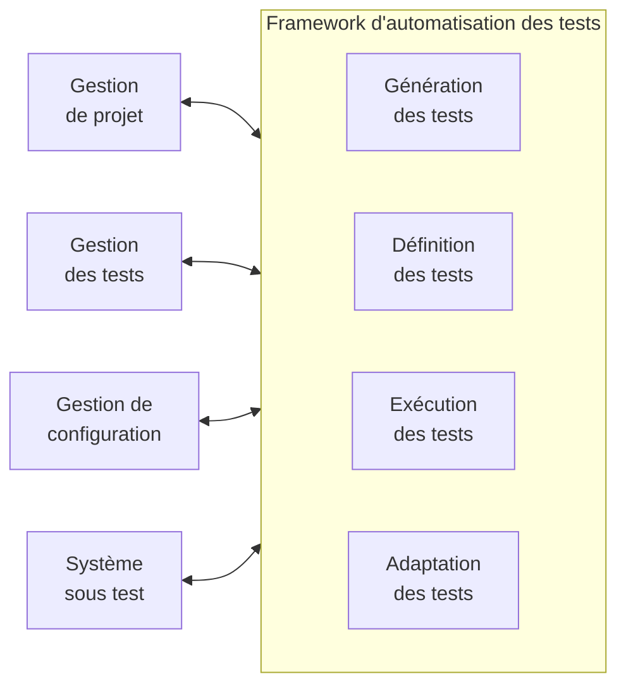
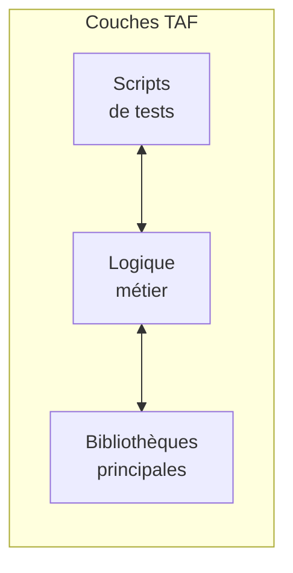
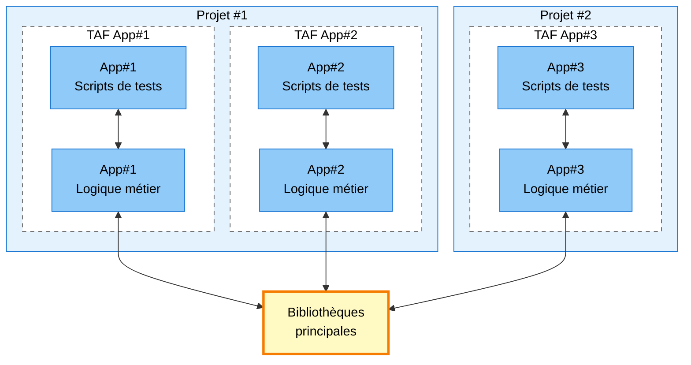
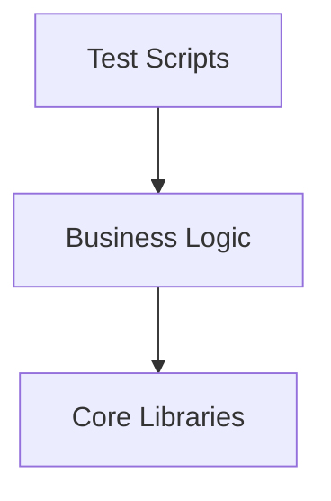
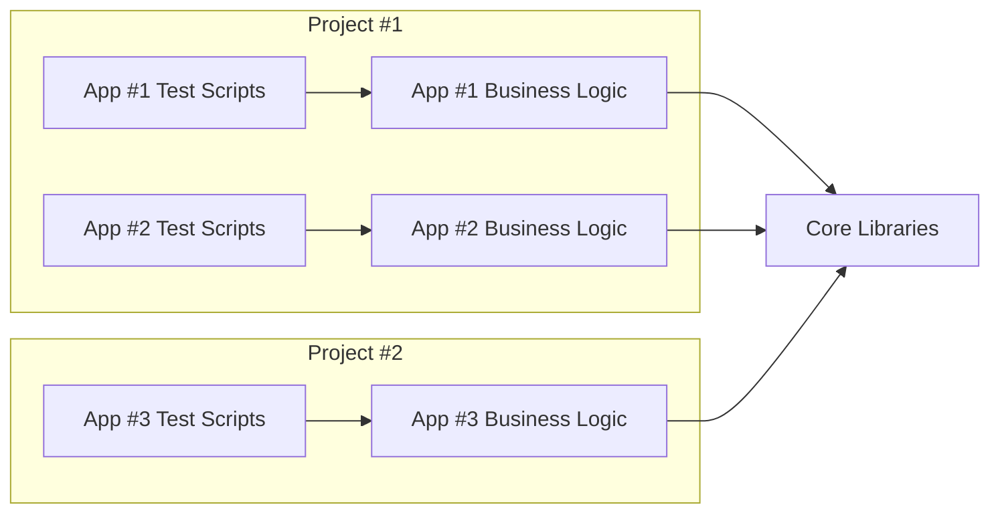

# Syllabus

## Chapitre 3 : Architecture d'Automatisation des tests (210 minutes - K3)

### Mots clés

Développement piloté par les comportements, capture/rejeux, tests génériques d'Automatisation des tests, architecture d'Automatisation des tests, tests pilotés par les mots-clés, scripting linéaire, tests basés sur des modèles, scripting structuré, couche d'adaptation des tests, architecture d'Automatisation des tests, harnais de tests, test piloté par les données, étape de test, solution d'Automatisation des tests, développement piloté par les tests, script de test

---

### Objectifs d'apprentissage

#### 3.1 Concepts de conception utilisés dans l'Automatisation des tests

- **TAE-3.1.1 (K2)** : Expliquer les principales fonctionnalités d'une architecture d'Automatisation des tests.
- **TAE-3.1.2 (K2)** : Expliquer comment concevoir une solution d'Automatisation des tests.
- **TAE-3.1.3 (K3)** : Appliquer la stratification des frameworks d'Automatisation des tests.
- **TAE-3.1.4 (K3)** : Appliquer différentes approches pour l'automatisation des cas de test.
- **TAE-3.1.5 (K3)** : Appliquer les principes et les modèles de conception dans l'Automatisation des tests.

---

## 3.1 Concepts de conception exploités dans l'automatisation des tests

### TAE-3.1.1 (K2) : Expliquer les principales capacités d'une architecture d'Automatisation des tests

#### Architecture générique d'Automatisation des tests (gTAA)

La gTAA est un concept de conception de haut niveau qui fournit une vue abstraite de la communication entre l'Automatisation des tests et les systèmes auxquels l'Automatisation des tests est connectée : le SUT, la gestion de projet, la gestion des tests et la gestion de la configuration. Il fournit également les capacités qu'il est nécessaire de couvrir lors de la conception d'une architecture d'Automatisation des tests (TAA).

**Figure 1 : diagramme gTAA**



Les interfaces de gTAA décrivent les éléments suivants :

- **Interface SUT** : Décrit la connectivité entre le SUT et le TAF (voir la section 3.1.3 concernant le framework d'Automatisation des tests).
- **Interface de gestion du projet** : Décrit l'avancement du développement de l'Automatisation des tests.
- **Interface de management des tests** : Décrit la cartographie des définitions de cas de test et des cas de test automatisés.
- **Interface de gestion de la configuration** : Décrit les pipelines CI/CD, les environnements et le testware.

#### Capacités offertes par les outils et bibliothèques d'Automatisation des tests

Les principales capacités d'Automatisation des tests doivent être identifiées et sélectionnées parmi les outils disponibles en fonction des exigences d'un projet donné.

**Génération de tests**

Soutient la conception automatisée des cas de tests basés sur des modèles de tests. Les tests basés sur des modèles peuvent être utilisés dans le processus de génération (voir le syllabus CT-MBT de l'ISTQB). La génération de tests est une capacité optionnelle.

**Définition des tests**

Soutient la définition et l'implémentation des cas de test et/ou des suites de tests, qui peuvent éventuellement être dérivés d'un modèle de test. Elle sépare la définition du test du SUT et/ou des outils de test. Elle contient les moyens de définir des tests de haut niveau et de bas niveau, qui sont traités dans les données de test, les cas de test et les composants de la bibliothèque de test ou des combinaisons de ceux-ci.

**Exécution des tests**

Soutient l'exécution du test et le logging des tests. Il fournit un outil d'exécution des tests pour exécuter automatiquement les tests sélectionnés, ainsi qu'un composant de logging des tests et de reporting des tests.

**Adaptation des tests**

Fournit la fonctionnalité nécessaire pour adapter les tests automatisés aux différents composants ou interfaces du SUT. Il fournit différents adaptateurs pour se connecter au SUT via des API, des protocoles et des services.

---

### TAE-3.1.2 (K2) : Expliquer comment concevoir une solution d'Automatisation des tests

Une solution d'Automatisation des tests (TAS) est définie par une compréhension des exigences fonctionnelles, non fonctionnelles et techniques du SUT, des outils existants ou requis qui sont nécessaires pour implémenter une solution. Une solution d'Automatisation des tests est implémentée avec des outils commerciaux ou open-source et peut nécessiter des adaptateurs supplémentaires spécifiques au SUT.

Le TAA définit la conception technique de l'ensemble du TAS. Elle doit aborder :

- La spécification des outils d'Automatisation des tests et des bibliothèques spécifiques aux outils.
- Le développement d'extensions et/ou de composants.
- L'identification des exigences en matière de connectivité et d'interface (par exemple, pare-feu, base de données, localisateurs de ressources uniformes (URL)/connexions, mocks/stubs, files d'attente de messages et protocoles).
- La connexion aux outils de gestion des tests et des défauts.
- L'utilisation d'un système de contrôle de version et de référentiels.

---

### TAE-3.1.3 (K3) : Appliquer une superposition dans les frameworks d'Automatisation des tests

#### Le framework d'Automatisation des tests (TAF)

Le TAF est la base d'un TAS. Il comprend souvent un harnais de test (également connu sous le nom de lanceur de test), ainsi que des bibliothèques de test, des scripts de test et des suites de tests.

#### Couches du TAF

Les couches du TAF définissent une frontière distincte de classes qui ont des objectifs similaires tels que les cas de test, le reporting des tests, le logging des tests, le cryptage et les harnais de test.

**Recommandation** : En introduisant une couche pour chaque objectif unique, la conception peut devenir compliquée. Il est donc recommandé de limiter le nombre de couches du TAF.

**Figure 2 : Couches du TAF**



#### Structure en couches

**Scripts de test**

L'objectif de cette couche est de fournir un référentiel de cas de test du SUT et des annotations de la suite de tests. Elle appelle les services de la couche logique métier, ce qui peut impliquer des étapes de test, des flux d'utilisateurs ou des appels d'API. Toutefois, aucun appel direct aux bibliothèques principales ne doit être effectué à partir des scripts de test.

**Logique métier**

Toutes les bibliothèques dépendantes du SUT sont stockées dans cette couche. Ces bibliothèques hériteront des fichiers de classe des bibliothèques principales ou utiliseront les façades fournies par celles-ci (voir la section 3.1.5 concernant l'héritage et les façades). La couche de logique métier est utilisée pour configurer le TAF afin qu'il s'exécute au regard du SUT et les configurations supplémentaires.

**Bibliothèques principales**

Toutes les bibliothèques indépendantes de tout SUT sont stockées dans cette couche. Ces bibliothèques principales peuvent être réutilisées dans n'importe quel type de projet partageant la même pile de développement.

#### Mise à l'échelle de l'Automatisation des tests

L'exemple suivant (figure 3) montre comment les bibliothèques principales fournissent une base réutilisable pour plusieurs TAF. Dans le projet #1, il y a deux TAFs construits au-dessus des bibliothèques principales, et un projet séparé utilise les bibliothèques principales déjà existantes pour construire son TAF afin de tester l'application #3. Un TAE construit les TAFs pour le projet #1, tandis qu'un second TAE construit le TAF pour le projet #2.

**Figure 3 : Application des bibliothèques principales à des TAFs multiples**



---

### TAE-3.1.4 (K3) : Appliquer différentes approches pour automatiser les cas de tests

Il existe plusieurs approches de développement que les équipes peuvent choisir pour produire des cas de tests automatisés. Il peut s'agir de langages de script interactifs ou de langages de programmation compilés. Les différentes approches offrent des avantages différents en matière d'automatisation et peuvent être exploitées dans des circonstances différentes.

**Note** : Bien que le développement piloté par les tests (TDD) et le développement piloté par le comportement (BDD) soient des méthodologies de développement, si elles sont suivies correctement, elles ont pour résultat le développement automatisé de cas de test.

---

#### Capture/rejeux

La capture/rejeux est une approche qui capture les interactions avec le SUT pendant qu'une séquence d'actions est exécutée manuellement. Ces outils produisent des scripts de test pendant la capture, et selon l'outil utilisé, le code d'Automatisation des tests peut être modifiable.

- **Automatisation no-code** : Outils qui n'exposent pas de code
- **Automatisation low-code** : Outils exposant du code

**Avantages**
- Initialement facile à mettre en place et à utiliser

**Inconvénients**
- Difficile à maintenir, à mettre à l'échelle et à faire évoluer.
- Le SUT doit être disponible lors de la capture d'un cas de test.
- Uniquement réalisable pour un périmètre restreint et un SUT qui change rarement.
- L'exécution du SUT capturé dépend fortement de la version du SUT à partir de laquelle la capture a été effectuée.
- Enregistrer chaque cas de test individuel au lieu de réutiliser les blocs de construction existants prend du temps.

---

#### Scripting linéaire

Le script linéaire est une activité de programmation qui ne nécessite pas de bibliothèques de test personnalisées réalisées par un TAE et qui est utilisée pour écrire et exécuter les scripts de test. Un TAE peut s'appuyer sur des scripts de test enregistrés par un outil de capture/rejeux, qu'il peut ensuite modifier.

**Avantages**
- Facile à mettre en place et à commencer à écrire des scripts de test.
- Par rapport à la capture/rejeux, les scripts de test peuvent être modifiés plus facilement.

**Inconvénients**
- Difficile d'assurer la maintenance, la mise à l'échelle et l'évolution.
- L'utilisateur final doit être disponible lors de la capture d'un cas de test.
- Uniquement réalisable pour un petit périmètre et un SUT qui change rarement.
- Par rapport à la capture/rejeux, certaines connaissances en programmation sont nécessaires.

---

#### Scripting structuré

Des bibliothèques de test sont introduites avec des éléments réutilisables, des étapes de test et/ou des parcours utilisateurs. Des connaissances en programmation sont nécessaires pour la création et la maintenance des scripts de test dans cette approche.

**Avantages**
- Facilité de maintenabilité, de mise à l'échelle, de portage, d'adaptation et d'évolution.
- La logique métier peut être séparée des scripts de test.

**Inconvénients**
- Des connaissances en programmation sont nécessaires.
- L'investissement initial dans le développement du TAF et la définition du testware prend du temps.

---

#### Développement piloté par les tests (TDD)

Les cas de test sont définis dans le cadre du processus de développement avant qu'une nouvelle caractéristique du SUT ne soit implémentée. L'approche de développement piloté par les tests consiste à tester, coder et refactoriser, aussi connu sous le nom de "red, green, and refactor" (rouge, vert et refactoriser).

**Cycle TDD** :
1. Un développeur identifie et crée un cas de test qui échouera (rouge).
2. Il développe ensuite une fonctionnalité qui satisfera le cas de test (vert).
3. Le code est ensuite refactorisé afin de l'optimiser et de respecter les principes du code propre.
4. Le processus se poursuit avec le test suivant et l'incrément de fonctionnalité suivant.

**Avantages**
- Simplifie le développement des cas de test au niveau des composants.
- Améliore la qualité et la structure du code.
- Améliore la testabilité.
- Facilite l'obtention de la couverture de code souhaitée.
- Réduit la propagation des défauts à des niveaux de test plus élevés.
- Améliore la communication entre les développeurs, les représentants des métiers et les testeurs.
- Les User Stories qui ne sont pas vérifiées à l'aide des tests de l'interface graphique et des tests de l'API peuvent rapidement atteindre les critères de sortie en suivant la méthode TDD.

**Inconvénients**
- Au départ, il faut plus de temps pour s'habituer au TDD.
- Ne pas suivre correctement le TDD peut entraîner une fausse confiance dans la qualité du code.

---

#### Tests pilotés par les données (DDT)

Les tests pilotés par les données (DDT) s'appuient sur l'approche du scripting structuré. Les scripts de test sont fournis avec des données de test (par exemple, des fichiers .csv, .xlsx et des vidages de base de données). Cela permet d'exécuter plusieurs fois les mêmes scripts de test avec des données de test différentes.

**Avantages**
- Permet d'étendre rapidement et facilement les cas de test grâce à des flux de données.
- Le coût de l'ajout de nouveaux tests automatisés peut être considérablement réduit.
- Les analystes de test peuvent spécifier des tests automatisés en alimentant un ou plusieurs fichiers de données de test qui décrivent les tests. Les analystes de test disposent ainsi d'une plus grande liberté pour spécifier des tests automatisés en dépendant moins des analystes techniques de test.

**Inconvénients**
- Une bonne gestion des données de test peut s'avérer nécessaire.

---

#### Tests pilotés par les mots-clés (KDT)

Les tests pilotés par les mots-clés (KDT) sont une liste ou un tableau d'étapes de test dérivées de mots-clés et des données de test sur lesquelles les mots-clés opèrent. Les mots-clés sont définis du point de vue de l'utilisateur. Cette technique est souvent basée sur le DDT.

**Avantages**
- Les analystes de test et les analystes métier peuvent être impliqués dans la création de cas de test automatisés en suivant l'approche du KDT.
- Les KDT peuvent également être utilisés pour les tests manuels indépendamment de l'Automatisation des tests (voir la norme ISO/IEC/IEEE 29119-5 concernant les tests pilotés par les mots-clés).

**Inconvénients**
- L'implémentation et la maintenabilité des mots-clés est une tâche complexe que les TAE doivent couvrir, ce qui peut devenir un défi lorsque le périmètre s'élargit.
- Cela engendre un effort considérable pour les systèmes de petite taille.

---

#### Développement piloté par le comportement (BDD)

BDD exploite un format de langage naturel (c.-à-d., étant donné, quand, alors (given, when, then)) pour formuler des critères d'acceptation qui peuvent être utilisés comme cas de tests automatisés et stockés dans des fichiers de caractéristiques. Un outil BDD peut alors comprendre le langage et exécuter les cas de test.

**Avantages**
- Améliore la communication entre les développeurs, les représentants du métier et les testeurs.
- Les scénarios BDD automatisés font office de cas de tests et assurent la couverture des spécifications.
- BDD peut être mis à profit pour produire plusieurs types de tests à différents niveaux de la pyramide des tests.

**Inconvénients**
- Des cas de test supplémentaires, généralement des conditions de test négatives et des cas limites doivent encore être définis par l'équipe, typiquement par un analyste de test ou un TAE.
- De nombreuses équipes confondent le BDD avec un simple moyen d'écrire des cas de test dans un langage naturel, et n'impliquent pas les représentants des métiers et les développeurs dans l'ensemble de l'approche.
- L'implémentation et la maintenance des étapes de test en langage naturel est une tâche complexe à couvrir pour les TAE.
- Des étapes de test trop complexes transformeront le débogage en une activité difficile et coûteuse.

---

### TAE-3.1.5 (K3) : Appliquer les principes et les canevas de conception à l'Automatisation des tests

L'Automatisation des tests est une activité de développement logiciel. Par conséquent, les principes et les canevas de conception sont tout aussi importants pour un TAE que pour un développeur de logiciels.

#### Principes de programmation orientée objet

Il existe quatre grands principes de programmation orientée objet : l'encapsulation, l'abstraction, l'héritage et le polymorphisme.

#### Principes SOLID

Il s'agit d'un acronyme de la **r**e**S**ponsabilité unique, de l'**O**uverture-fermeture, de la substitution de **L**iskov, de la substitution d'**I**nterface et de l'inversion de **D**épendance (de l'anglais Single responsibility, Open-closed, Liskov substitution, Interface substitution and Dependency inversion). Ces principes améliorent la lisibilité du code, la maintenabilité et l'évolutivité.

#### Canevas de conception

Parmi les nombreux canevas de conception, trois sont plus importants pour les TAE.

**Modèle de façade**

Le modèle de façade masque les détails de l'implémentation pour n'exposer que ce que les testeurs doivent créer dans les cas de test.

**Canevas de singleton**

Le canevas de singleton est souvent utilisé pour s'assurer qu'il n'y a qu'un seul pilote qui communique avec le SUT.

**Modèle objet page (Page Object Model)**

Dans le modèle objet page, un fichier de classe est créé et appelé modèle de page. Chaque fois que la structure du SUT change, le TAE devra faire des mises à jour à un seul endroit, le localisateur à l'intérieur d'un modèle de page, au lieu de mettre à jour les localisateurs dans chaque cas de test.

**Canevas de modèle de flux (Flow Model Pattern)**

Le canevas de modèle de flux est une extension du modèle d'objet de page. Il introduit une façade supplémentaire au-dessus des modèles d'objets de page, qui stocke toutes les actions de l'utilisateur qui interagissent avec les objets de page. En introduisant une conception à double façade, le canevas de modèle de flux améliore l'abstraction et la maintenabilité, car les étapes de test peuvent être réutilisées dans plusieurs scripts de test.

---

*Annotations*

- **Modèle de façade** : Exposer des méthodes métier (ex. « se connecter », « ajouter au panier ») au lieu des éléments de page ; les tests restent lisibles et moins sensibles aux changements internes.
- **Canevas de singleton** : Une seule instance du driver (ex. WebDriver) pour tout le framework ; en parallèle, utiliser un singleton par thread (Thread-Local).
- **Modèle objet page** : Une classe par page qui regroupe localisateurs et actions ; si l'UI change, on ne modifie que cette classe.
- **Modèle de flux** : Couche au-dessus des Page Objects qui regroupe des enchaînements métier (ex. « parcours achat complet ») ; double façade = Page Objects + couche Flux.
- **Modèle vs canevas** : Dans le syllabus, « canevas » = design pattern ; « modèle » = abstraction ou reprise du terme anglais *model*. Tous sont des patterns à appliquer en automatisation.

---

# Notes

## Test Automation Architecture - Introduction

This chapter explore archtecture concepts of Test Automation Implementation, such as:

- gTAA (Generic Test Automation Architecture)
*and major capabilities. Provide a high level framework on how test automation communicate with other systems*
- TAS (Test Automation Solution) Design
*Using on functional, non-functional and technical requirements*
- TAF (Test Automation Framework) Layering
*To organize code into layers, each with a specific responsibility (test scripts, business logic, libraries)*
- Approaches to Automate Test Cases
*From capture/replay, Linear Scripting to Structured Scripting, DDT (Data Driven Testing) and BDD (Behavior Driven Development).*
- Design principles and patterns
*to professionnalize code writing*

## Explain the Major Capabilities in a Test Automation Architecture

### gTAA (Generic Test Automation Architecture)

gTAA (Generic Test Automation Architecture) is a high level design concept that gives an abstract view of how test automation cummunicates with other systems. (It shows the big picture of how everything is connected together)

Ex. Designing a TAA (Test Automation Architecture) for a banking application. It helps to understand how automation interact with the banking application, but also test management system, CICD pipppeling and our configuration management system. It helps to visualize those connections and plan accordingly.

**Figure 1 : diagramme gTAA**


gTAA represents multiple interfaces interacting with the test automation framework.

### The interfaces of gTAA

- SUT interface : It connects the framework to the system being tested (ex. web elements, APIs). ex. for banking application, this interface define how automation interact with web elements of a web application (frotn end), and API call (backend).
- Project management interface : Tracks automation progress (ex. Jira integration)
- Test mangaement interface : Maps manual test cases to automated tests. It helps to maintain relationships between initial manual test cases  after automation is implemented.
- Configuration management interface : Manage CI/CD pipelines, environements, and versioning. It helps to manage versioning and deployment for automation code. Ex. project where test management interface is not properly defined. Tracing automated tests with manual test cases become difficult, wasting weeks to reconcile the information.

### Layers of the TAF (Test Automation Framework)

Capabilities provided by test automation tools and libraries:

- Test generation capabilty : Automatically designs test cases from models (e.g., model-based testing > approach modeling the system behavior to generate automatically test cases from the model with a tool. like asking a computer to find all the path for a given map. ex. telecommunication project where hundreds of test cases where generated from a state model of how calls should be routed for a complex call routing system, saving weeks of work and covering all possible scenarios. test generation is optional because all project does not require this level of sophistication)
- Test definition capability : Support définition and implementation of test cases and/or test suites (ex. separation of test definition and SUT/tools). this capabilities separates the definition from the SUTand/or test tools (define where we want to test). It separates high level test (ex. login, logout) from low level test (ex. enter username, password, etc.). It creates the blueprint for automation (its like a recipe to follow to create the automated test). ex. healthcare project, comprehensive test definition layers allowing BA (business analyst) to define tests in excel using keywork driven approach. Which are Test automation framework translatable into executable code. this seperation allow non technical team member to contribute to the test definition process.
- Test execution capability : It provides execution tools to support running test and record results, such as scheduling running tests at a specific time, running parallel tests to save time, handling test dependencies to execute specific tests first, managing test data, reporting test results in a meaningful way, etc. ex. e-commerce project, where test capability of the tool allows runing 500+ tests nightly, in 2 hrs, by executing in parallel multiple tests accros multiple browsers and environments.
- Test adaptation capability : Adapt tests to different components/interfaces of the SUT (ex. adapters for different APIs, protocols, services). ex. SUT with both a web interface and a mobile app, test adpatation layer will provide component to interact with both interfaces, using different tools or libraries for each. Is the difference between a brittle solution breaking at every UI change and a robust solution withstanding frequent changes to the SUT. ex. Healthcare project, test adaptation layer abstracting the mean interacting with the system, allowing to only update the adaptation layer after a complete UI redesign, while test definition remained unchanged.

Ex. Building a TAS (Test Automation Solution) for a online banking application:

- Test Generation :  use of a model-based testing tool to generate test cases for complex workflows (ex. funds transfers between accounts).
- Test Definition : Define test cases in a structure way using keyword driven or date driven approach, specifying what needs to be tested.
- Test Execution : Setting up framework to execute tests automatically, as part of the nightly build process and generate report.
- Test Adaptation : Adapters creation allowing tests to interact with web interface, mobile app and APIs of the banking application.

Implemanting this capabilities creates a comprehensive TAS, able to test all aspects of the banking application.

### Conclusion

1. gTAA provides abstract view of automation communication between automation and connected systems.
2. Four key interfaces:
    - SUT interface
    - Project management interface
    - Test management interface
    - Configuration management interface
3. Core capabilities:
    - Test generation
    - Test definition
    - Test execution
    - Test adaptation

Understanding theses capabilities is crucial for designing effective TAS, able to scale with the project, and adapt to changes in the SUT.

## Explain How to Design a Test Automation Solution

### What is a TAS (Test Automation Solution)?

is the complete package/ everything you need for automating testing activities (beyond just tools/scripts) and define by 3 types of requirements:
1. Functional requirements of SUT
2. Non-functional requirements of SUT
3. Technical requirements

Ex. healthcare application, 
- functional requirements are like "users must be able to schedule appointment" and "doctores must be able to view patient records""
- non-functionnal requirements are like "security : must be compliant with HIPAA" and " performance : must handle 10 000 concurrent users"
- technical requirements are like " compatibility : support specific browsers and operating systems"

### Imptementing a TAS

- Tool Options :
  - Commercial tools (pâid)
  - Open-source tools (free)
  - Combination of both (most common - no single tool can cover all testing activities needs)

Ex. healcare project, used 2 tools : Tricentis Tosca (UI testing - strong support for healtcare industry regulations), Jmeter (performance testing - good at simulating heavy users loads)

Note: Always need to develop some custom components or adapters specific to your SUT. (every application has its unique characteristics. offshell tools won't perfectly addres all your needs)

### Role of TAA (test automation architecture)

Defines the technical design for the automation solution (like blueprint/master plan for autoimation efforts).

TAA must address the following key aspects:

- Selecting tools/libraries
- Developing plugins/components
- Identifying connectivity/interfaces requirements
- Connecting to test/defect management tools
- Utilizing version control

#### Selecting tools/libraries

Most critical decision. 

Ex. A project, tool selected based on team familiarity, tool was not adapted for API testing representing a major part of the testing effort. ended up by switching to another tool mid project, costing a lot of time and effort.

When selecting, consider:

- Application type (web, mobile, API, etc.)
- Testing needs (UI, API, performance, security, etc.)
- Team skills
- Budget
- Integration capabilities

Ex. For testing React frontend and REST API, you may select:

- Selenium and RestAssured, if the team is familiar with Java
- Cypress and Postman, if the team is familiar with Javascript

#### Developing plugins/components

Project may require to develop custom plugins/components to extend the tool functionnality and capabilities to cover specific SUT needs. pretty common, no off the shelf solution can cover all specific needs of SUT.

Ex. Ecommerce project, application had unique checkout process, selected testing tool unable to properly interect with those process, was forced to develop a custom component understanding the specific dom structure of the checkout page to reliably interact with.

### Identifying connectivity/interfaces requirements*

often overlooked until it's too late. have too identify all connectivity and interfaces requirements from the get go for TAS

Includes:

- Firewall configurations (did testing require access system accross firewall?)
- Database connections (does automation need to verify data in database?)
- URL/endpoints (what endpoints does automation need to access?)
- Mocks/stubs (Do you need to simulate components unavailable ?)
- Message queues (is system using asynchronous messaging ?)
- Protocols (What communication protocols does SUT use ?)

Ex. setting up TAF (Test Automation Framework), some of the connections were blocked by firewall, had to redesign part of the TAS to comply with customer security constraints.

### Connecting to test/defect management tools

TAS doesn't exist in isolation, have to connect to test management (TestRail) and defect management (Jira) tools.

Ex. On test failures, auto-create jira tickets with screenshots/logs AND/OR update test cases status in TestRail. (save time and increase testing reliability)

### Utilizing version control

Have to consider how manage automation code (like development), which implies selecting:

- version control system (Git, SVN, etc.)
- organized repository structure
Establishing branching strategy (feature, release, hotfix)
defining processes for code reviews, merges, and releases

EX. Project where repository structure was badly planned, ended up with unwieldy monolithic repository, problem increase as the project grew, had to refactor into multiple repositories organized by test level, unit, API and UI.

### Real world example

Ecommerce website automation:
- Requirements:
  - Functional : Browse products, checkout
  - Non-functional : Holiday traffic, <2sec load time
  - Technical : Chrome/Firefox/Safari, Mobile
- Tools :
  - Selenium webdriver (UI testing)
  - Jmeter (performance testing)
  - RestAssured (API testing)
  - Browserstack (cross browser testing)
- Custom components :
  - Shopping cart wrapper
  - Custom reporting (aggregate result from different test type)
- Connectivity requirements :
  - DB access (verify order placement)
  - Mock payment gateway (checkout testing)
  - API endpoint (product catalog testing)
- Tool integration : 
  - Jira (tickets manager to manage defects)
  - TestRail (test manager to manage test cases)
- Version control :
  - Git (reposity organized by test type)
  - Jeckins (CI/CD pipeline for continuous integration)
  - Docker (create controled environments)

### Common pitfalls to avoid

1. Tool first approach - selection based on tool usage rather than testing needs
2. Ignoring maintanability - Bad TAS architecture planning making it unmaintainable and hard to scale
3. Insufficient abstraction - Granular tests creation, limiting test reuse and maintanability. break with every UI change..
4. Neglecting reporting - minimal investment limiting repprting capabilities and increasing difficilty to interpret test results.
5. Siloed approach - TAS development not integrated with development process/ SDLC. 

### Conclusion

TAS design is more than selecting tools and writing scripts. It requires :

* Understanding SUT requirements
* Right mix of tools + custom components
* Comprehenbsive connectivity planning
* Integration with testing/dev ecosystem
* Proper code management

Test Automation is a journey, not a destination (evolve with the application, emergence of new technic, etc.)

## Apply Layering of Test Automation Frameworks

### What is a TAF (Test Automation Framework)?

TAF (Test Automation Framework) is the frame of a TAS (Test Automation Solution). It's like a house's bleuprint determining the placement and the function of each room. It includes :

- Test harness/runner -is the component executing the tests (like the conductor of an orchestra telling when to start and coordinating everything)
- Test libraries - are the collection of reusable code, that help to perform common actions of the tests (ex. fill a field, click a button, etc.). You may have several libraries to handle different types of actions, like interacting with a database, or for handling complex UI components.
- Test scripts -  are the automated tests (steps-by-steps instructions  verifying the application works as expected)
- test suites - are the collection of test scripts, that are runned together.

Layering avoid monolithic test script (ex 2000 line script), promoting maintanability and reusability of test code.

### The Three Main Layters
#### TAF layers



Layers are distinct boprders for code with similar purposes (like organizing a kitchen where plates, glasses and ustensiles are stored separately). The goal is to organize test automation code by similar functions to improve maintainability and reusability of code. The industry standard is to use 3 main layers (Keep it simple), which are:

- Test scripts layer - Sit at the top of the framework. Focus on WHAT to test. its purpose is to provide a repository of SUT test cases and organize them into test suites. It contains test scripts verifying specific functionnality of the application. (ex. testing ecommerci site, test script for longin functionnality, product search, adding items to cart, check out process, etc.). Must call the services of the business logic layer to perform the tests, never the core libraries layer.

```python
def test_valid_login():
  # This calls methods from business logic layer
  login_page.enter_username("test@example.com")
  login_page.enter_password("password")
  login_page.click_login_button()
  
  # Verify the result
  assert dashboard_page.is_displayed(), "Dashboiard should be displayed after login"
```

- Business logic layer - Sit at the middle of the framework. Focus on HOW to test for the specific SUT. Contains all the librairies specific to the application, which inherited or use the core libraries, and are customized to the SUT. Layer also used to set up  the TAF (Test Automation Framework) under specific SUT and handle specific configurations.

```python
class LoginPage(BasePage): # Inherits from a class in Core Libraries.
  def enter_username(self, username):
    self.find_element(By.ID, "username_field").send_keys(username)

  def enter_password(self, password):
    self.find_element(By.ID, "password_field").send_keys(password)

  def click_login_button(self):
    self.find_element(By.ID, "login_button").click()
```

- Core libraries layer - Sit at the base of the framework. contains all the librtairies independant/non-specific to any SUT. are the generic reusable component useable in any project with the same technology stack ( SUT-agnostic tools. ex. Webdriver, API clients.). May ave several specific libraries for specific uses and needs (interacting with web browser, making api calls, working with database, or logging test results, etc.).

```python
class BasePage:
  def __init__(self, driver):
    self.driver = driver

  def find_element(self, by, value):
    return self.driver.find_element(by, value)

  def waint_for_element(self, by, value, timeout=10):
    # implement wait a wait logic
    pass
```

### How these layers interact

- test scrpts layer define WHAT to test (login process)
- business logic layer define HOW to test (enter username, password, click login button)
- core libraries layer provide the tools to perform the actions (find element, enter text, click button, etc.)

this approach Separate responsabilities, make code more maintainable and flexible.
Ex. ID username change, ojnly business logic must be updated. Test scripts and core libraries remain unchanged.

### Scaling test automation



Core libraries enable reuse accross projets (ex. new project, instead of starting from scratch, they leverage the same core libraries).

Ex. Financial services company, centralize a test engineer team for all the organization maintaining a core librairy, each product team build specific business logic and test scripts on top of these core libraries. Allow to get up and running test automation much faster for new project.

### Real World Example : E-commerce testing

Building TAF for e-commerce website:

1) Scripting layer with test cases such as:

  - Test_search_functionality,
  - Test_add_to_cart,
  - Test_checkout_process,
  - Test_account_creation.

2) Business logic layer have classes specific to SUT:

- HomePage with methods such as :
  - search_for_product,
  - navigate_to_category,
  - etc.
- ProductPage with methods such as :
  - add_to_cart,
  - select_size,
  - etc.
- CartPage with methods such as :
  - Proceed_to_checkout,
  - Update_quantity,
  - etc.
- CheckoutPage with methods such as :
  - enter_shipping_info,
  - enter_payment_info,
  - etc.
  
3) Core libraries layer includes:

  - A webdriver wrappers handling browser initialization, navigation, finding elements, etc.
  - A REST client for API testing.
  - A database connector for verifying data.
  - A Logging utiliy
  - A reporting utility

### Benefits of layering

- Maintainability : updates usually limited to one layer
- Reusability : Cora libraries shared accross projects
- Scalabiltiy : Easy to add new test scripts
- Readability : Test scripts focus on business logic
- Division of labor : Technical vs domain experts work on different layers.

### Challenges and best practices

#### Challenges

- Initial investment : higher upfront cost in time and money, but higher maintenability and scalability in the long term.
- Learning curve : higher complexity as team member have to understand layering concepts, and follow the patterns.
- Over-engineering : risk of creating too many layers or abstractions.

#### Best practices

- Start simple : Start small with the 3 layers discussed, and add more layers as needed.
- Document well : Assure team understand the purpose of each layer, and how they interact with each other.
- Use design patterns : such as Page Object Model, Work well with layered approach.
- Code reviews : Ensure layering principles are followed correctly.

### Conclusion

1. Layering creates maintainable, reusable, and scalable automation.
2. 3 layers : Test scripts (what), Business logic (how), Core libraries (tools).
3. Saves long-term time despite upfront investment.

## Apply Different Approaches to Automate Test Cases


## Object Oriented Programming Principles


## Solid Principles


## Design Patterns


## Test Automation Architecture Q&A


