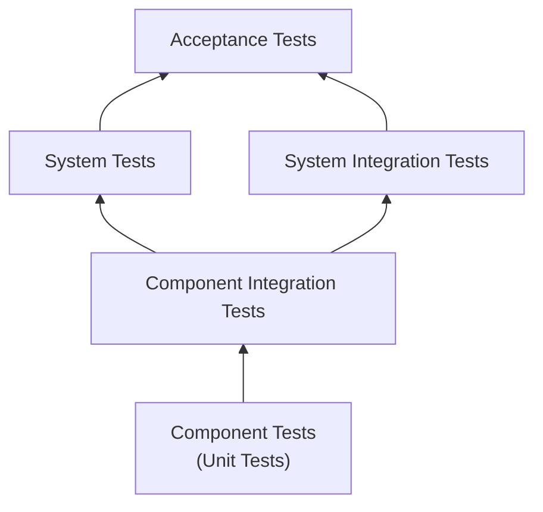
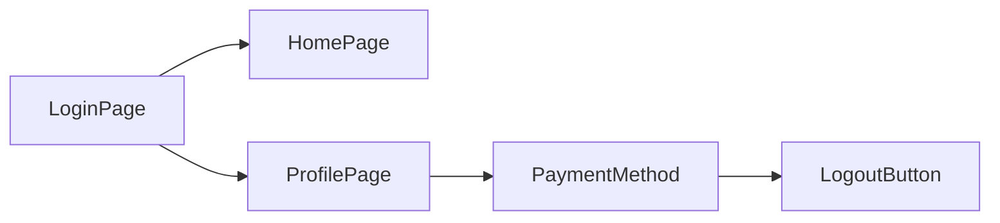
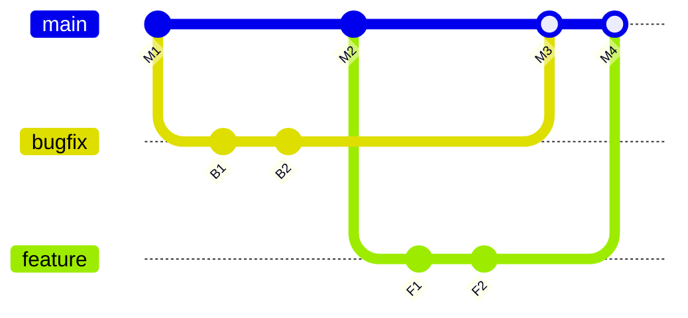

# Synthesis

## Test Automation Implementation - Introduction

This chapter explores how to put the test automation architecture into practice, such as:

- Pilot and deployment (TAE-4.1.1)
*Guidelines to run a short pilot (languages, tools, test levels, selected cases, development approach, CI/CD, team/licensing) and decide whether to scale*
- Deployment risks and mitigation (TAE-4.2.1)
*Deployment risk problems (communication, environment, design/capacity, information) and how to manage them — so quality gates stay reliable*
- TAS maintainability (TAE-4.3.1)
*Factors that keep the TAS working as the SUT evolves: clean code,  design patterns, static analysis, branching — a pilot evaluation criterion and a long-term investment*

The three themes form a sequence: the pilot (4.1) reveals deployment risks (4.2) and tests maintainability (4.3) before scaling.

## TAE-4.1.1 (K3) : Apply Guidelines that Support Effective Test Automation Pilot and Deployment Activities

### What is a test automation pilot?

A small-scale implementation of the automation strategy — a test drive before full deployment. It does not take long, but it can significantly change the project's direction.

Define the validation scope first (SUT + project requirements).

Ex. Healthcare application: two-week pilot showed the chosen tool could not meet security requirements → months of wasted effort avoided.

### Guidelines to set up the pilot

Evaluate these five points to define an initial approach:

- **Programming language(s)** — match the development team's expertise so developers can contribute. Ex. Python chosen while the SUT was Java → more time teaching Python than automating.
- **Tools** (COTS / open-source) — match the SUT, not marketing. Web: Selenium, Cypress, Playwright. API: Postman, RestAssured, Karate. Mobile: Appium, XCUITest, Espresso. Ex. Record-and-playback commercial tool looked easy; after six months it could not handle dynamic elements → restart.
- **Test levels to cover** — not all levels need automation at once. Start with the longest manual tests, or with component tests for faster developer feedback.



Dotted triangle on the slide = test pyramid (more effort at lower levels).

- **Test cases selected** — a representative mix, not only easy cases: happy paths, complex multi-step flows, at least one edge/negative case. Ex. Banking pilot: 10 cases (login, simple transfer, multi-currency transfer, error scenarios).
- **Development approach** — linear (quick, hard to maintain), structured (reusable functions), DDT (data separated from logic), KDT (keywords for actions), BDD (natural language; good for stakeholders, more setup).

### Prototypes

From the five points above, create several prototypes of the same tests, then pick a path.

Ex. E-commerce: same five tests in (1) Selenium + Java + POM, (2) Cypress + TypeScript, (3) Cucumber + Selenium (BDD). Compared on: execution speed, ease of writing, readability, stability, learning curve.

### Timeline and CI/CD

Define a calendar and check progress periodically to catch risks early. Typical duration: 2–4 weeks.

- Week 1 — setup and initial test cases
- Week 2 — expand coverage
- Week 3 — integrate with CI/CD (Continuous Integration / Continuous Delivery)
- Week 4 — evaluation and recommendation

Integrate the TAS into CI/CD during the pilot. This surfaces issues in the SUT, the TAS, or how tools work together.

Ex. Tests passed locally, failed randomly in the pipeline → CI server memory issue, found early.

As the suite grows, adjust how and when tests run:

- Smoke tests on every commit
- Critical regression nightly
- Full regression weekly

### Non-technical aspects

- **Team knowledge/experience** — skill gaps → training time
- **Team structure** — dedicated TAE vs. manual testers writing automation
- **Licensing / organizational rules** — open-source or cloud restrictions
- **Test plan** — what to automate (functional, performance, security) and which levels

### Evaluating the pilot

Once the pilot is complete, TAE and Test Managers decide success or failure — go, adjust, or stop — based on pilot outcomes against the guidelines set up front. Do not rush this step.

- **Tool / approach fit** — did they work for this SUT?
- **Create & maintain effort** — how hard was it to create and maintain the tests?
- **Result reliability** — reliable results, or many flaky tests?
- **Toolchain integration** — how well did it integrate with existing tools and processes?
- **Team learning curve** — what was the learning curve for the team?

| | Company A (success) | Company B (failure) |
|---|---|---|
| **Approach** | Clear guidelines; mix of simple and complex cases; 3 automation approaches compared; whole team in the evaluation | Rushed; skipped planning; tool chosen because competitors used it; only easy cases; no CI/CD during pilot |
| **Duration** | 4 weeks → solid automation direction | Drifted without a clear go/no-go |
| **Outcome** | 2 years later: 2000+ tests daily, ~10% maintenance overhead | 6 months later: hundreds of brittle failing tests nobody trusted → scrap and restart |

### Conclusion

1. A well-planned pilot is crucial — short, high impact on direction.
2.  Define guidelines (language, tools, test levels, selected cases, development approach), build competing prototypes with the same tests, then pick the path that wins on speed, readability, stability, and learning curve.
3. Integrate CI/CD early; adjust as the suite grows (smoke on commit, critical nightly, full weekly).
4. Evaluate technical *and* non-technical factors (skills, team structure, licenses, test plan).
5. The pilot's goal is to find the approach that fits *this* SUT, *this* team, and *this* organization.

## TAE-4.2.1 (K4) : Analyze Deployment Risks and Plan Mitigation Strategies for Test Automation

### Introduction

Deployment risks are often overlooked until too late — like leaving on a road trip without checking the car. Analyzing those risks and planning mitigation strategies is critical for a smooth test automation implementation.

Those problems occur whenever deploying across environments with different characteristics (connectivity, 
resources, configuration). TAE (Test Automation Engineers) must prepare for them so quality gates stay reliable.

Four risk types exist:

| Risk type | Gloss | Example |
|---|---|---|
| **Communication / access** | TAF cannot reach the SUT or a dependency (wrong interface, firewall, network) | Passed tests in dev fail due to corporate firewall blocking the database in test |
| **Environment / replicability** | Run conditions differ across machines or between runs (versions, uncontrolled updates) | Tests pass locally but fail in CI — different library versions; overnight OS update breaks the run |
| **Design / capacity** | Execution environment overloaded; tests not isolated (no harness/fixtures) | CI runs out of RAM under parallel UI tests; leftover data from test A makes test B fail randomly |
| **Information / diagnosis** | Too little or too much logging — hard to find the root cause | Only Info logs — failure with no clue; Debug shows the test clicked before the element loaded |

### 1. Communication / access

| Problem | Example | Mitigation |
|---|---|---|
| **Interfacing** | TAF uses Selenium WebDriver but a legacy Java applet cannot be driven | Define how TAF talks to SUT (driver, protocol) in architecture *before* packaging, logging, or test harness |
| **Firewall / network access** | Tests pass in dev; corporate firewall blocks the database in test | Open required firewall ports; run automated connectivity checks before the suite |
| **Connectivity / reliability** | SUT restarts mid-run or network drops between runner and SUT | Health checks before/during run; retry transient failures |
| **Mobile network coverage** | Device on weak Wi-Fi or in a dead spot — cannot reach SUT | Add access points near the lab; verify network reachability at start of run |

### 2. Environment / replicability

| Problem | Example | Mitigation |
|---|---|---|
| **Packaging** | Tests pass locally but fail in CI — different library versions on each machine | Bundle testware (JAR/NuGet/npm); store in a versioned Git repo; pin dependency versions with a package manager (Maven, npm, NuGet); run in a container (Docker) for the same runtime everywhere |
| **Updating** | CI agent or device OS updates overnight — tests break on the next run | Disable automatic updates; apply updates on a planned, controlled schedule |
| **Mobile device readiness** | Run starts on a device that is off, low on battery, or without the app installed | Charging station; check battery level before run; confirm app installation succeeded |

### 3. Design / capacity

| Problem | Example | Mitigation |
|---|---|---|
| **Resource utilization** | Parallel UI tests exhaust CI RAM; disk fills with logs and reports | Size CPU/RAM/disk for peak load; monitor usage; cap parallel threads |
| **Test structuring** | Tests share state or skip cleanup — order-dependent, flaky results | Use a test harness (JUnit, NUnit, Jest, pytest) with fixtures for setup/teardown; isolate tests per **FIRST** |

**FIRST** approach for fixtures:

- **F**ast — tests should run quickly
- **I**ndependent — tests should not depend on each other
- **R**epeatable — tests should yield the same results every time
- **S**elf-validating — tests should automatically determine pass or fail
- **T**imely — tests should be written at the right time (usually alongside the code they test)

### 4. Information / diagnosis

| Problem | Example | Mitigation |
|---|---|---|
| **Insufficient logging** | Test fails on click — only Info logs, no detail on element state | Enable Debug for investigation; log key actions and wait conditions |
| **Excessive logging** | Huge log file — real failure buried in Trace noise | Info for normal flow; reserve Trace for deep diagnosis only |

| Level | When to use |
|---|---|
| **Fatal** | Unrecoverable error — abort execution |
| **Error** | Condition failed — test fails |
| **Warning** | Unexpected but flow continues |
| **Info** | Normal flow (login, add to cart) |
| **Debug** | Investigate failures (element state, waits) |
| **Trace** | Full step-by-step detail — use sparingly |

Ex. Debug logging revealed the test interacted with an element before it was fully loaded → wait condition added.

### 5. Risk mitigation process

Applies to every category above:

1. **Identify** — list deployment risks for this context
2. **Assess** — rate likelihood and impact (high / medium / low)
3. **Prioritize** — high-likelihood + high-impact first
4. **Mitigate** — specific strategies per risk
5. **Monitor** — check mitigations work

| | Low impact | Medium impact | High impact |
|---|---|---|---|
| **High likelihood** | 3 | 4 | 5 |
| **Medium likelihood** | 2 | 3 | 4 |
| **Low likelihood** | 1 | 2 | 3 |

(5) Critical → (1) Low.

### 6. Integrated example — mobile lab

Several risk categories stack on one deployment: devices powered and charged (environment), on the network and able to reach the SUT (communication), OS updates controlled (environment), app install verified (environment / design).

| Problem | Example | Mitigation |
|---|---|---|
| **Device power / availability** | Run starts on a powered-off device or one at low battery | Charging station; check power and battery before run |
| **Weak Wi-Fi / dead spots** | Device loses connection mid-run in a coverage gap | Extra Wi-Fi access points; network check at start of run |
| **Unexpected OS updates** | Device updates overnight — tests fail next morning | Disable auto-updates; apply updates on a planned schedule |
| **Silent app install failures** | App seems installed but wrong version — tests fail with no clear cause | Verify app version and installation succeeded before starting tests |

### Conclusion

1. Four deployment risk problems: communication, environment, design/capacity, information.
2. Main means: design TAF–SUT interface first; then packaging, logging, harness/fixtures, update control.
3. Pilot must weigh expansion and maintainability — they affect the go/no-go.
4. Identify → assess → prioritize → mitigate → monitor.
5. Preparation is the key to successful deployment.

## TAE-4.3.1 (K2) : Explain Which Factors Support and Affect Test Automation Solution Maintainability

Maintainability is the ability to keep a system in working order over time.

Here, it is the ability to keep the TAS working as the SUT evolves (new features, UI changes, bug fixes). When maintainability is high, test updates stay quick and localized. When it is low, teams spend more time fixing tests than testing the product.

In practice, it depends on shared programming standards and team expectations among TAE. Creating tests is the start; keeping them up to date is ongoing work.

### What affects maintainability

| Problem | What it looks like | Consequence |
|---|---|---|
| **Hardcoding** | URLs, credentials, or test data embedded in code | One SUT change forces edits across many tests |
| **Inconsistent standards** | Mixed naming (`btnLogin` vs `login_button`, `test1`); no agreed folder layout | Hard to read, onboard, and debug |
| **Poor code hygiene** | Long multi-purpose methods; too many parameters; little logging | Failures hard to trace and fix |
| **Missing or misused patterns** | UI logic copied into every test; no page objects (TAE-3.1.5) | UI change forces edits across the whole suite |
| **Weak tooling / process** | No static analyzers or formatters; no branching strategy (everyone on `main`) | Defects found late; parallel changes break tests without warning |

### What supports it

Maintainability is supported by clean code principles, static analyzers, code formatters, and a clear version-control branching strategy.

#### Clean code principles

*(Robert C. Martin, Clean Code, 2008)*

| Principle | Implication | Impact |
|---|---|---|
| Meaningful naming | Use evocative names that clarify the role of classes, methods, and variables | Anyone can read intent without digging into the body |
| Logical project structure | Organize code in a shared, consistent folder layout | Any TAE can find tests and helpers quickly |
| Avoid hardcoding | Keep values out of test logic — use config, DDT, or constants | One change, one place to update |
| Few method parameters | Limit inputs per method | Easier to call, read, and reuse |
| Short, focused methods | Keep each method to one responsibility | Easier to understand, update, and reuse |
| Logging | Record key steps during execution | Failures point to the exact broken step |
| Design patterns | Apply proven structures when useful (TAE-3.1.5) — e.g. POM, Flow Model | UI/logic changes stay localized |
| Testability | Split responsibilities across layers | Parts can evolve independently |

##### Examples

**Meaningful naming**

| Obscure | Evocative |
|---|---|
| `t1()`, `e`, `btn1`, `r` | `userCanLogInWithValidCredentials()`, `loginButton`, `resultMessage` |

Ex. Project with ~200 tests named `test1`, `test2`, … — hard to read and maintain; slowed onboarding of new TAE. The team spent two weeks renaming methods before the suite became maintainable.

**Logical project structure** — Shared layout so anyone locates code without hunting:

```text
src/
├── main/java/com/company/
│   ├── pages/     # Page objects
│   ├── utils/     # Utilities
│   ├── data/      # Test data
│   └── config/    # Configuration
└── test/java/com/company/
    ├── smoke/
    ├── regression/
    └── e2e/
```

**Avoid hardcoding**

```java
driver.navigate().to("https://dev.mycompany.com/login");           // hardcoded — update every test
driver.navigate().to(Config.getBaseUrl() + "/login");              // config — one place
```

Prefer DDT (data from files/DB) and centralized constants. Ex. Hardcoded data in ~50 tests → days of manual updates when requirements changed.

**Short, focused methods**

| Hard to maintain | Focused |
|---|---|
| One 100-line `testUserRegistration()` doing form, submit, page check, and email | `fillRegistrationForm(); submitForm(); verifyConfirmationPage(); verifyConfirmationEmail();` |

**Logging** — Without logs, a failure gives only a stack trace. With step logs, the broken action is obvious:

```java
logger.info("Starting login test");
logger.debug("Clicking login button");
loginPage.clickLoginButton();
logger.info("Login successful");
```

**Design patterns** — Without POM, every test embeds locators; a UI change touches the whole suite. With POM, update a few page objects:



#### Static analyzers and formatters

| Practice | Implication | Impact |
|---|---|---|
| Static analyzers | Run automated checks on source code without executing it — Find unused variables, unclosed resources, null pointers, dead code | Defects found early; fewer latent bugs that make tests hard to maintain |
| Code formatters | Apply a shared style automatically (indent, spacing, layout) via the IDE or CI | Consistent readability across the suite; reviews focus on behavior, not formatting |

##### Examples

- Analyzer flags an unused locator variable or a resource never closed in a teardown — fix before the suite grows brittle.
- Formatter (IntelliJ, Eclipse, VS Code) aligns every commit to the same layout so new TAE read one style.

#### Version control and branching

| Practice | Implication | Impact |
|---|---|---|
| Version control | Keep the TAS under the same change history as the SUT | Trace who changed what; recover previous working versions |
| Branching strategy | Use separate branches for features, releases, and bugfixes | Branch content stays understandable; parallel work does not silently break `main` |

##### Examples

Without a strategy (everyone commits to `main`), tests break without warning. With reviews + branches, stability improves.

**GitHub Flow**: `main` always deployable → feature/bugfix branch → pull request → merge → deploy.



### A tale of two projects

Two similar e-commerce TAS at different companies — same domain, opposite choices, on a six months project:

| | Company A | Company B |
|---|---|---|
| **Approach** | Maintainability from day one: POM used consistently; short focused methods; property files (no hardcoding); comprehensive logging; clear branching + code reviews | Speed first: everything hardcoded; long complex methods; minimal logging; no page objects or other patterns; everyone on the same branch |
| **Outcome** | Suite still running smoothly; UI change → update a few page objects; back to green within hours | Suite falling apart; tests break constantly; more time fixing tests than testing new features; scrap and rebuild from scratch — months of work lost |

Lesson: investment in maintainability up front pays later.

### Practical tips

- **Conduct regular code reviews** — peers check that new/changed tests follow maintainability guidelines (naming, structure, no hardcoding)
- **Refactor regularly** — reserve time to improve existing code, not only to add new tests
- **Automate what you can** — run static analyzers and formatters (and linters where used) so style and common defects are enforced automatically
- **Document your approach** — describe TAS architecture, design patterns in use, and coding standards for the team
- **Train your team** — make sure every TAE understands why maintainability matters and how to write maintainable tests
- **Test your tests** — occasionally inject known bugs into the SUT; if the suite misses them, the tests are weaker than they look

### Conclusion

1. Maintainability = keeping the TAS working as the SUT changes. It is a team discipline: shared standards and expectations among TAE, applied from day one.
2. **Degrades it:** hardcoding; inconsistent standards; poor code hygiene; missing/misused patterns (TAE-3.1.5); weak tooling/process.
3. **Supports it:** clean code principles; static analyzers and formatters; version-control branching.
4. It is continuous effort — every SUT change may require test updates for the life of the suite.

