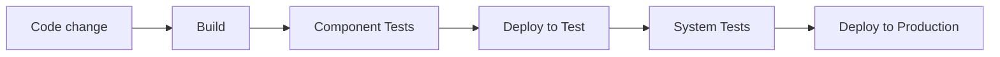
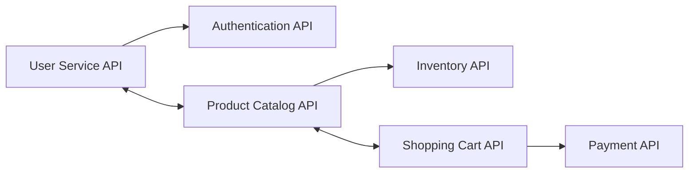
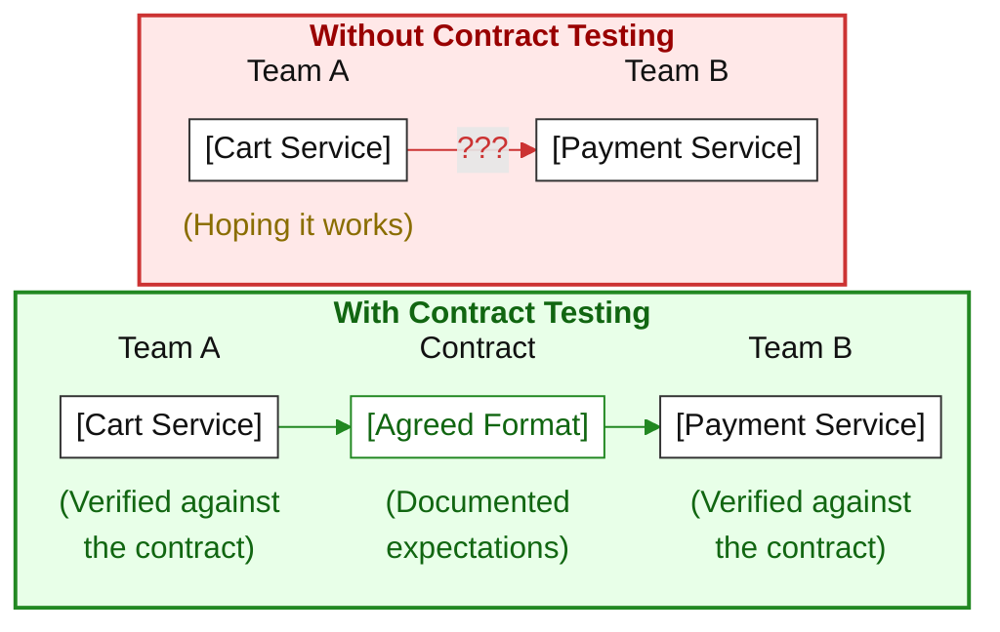

# Synthesis

## Test Automation Implementation and Deployment Strategies - Introduction

This chapter covers integration to CI/CD pipelines (syllabus §5.1), through three learning objectives:

- TAE-5.1.1 — Apply Test Automation at Different Test Levels within Pipelines
*How each test level is applied in CI/CD (or scheduled) pipelines: build vs post-deploy, gates vs informational runs, plus periodic suites*
- TAE-5.1.2 — Explain Configuration Management for Testware
*How to manage test environment configuration, test data, and suites across environments and SUT (System Under Test) releases: feature toggles or co-versioning with the SUT*
- TAE-5.1.3 — Explain Test Automation Dependencies for an API Infrastructure
*API connections and documentation as baselines for automation, plus contract testing (consumer- vs provider-driven) to catch integration defects early*

Sequence: apply automation at each test level within pipelines (5.1.1), explain testware configuration management (5.1.2), then explain API automation dependencies and contracts (5.1.3).

## TAE-5.1.1 (K3) : Apply Test Automation at Different Test Levels within Pipelines

One of the main advantages of test automation is that implemented tests can run unattended. That makes them ideal candidates for CI/CD (Continuous Integration / Continuous Delivery or Continuous Deployment) pipelines, or for dedicated pipelines that run tests on a schedule.

A pipeline is an assembly line for software: code enters one end, passes quality checkpoints (including automated tests), and exits ready to deploy if all checks pass.



Principle: place each test level where it gives the best quality-control / cost-and-time ratio. Use blocking quality gates where a failure must stop progression (merge or deployment). Put the fastest, most reliable tests early to catch problem quickly; then more comprehensive suites later to ensure overall quality.

### Test levels in the pipeline

| Level | Target | Function | Integration | Gate? |
|---|---|---|---|---|
| Configuration tests | TAF/TAS | Verify configuration is ready before use (pre-flight check): script paths are correct and referenced files exist. | TAF/TAS build phase (automation project build or push) | Yes (build gate) |
| Component tests | SUT | Verify one component in isolation (≈ unit tests). Ex.: date-picker accepts valid dates, rejects past dates. | SUT Continuous Integration (CI) build phase (push or pull request) | Yes (CI gate) |
| Component integration tests | SUT | Verify that low-level components work together. Ex.: after login, profile shows expected data. | Same SUT Continuous Integration (CI) build phase as component tests (run together) | Yes (CI gate) |
| System tests | SUT | Verify end-to-end behaviour from a user view. Ex.: register, cart, purchase. | Often Continuous Deployment, after deploy to non-production (e.g. test) | Choose (approaches below) |
| System integration tests | SUT | Ensure separately developed system components work together. Ex. : app and payment gateway. Not component integration. | Often Continuous Delivery pipeline (as quality gates); after deploy to non-production (e.g. staging) | Choose (approaches below) |

Many CI (Continuous Integration) systems split the pipeline into a build phase and a deploy phase. When the SUT CI build succeeds, the SUT is deployed to a non-production environment. Then system tests, system integration tests, and acceptance tests use one of the two approaches below.

### Two approaches

System tests, system integration tests, and acceptance tests can be integrated in two ways:

1. **As a quality gate, part of the deployment phase of the CI/CD pipeline**

   Run them after the component is deployed to the target environment of that phase (often test or staging). A failure can fail the deployment and trigger rollback. Downside: rerunning the tests usually requires a full redeploy. Flaky tests here cause unnecessary rollbacks; keep this set to critical paths.

2. **As a separate pipeline**

   Trigger them after a successful deployment to that environment. Useful when different suites or teams run specialized automation on each deploy. These tests are informational; they are not quality gates. Add simple automated smoke or deployment checks to confirm the SUT is up in that environment. They do not replace full functional coverage. Manual (or other) actions are needed to reverse a bad deployment.

In summary:

| | Deployment phase (approach 1) | Separate pipeline (approach 2) |
|---|---|---|
| Gate | Blocking (can rollback) | Informational (not a gate) |
| Rerun cost | Redeploy first | Rerun without redeploy |
| Best when | Must stop progression (critical paths) | Varied or specialized suites or teams after deploy |

Criteria for the choice:

- Approach 1: need automatic gate (fail / rollback) on critical paths.
- Approach 2: need informational post-deploy feedback, or varied / specialized suites per deploy.

### Other pipeline uses

Pipelines can also run functional or non-functional automation on a schedule or other trigger, without being the build or deploy gate:

- Periodic suites: for example a nightly full regression (long suites) that gives a morning quality picture.
- Non-functional tests (performance, security, accessibility): inside a Continuous Deployment pipeline or in a separate pipeline (for example weekly performance monitoring).

### Example: Real-world pipeline

Financial application with strict quality requirements:

1. Developer commits code
2. CI server runs the build
3. Component tests (~45 s)
4. Component integration tests (~1 min)
5. Deploy to test environment
6. System tests on critical paths (~3 min)
7. Deploy to staging
8. System integration tests on external integrations (~5 min)
9. Nightly full regression (~10 min)
10. Separate pipeline: performance tests every Sunday night (low usage)

Outcome: 
- ~85% of issues caught before production; 
- remaining ~15% mostly hard-to-anticipate edge cases.

### Conclusion

1. Automation particularly fits pipeline systems (CI/CD and scheduled pipelines), as suites can be triggered automatically and need no human attendance.
2. Placement: 
   - configuration tests gate the TAF/TAS build; 
   - component and component integration tests gate the SUT CI (Continuous Integration) build; 
   - system tests often sit in Continuous Deployment; 
   - system integration tests often sit in Continuous Delivery. 
   - Those post-build checks usually run after deploy to a non-production environment (test or staging), before production.
3. For system tests, system integration tests, and acceptance tests only: 
   - approach 1 is a deployment-phase quality gate (fail or rollback; critical paths); 
   - approach 2 is a separate informational pipeline after a successful deploy to that environment (optional smoke or deployment checks that the SUT is up, not full functional fitness).
4. For functional and non-functional suites (regression, performance, security, etc.): non-blocking dedicated pipelines can be configured, typically time-triggered (e.g. nightly/weekly) or another trigger, to monitor SUT quality.
5. Right tests in the right places: fast, reliable tests early for quick feedback; more comprehensive suites later for broader quality information.

## TAE-5.1.2 (K2) : Explain Configuration Management for Testware

Configuration management for testware tracks and controls what the automation needs to run across multiple test environments and SUT (System Under Test) versions. Poor management causes environment-specific failures (tests pass in development, fail in staging) that are hard to diagnose.

### Components of configuration management

Configuration management mainly covers three testware artifacts. They often change with the test environment (e.g. DEV, staging) and with the SUT version (e.g. 1.0.0, 1.1.0). Those artifacts are:

| Component | What it covers | Typical storage |
|---|---|---|
| Test environment configuration | Settings that differ by environment: URLs, credentials, database connections, feature flags | With the testware; or a shared repository / common library if several projects or TAFs (Test Automation Frameworks) use the same config |
| Test data | Data used to exercise the SUT; may depend on environment, SUT release, or feature set | Small project: within the TAF. Large project: in a TDM (Test Data Management) system. |
| Test suites / test cases | Suites grouped by purpose (e.g. smoke, regression, feature-specific), often run at different levels via different pipelines and environments | Folder structure in: same repo as the SUT; or a dedicated testware/automation repo. Often co-versioned with the SUT (same version tags). |

#### Test environment configuration

Same test code should run in several environments without edits. Example:

```json
{
  "development": {
    "baseUrl": "https://dev.myapp.com",
    "password": "dev_password",
    "featureFlags": { "newCheckout": true, "darkMode": true }
  },
  "staging": {
    "baseUrl": "https://staging.myapp.com",
    "password": "staging_password",
    "featureFlags": { "newCheckout": true, "darkMode": false }
  }
}
```

#### Test data

Data sets differ by environment (or by release / feature set). Prefer synthetic data when real data is sensitive.

```text
TestData/
├── Development/   (small set)
│   ├── Users.csv
│   └── Products.json
└── Staging/       (richer set for edge cases)
    ├── Users.csv
    └── Products.json
```

#### Test suites / test cases

Organize cases by purpose; run them via different pipelines / environments / levels.

```text
TestSuites/
├── Smoke/        (fast; often CI)
├── Regression/   (broader; e.g. nightly)
└── Feature/      (by area; when that area changes)
    ├── Checkout/
    └── UserProfile/
```

### Managing different SUT releases

Problem: each SUT release ships a different feature set, so you need matching tests for that release, without running tests for features that are not available yet (or without mixing testware meant for another version).

Two main options in the testware:

1. Feature toggle configuration

   A config says which features are on/off per release (or environment). The testware reads it and selects suites accordingly.

   ```json
   {
   "release-1.0": { "newCheckout": false, "guestCheckout": true, "savedCreditCards": false },
   "release-2.0": { "newCheckout": true, "guestCheckout": true, "savedCreditCards": true }
   }
   ```

   On release 1.0, do not run "savedCreditCards" tests (feature off). On release 2.0, those suites become eligible.

2. Co-version testware with the SUT

   Ship testware with the same version as the SUT so the pair always matches. Usually tags or branches:

   ```bash
   git tag v1.0.0   # SUT 1.0.0 + matching testware
   git tag v1.1.0
   git tag v2.0.0
   ```

   Useful for long-term support: to patch an old release, check out the matching testware tag and run its suites.

These options can be combined (e.g. co-version per major release, toggles for gradual rollouts inside a release).

### Example: healthcare portal

Environments: development, staging, production.

- Environment configuration: URLs, API endpoints, authentication per environment
- Test data: synthetic patient data; minimal in development, richer in staging
- Test suites: smoke on every commit, regression nightly, compliance before release
- Releases: same version tag for SUT and testware, plus feature toggles for gradual rollouts

Result: right tests in the right environments, ability to switch between releases, fewer environment-only surprises.

### Conclusion

1. Without configuration management, the same automation breaks across environments or SUT versions for unclear reasons.
2. Configuration management focus on three testware artifacts: environment configuration, test data, and test suites / test cases.
3. Keep config (and often data) with the testware, share it across TAFs/projects when needed, and use a TDM (Test Data Management) system when data gets large.
4. For different SUT releases, use feature toggles to pick the right suites, and/or co-version the testware with the SUT (tags or branches).
5. The same test code should run in the right environment and against the right release, without ad hoc edits.

## TAE-5.1.3 (K2) : Explain Test Automation Dependencies for an API Infrastructure

API testing is central in modern development and is often easier to automate than UI testing. To build an adequate API automation strategy, you need clear dependency information: mainly API connections and API documentation. Contract testing is a common best practice on top of that.

### What is an API

An API (Application Programming Interface) is how software systems talk to each other. Like a waiter: you place an order, the waiter takes it to the kitchen and brings the meal back; you never enter the kitchen yourself. One system sends a request; the API delivers it and returns a response.

Most modern APIs communicate over HTTP. Two common styles:

| | REST (Representational State Transfer) | GraphQL |
|---|---|---|
| How you ask | Several URLs (endpoints), one resource family per URL (e.g. `/users`, `/orders`) | Usually one URL; you send a query that lists the fields you want |
| How you act | Standard HTTP methods: GET (read), POST (create), PUT/PATCH (update), DELETE (remove) | Operations described in the query/mutation language, still over HTTP |
| What you get back | A fixed response shape defined by that endpoint | Only the fields requested in the query |
| Typical specificity | Simple, predictable resource model; client may need several calls to assemble a screen | Client controls the payload in one call; reduces fetching unused fields or missing ones |

In short: REST exposes many resource endpoints with fixed replies; GraphQL exposes a flexible query where the client shapes the reply.

### API connections

Connections describe business logic and relationships between APIs (who calls whom, in what order).

E-commerce example:



Checkout needs a fixed order with the right data flowing: Product Catalog → Shopping Cart → Payment.

Analysing connections helps you:

- Identify dependencies: which APIs call or need other APIs
- Set the order of test execution: which calls must succeed before the next (e.g. catalog → cart → payment)
- Decide which mocks / stubs to create: stand-ins for collaborators you cannot or should not call for real

### Service mock

A mock (mock service / stubbed dependency) simulates another API so you can test a service without calling the real collaborator. Useful when that API is unavailable, costly, slow, or not ready. Contract testing often uses mocks that match the agreed contract so each side can be verified in isolation.

### API documentation

Documentation is the baseline for automation. It typically includes:

- Endpoints (URLs)
- HTTP methods (GET, POST, PUT, DELETE, etc.)
- Required request parameters and headers
- Expected response formats
- Authentication requirements
- Error codes and messages

Illustrative excerpt:

```http
GET /api/users/{id}
Description: Retrieves a user by their ID

Path Parameters:
  - id (integer, required): The unique identifier for the user

Headers:
  - Authorization: Bearer {token}

Response:
  200 OK:
  {
    "id": 123,
    "username": "johndoe",
    "email": "john@example.com",
    "createdAt": "2023-05-10T14:30:00Z"
  }

  404 Not Found:
  {
    "error": "User not found"
  }
```

Benefits for API test automation:

- Build requests correctly (URL, method, parameters, headers, auth)
- Define expected results (status, body fields, formats)
- Design negative cases from documented errors (e.g. 404) without guessing the API behaviour

### Integrated automated API testing

API automation can be done by developers or by a TAE (Test Automation Engineer). With shift-left, share responsibility across levels. API work often fits at component integration and system integration; contract testing extends that practice.

> **Shift-left:** move testing earlier in the development process, so defects are found sooner, when they are cheaper and easier to fix.

### Contract testing

Contract testing is a type of integration testing: it checks that services can communicate and that shared data follows agreed rules (the contract). It goes beyond schema checks: both sides agree on allowed interactions and how they may evolve. Interactions are captured in a contract; each side is verified against it, often independently, so teams can work in parallel.

Example: Team A builds a shopping cart service; Team B builds a payment service.



Without a contract, teams often hope integration will work when services meet in a shared environment. With a contract, each side can be checked independently against the same agreed interactions.

#### Consumer-driven vs provider-driven

| Approach | Who defines the contract |
|---|---|
| Consumer-driven | The consumer states how the provider must respond to its requests |
| Provider-driven | The provider publishes how its services work; consumers adapt |

Example (consumer-driven): a hotel booking service needs name, payment methods, and loyalty status from a user profile service. The hotel team defines those expectations; the profile team knows exactly what to support; the hotel service can be tested in isolation with contract-matching mocks.

#### Why it helps

- Find defects from underlying services earlier in the SDLC (Software Development Life Cycle)
- Identify the defect source more easily
- On failure: know which contract was violated and which service is responsible
- Debug faster than with end-to-end testing
- Catch breaking API changes immediately (e.g. `userName` → `username`) before a shared environment

Tools (examples): Pact, Spring Cloud Contract, Postman.

Example (Pact contract): CartService (consumer) expects PaymentService (provider) to accept a payment request and return a successful response. Dynamic fields can use pattern matching (e.g. regex for a transaction reference).

```json
{
  "provider": {
    "name": "PaymentService"
  },
  "consumer": {
    "name": "CartService"
  },
  "interactions": [
    {
      "description": "a request to process payment",
      "request": {
        "method": "POST",
        "path": "/api/payments",
        "headers": {
          "Content-Type": "application/json"
        },
        "body": {
          "orderId": "123",
          "amount": 99.99,
          "currency": "USD"
        }
      },
      "response": {
        "status": 200,
        "headers": {
          "Content-Type": "application/json"
        },
        "body": {
          "paymentId": "456",
          "status": "successful",
          "transactionReference": "MATCHING(REGEX, '\\w{8}-\\w{4}-\\w{4}-\\w{4}-\\w{12}')"
        }
      }
    }
  ]
}
```

Typical rollout:

1. Identify API interactions between services
2. Define a contract for each interaction
3. Write tests that verify each service against its contracts
4. Run those tests in the CI/CD (Continuous Integration / Continuous Delivery or Continuous Deployment) pipeline
5. Block deployment if contract tests fail (when used as a gate)

### Conclusion

1. API automation depends on two inputs: connections (who depends on whom, test order, mocks/stubs) and documentation (how to build requests, oracles, and error cases).
2. Place API testing mainly at component integration and system integration, shared between developers and TAEs, with a shift-left mindset.
3. A contract records the agreed interactions between consumer and provider; contract testing checks that both sides still honour that agreement (beyond schema-only checks).
4. Two ways to issue the contract: consumer-driven (consumer sets expectations) or provider-driven (provider publishes behaviour).
5. Payoff: find integration defects earlier and locate the failing contract/service faster than waiting for full end-to-end integration.
