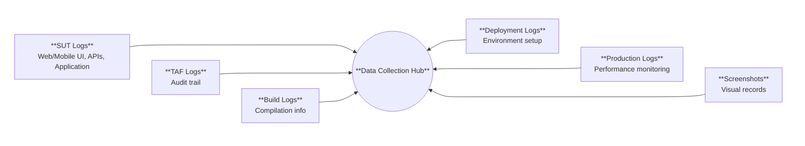
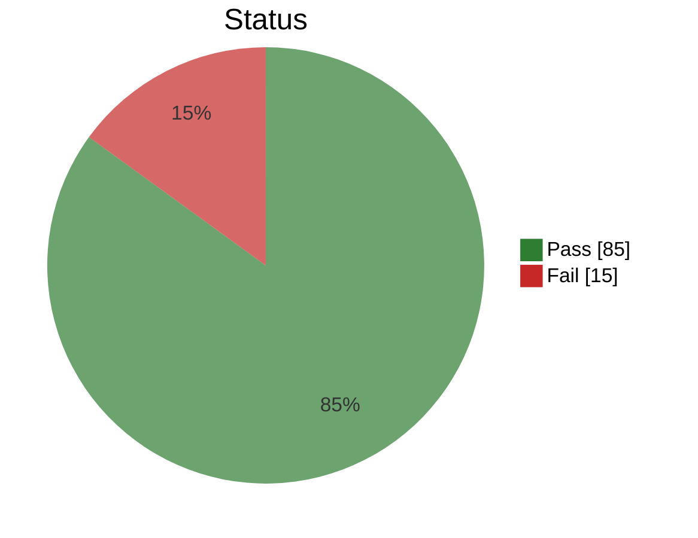
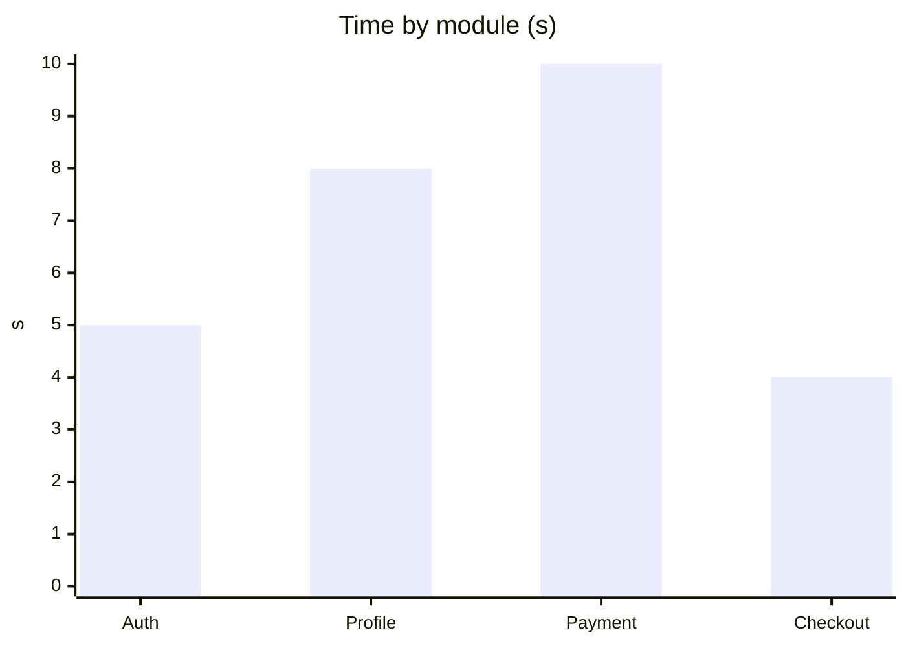
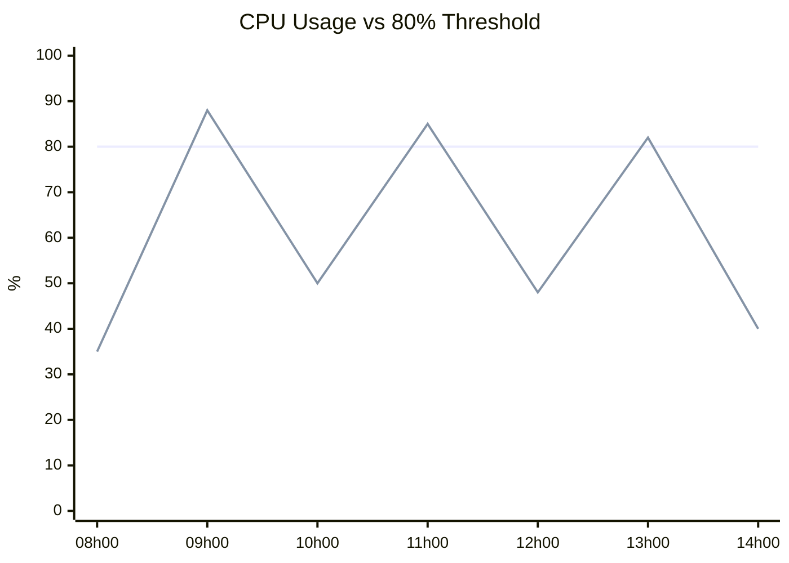
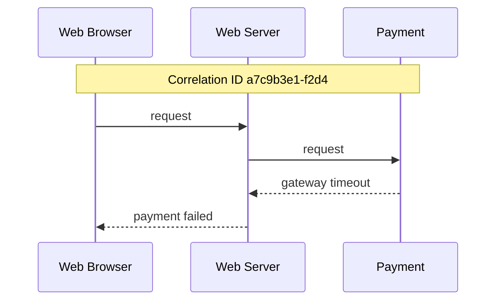
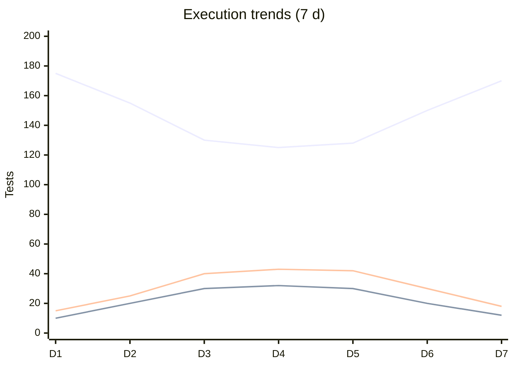
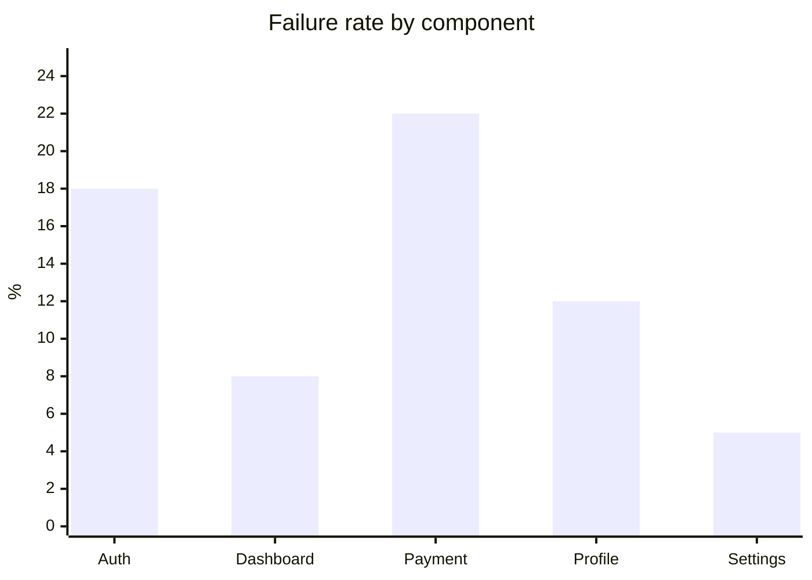

# Synthesis

## Test Automation Reporting and Metrics - Introduction

This chapter covers collection, analysis, and reporting of test automation data (syllabus §6.1), through three learning objectives:

- TAE-6.1.1 — Apply Data Collection Methods from the Test Automation Solution and the System Under Test
*Where and how to collect data from the TAS (Test Automation Solution) and the SUT (System Under Test): logs, build/deploy/production sources, screenshots, enhanced testware, assertions, and visualization*
- TAE-6.1.2 — Analyze Data from the Test Automation Solution and the System Under Test to Better Understand Results
*How to analyze TAS and SUT data to distinguish SUT vs TAS vs environment issues: trends, failure process, correlation IDs, and dashboards*
- TAE-6.1.3 — Explain How a Test Progress Report is Constructed and Published
*How to turn detailed logs into stakeholder-ready progress reports: content, publication channels, audience-specific views, modern dashboards, and AI-assisted log analysis*

Sequence: collect data from the TAS and the SUT (6.1.1), analyze it to understand results (6.1.2), then construct and publish effective test progress reports (6.1.3).

## TAE-6.1.1 (K3) : Apply Data Collection Methods from the Test Automation Solution and the System Under Test

Running automated tests is only half the value; the other half is the data collected during execution, which explains what happened in the TAS (Test Automation Solution) and in the SUT (System Under Test).

Principle: gather complementary sources, capture useful signals inside the TAS, log enough context to diagnose, then share and present results so decisions are fast.

### Data collection sources

Several data sources exist. Each brings a different angle on the same run; together they give a fuller picture. The main sources are:



| Source | Nature | Usage |
|---|---|---|
| SUT logs | Runtime messages from UI (web/mobile), APIs, applications, web servers, database servers | Diagnose SUT behaviour and environment mismatches (e.g. different DB timeouts in test vs production) |
| TAF logs | Chronological audit trail of automated actions and outcomes | Reconstruct what the automation did step by step |
| Build logs | Compilation and packaging events and errors | Confirm the build succeeded; isolate build-time defects early |
| Deployment logs | Events and errors when deploying to test or production | Confirm what was deployed where; spot deploy failures before blaming tests |
| Production logs | Live usage and performance signals; also load/stress/spike logs in dedicated environments | analyze trends and compare test behavior with real-world conditions |
| Screenshots / recordings | Visual capture of the UI (native tool or third party) | Debug UI failures when text logs are not enough |

### Capturing data in TAS

Beyond reading external logs, the TAS itself can produce measurement and verification data.

#### Enhancing shared testware

The TAS includes automated testware (scripts, helpers, libraries, runners). That testware is layered: a shared underlying layer (common code) and higher-level scripts that call it. Enhance the underlying layer once by adding instrumentation that records its usage (execution metadata such as start time, end time, duration). Higher-level scripts then produce the same data automatically, without each script embedding that instrumentation.

Example - shared `runTest()` with timing logs:

```java
// Before enhancement
public void runTest() {
    loginToApplication();
    navigateToUserPage();
    verifyUserDetails();
    logout();
}

// After enhancement
public void runTest() {
    logger.info("Test started at: " + getCurrentTime());

    loginToApplication();
    navigateToUserPage();
    verifyUserDetails();
    logout();

    logger.info("Test completed at: " + getCurrentTime());
    logger.info("Total execution time: " + calculateExecutionTime() + " seconds");
}
```

Timing lives in one shared method. Every caller gets start time, end time, and duration.

#### Measurement and reporting features

Many test tools can record and log information before, during, and after individual tests and whole suites. Reporting for each series of runs should also analyze previous results to highlight trends, such as changes in the pass rate (for example a gradual drop from 98% to 95% that can warn of a growing defect before a single run looks alarming).

#### Assertions and verification

Test automation usually covers both execution and verification. Verification compares specific actual results with expected results, best done with assertions (a check that a condition holds, often actual vs expected, and fails the test if it does not).

The information reported from that comparison matters. Status must be clear (passed or failed). On failure, provide enough context to diagnose (compared values, screenshots) so the gap between actual and expected is obvious.

Example - order total with useful failure context:

```javascript
// Weak: failure says little
assert.equals(actualValue, expectedValue, "Values should match");

// Better: failure shows what was compared
function verifyOrderTotal(orderPage) {
    const itemPrices = orderPage.getAllItemPrices();
    const calculatedTotal = itemPrices.reduce((sum, price) => sum + price, 0);
    const displayedTotal = orderPage.getOrderTotal();

    assert.equals(
        displayedTotal,
        calculatedTotal,
        `Order total ${displayedTotal} doesn't match sum of items ${calculatedTotal}. Items: ${itemPrices.join(', ')}`
    );
}
```

Tool support can also ignore expected differences (dates, timestamps) while highlighting unexpected ones.

### Test logging essentials

Test logs are a primary input when analyzing defects in the TAS or the SUT.

#### TAS logging

Context determines whether the TAF or the test execution owns logging. TAS logs should include:

- Executed test case id, start and end time
- Status: passed, failed, or TAS failure (not a SUT defect); inconclusive statuses defined by the org; status also on the TAF dashboard
- Significant steps and their timing
- Dynamic SUT findings from third-party tools (e.g. memory leaks), with actual results linked to the suite
- Cycle count on reliability / stress runs (e.g. `cycle=847/1000`)
- Random parameters or step choices (to replay the same run)
- Actions in a playable form (same steps and timing; including customer-captured logs for later replay)
- Screenshots for root-cause analysis
- On failure: crash dumps, stack traces, and copies of overwritable logs (e.g. cyclic buffers)
- Optional colour (e.g. defects red, progress green)

#### SUT logging and correlation

Correlate TAS results with SUT logs to find root causes in either side.

- On SUT defect: timestamps, source location, error messages
- At system startup: configuration (software/firmware versions, SUT config, OS config)
- Synchronize timestamps so a failure at a given time can be matched on the server side (e.g. a database timeout explaining a wrong UI message)

### Sharing and presenting results

Once collected, results are often reused outside the TAS in two complementary ways: feeding other tools for tracking and reporting, and presenting status visually for decision-making.

#### Third-party tool integration

First, automated results can feed other tools for tracking and reporting (e.g. traceability updates, required report formats). They are provided in a suitable format (spreadsheets, XML, documents, databases, report tools), via built-in export or customized reporting (e.g. XML then generated PowerPoint).

#### Visualization of results

Second, the same results can be shown with charts and traffic-light icons (red / yellow / green) for overall execution / automation status, supporting decisions. Management relies on visual summaries and can drill down when needed; the test team also benefits from the same views (e.g. pass/fail mix, time by module, pass-rate trend).

Example - overall status as a traffic light (green lit = healthy run):

<div style="display:flex; align-items:center; gap:16px; margin:8px 0 16px 0;">
  <div style="display:flex; flex-direction:column; gap:6px; background:#222; padding:10px 8px; border-radius:12px;" title="Traffic-light status">
    <div style="width:18px; height:18px; border-radius:50%; background:#5a1a1a;"></div>
    <div style="width:18px; height:18px; border-radius:50%; background:#5a4a10;"></div>
    <div style="width:18px; height:18px; border-radius:50%; background:#2e7d32; box-shadow:0 0 10px #2e7d32;"></div>
  </div>
  <div>
    <div><strong>Overall TAS health:</strong> Green</div>
    <div style="color:#555; font-size:0.95em;">Execution healthy - no blocking failures</div>
  </div>
</div>

Example - stakeholder charts (distribution, time by module, pass-rate trend):

<div style="display:flex; gap:8px; flex-wrap:wrap; align-items:flex-start;">
<div style="flex:1; min-width:200px;">



</div>
<div style="flex:1; min-width:200px;">



</div>
<div style="flex:1; min-width:200px;">

```mermaid
xychart-beta
    title "Pass rate (30 d)"
    x-axis ["Apr 1", "Apr 15", "Today"]
    y-axis "%" 70 --> 90
    line [80, 84, 89]
```

</div>
</div>

### Example: financial application

Payment-processing tests failed inconsistently on a financial application.

We set up comprehensive logging in the TAF and the payment service, integrated Grafana for visualization, and added alerts for unusual patterns.

After a week of data, the dashboard showed failures clustered around specific times of day. Correlating test logs with system logs showed the payment processor was running batch jobs then, causing increased response times that exceeded test timeout thresholds.

The fix was simple: more realistic timeouts, and critical tests scheduled outside batch windows. Reliability rose from 75% to 99%.

### Conclusion

1. Collecting data from several sources (SUT, TAF, build, deployment, production, screenshots) gives a fuller picture of the run and speeds up diagnosis; each source adds a different angle.
2. Enhancing shared testware (helpers/libraries) once gives every higher-level script the same data (e.g. timing logs); one change instead of logging in each script.
3. Asserting actual result against expected result with rich failure context clarifies what broke and how far results diverge, so diagnosis is faster.
4. Logging in both the TAS and the SUT, then correlating with timestamps, makes it easier to place the root cause (SUT, TAS, or environment).
5. Exporting results and visualizing them (charts, traffic lights) helps stakeholders decide from summaries and drill down only when needed.

## TAE-6.1.2 (K4) : Analyze Data from the Test Automation Solution and the System Under Test to Better Understand Results

After test execution, test results are analyzed to understand what happened (pass or fail) and to identify possible failures in the SUT (System Under Test) and in the TAS (Test Automation Solution).

Main ideas covered here are:

- TAS data as primary evidence; SUT data as secondary context
- Test environment (resources and availability)
- Comparison with previous runs
- Systematic failure analysis, including correlation / trace IDs
- Identifying patterns across Dashboard metrics

### Analysis purpose

Understanding a test result means more than reading pass/fail. Analysis uses TAS data first, then SUT context, to attribute a failure to the SUT, the TAS, or the environment, and to check whether a reported failure is a real SUT defect or not (e.g. wrong expectation, brittle locator, invisible mismatch such as whitespace).

### Test environment

Environment problems sit outside SUT product logic and TAS script logic, as limited resources or availability issues can still make tests fail.

#### Resource usage and sizing

Environment data helps size automation properly (especially in the cloud). Typical points to look at are:

- Clusters and resources (CPU, RAM, etc.)
- Single-browser vs multi-browser runs (cross-browser testing)

Example - banking timeouts vs CPU spikes (failures aligned with CPU usage above 80% when more than 10 parallel sessions are running; Setting up larger VMs solved the failures):



#### Environment availability

Availability is another environment factor that affects whether tests can succeed. When a large share of tests fail at once (same error or many seemingly unrelated errors), that pattern often points to an availability problem rather than many separate SUT defects (e.g. database restart during the run).

SUT logs help confirm whether the environment was down or only partly available at that time.

If failures are isolated rather than widespread, it is better to focus on those failing tests (TAS vs SUT), while still checking environment data if needed.

### Comparing previous runs

Comparing current results with previous executions highlights trends, such as:

- possible regression (Passed before, fails now)
- possible fix (Failing for a long time, then passes)
- possible flaky test (Intermittent fail)

Historical comparison can also link failures to a change area (e.g. authentication commits). While Web logs can help monitor how the software is used over time.

### Failure analysis process

When a test fails, a systematic path separates known issues from new ones, and SUT defects from TAS or environment problems:

1. Check whether the same failure occurred in previous runs (known SUT or TAS defect; result history helps).
2. If unknown, identify the test case and what it tests (name or test-management ID from the log).
3. Find which step failed (logged by the TAS).
4. Analyze test-log information on SUT state vs expected (screenshots, API and network logs, or any log that shows SUT state).
5. If SUT state does not match expected, log a defect in the defect-management system, with the information and logs that justify it.

If the SUT state matches what is expected, or evidence points elsewhere, the reported failure is not treated as a SUT defect (wrong test, invisible mismatch, or environment condition). That is the veracity check around the same evidence: real SUT bug vs false alarm from a product perspective.

Example - step failure in the log:

```text
[2025-04-15 09:32:20] DEBUG: Entering shipping information
[2025-04-15 09:32:22] ERROR: Element not found: 'payment-method-selector'
[2025-04-15 09:32:22] ERROR: Screenshot saved: checkout_failure_20250415_093222.png
[2025-04-15 09:32:22] INFO: Test case 'CheckoutProcessTest' failed
```

#### Correlation and trace IDs

When analyzing SUT evidence, audit logs for user interactions (UI sessions or API calls) help if each interaction carries a unique ID through later calls and integrations. That ID is a correlation ID or trace ID. Logging it in the TAS makes it possible to observe and trace one request across the system.

Example - checkout shows a generic "payment failed" in the UI. The TAS log holds correlation ID `a7c9b3e1-f2d4`. Searching that ID in SUT logs shows the external payment gateway timed out; the defect is outside local SUT/TAS logic.



### Visualization for analysis

Dashboards that combine several metrics help analysts to spot patterns and correlations (execution trends, failure rates by component and environment, performance metrics). Visualization here supports analysis; it is not only a stakeholder reporting view.

<div style="display:flex; gap:8px; flex-wrap:wrap; align-items:flex-start;">
<div style="flex:1; min-width:220px;">



</div>
<div style="flex:1; min-width:200px;">



</div>
</div>

### Example: registration flow

Registration tests failed intermittently. Historical data showed about a 15% failure rate. The failing step was confirmation-email validation: the test timed out waiting for the email. Following the correlation ID through system logs, and checking environment metrics, showed the email service was under-resourced at peak load. The team increased email-service capacity and replaced the fixed timeout with a dynamic wait.

### Conclusion

1. Examining both TAS and SUT data (TAS primary, SUT secondary) gives a complete picture of results and failures.
2. Comparing historical results reveals trends (regression, fix, flaky test).
3. Following a systematic failure analysis separates SUT defects from TAS or environment issues.
4. Leveraging correlation / trace IDs traces a request across services (e.g. payment gateway timeout).
5. Visualizing multiple metrics on one dashboard speeds up pattern recognition.

## TAE-6.1.3 (K2) : Explain How a Test Progress Report is Constructed and Published

After a test suite runs, detailed logs alone do not give a good overview of results. A concise test progress report is created and published so stakeholders can see status without drowning in debug detail.

Main ideas covered here:

- Why logs are not enough and what a progress report adds
- Report content (results, SUT, environment, failures, TAF issues)
- Publication channels and report history
- Stakeholder-specific views
- Modern dashboards and AI/ML log analysis

### Why progress reports

Test logs record steps, actions, and expected responses for cases and suites. That detail is essential for debugging, but it is overwhelming for people who only need an overview. A progress report (often produced by a report generator) summarizes results in a format suited to stakeholders.

Example - raw log vs concise summary:

```text
[2024-04-25 14:32:15] INFO - Starting test: LoginTest_ValidCredentials
[2024-04-25 14:32:16] DEBUG - Navigating to: https://app.example.com
... (hundreds of lines) ...
[2024-04-25 14:45:03] INFO - Test completed: LoginTest_ValidCredentials - PASSED
```

<clean-progress-report-widget></clean-progress-report-widget>

### Report content

The report should include test results, SUT information, and documentation of the test environment, in a form appropriate for each stakeholder.

#### Core components

- Test result summary (totals; passed, failed, skipped)
- SUT information (version, build under test)
- Test environment documentation (OS, browsers, databases, staging vs other)

Example - overnight suite (~2000 tests): a daily report showing totals, top failing suites, build version, and environment lets managers see hotspots (e.g. authentication, payment) without reading every log.

<daily-report-widget></daily-report-widget>

#### Failures and follow-up

Besides the high-level result summary, the test progress report must give enough failure detail to make troubleshooting and correction possible, including:

- Failed tests: which cases/suites failed (not only a fail count)
- Failure reason/cause: why each failure occurred (if information is available)
- Test execution history: result of prior runs of the same tests (to spot recurrence and patterns; may be linked to flaky tests)
- Reporter: who reported the failure (usually the person who created or last updated the test)

<test-failure-breakdown-widget></test-failure-breakdown-widget>

In parallel, the person responsible needs to investigate the cause, report the related defect, follow up on the fix, and test that the fix was correctly implemented.

Depending on the size of the team, that person may be one TAE handling the whole chain, or ownership may follow application areas (tester/TAE for that segment, often with the BA and developer for the same area).

#### TAF diagnostics

Test reporting is also used to diagnose failures in TAF components (e.g. bad test-data setup, environment not reset between runs), not only SUT defects.

### Publishing reports

The report is published to relevant stakeholders so it is actually reviewed. Typical channels:

- Website or document repository (e.g. internal site, SharePoint)
- Cloud storage (e.g. Drive, Dropbox, OneDrive)
- On-premises storage (e.g. network drive)
- Email distribution list
- Test management tool (e.g. Zephyr, TestRail)
- Chat notifications (e.g. Slack, Teams, chatbot posts)

Example - chat notification:

<chat-notification-widget></chat-notification-widget>

Keeping a history of reports supports trend analysis (suites with frequent regressions, deeper quality issues).

### Stakeholder views

Report content and depth vary by audience:

| Audience | Typical roles | Focus |
|---|---|---|
| Management | solution/enterprise architect, project/delivery/program manager, Test Manager / director | trends (cases added, pass/fail ratio, TAS and SUT reliability) |
| Operational | Product Owner/manager, business representative, Business Analyst | product usage and business-impact metrics |
| Technical | team lead, scrum master, admins, test lead, TAE, tester, developer | low-level detail (failed tests, errors, stack traces) |

A practical layout often starts with an executive summary for management, then detailed sections for technical readers.

### Dashboard creation

Modern reporting tools offer dashboards, colored charts, detailed log collections, and automated log analysis. They aggregate data from sources such as pipeline execution logs, project-management tools, and code repositories. Visualization helps stakeholders see trends and decide (defect clusters, defect spread across environments, SUT performance degradation, build reliability).

Example views on one dashboard: pass/fail trend over time, modules with most defects, severity distribution, time-to-fix metrics.

<test-dashboard-widget></test-dashboard-widget>

### AI log analysis

Some automation tools include or rely on machine learning for automated analysis of large test-log volumes. That helps the TAE spend less time locating failures, deciding whether a failure is in the SUT or the TAS, and grouping common defects for reporting (see ISTQB CT-AI syllabus).

### Example: overnight suite

About 2000 automated tests run every night. Going through all those logs manually would be tedious, so the team produces a test progress report that includes:

- Totals: passed, failed, and skipped
- Top failing test suites
- Build version
- Environment

With that overview, the project manager can immediately see module-level hotspots (e.g. user authentication, payment processing) without reading every log, and prioritize getting those fixed. Keeping a history of those daily reports later shows which modules regress often, which guides deeper analysis and longer-term prioritization.

### Conclusion

1. Bridging detailed logs and stakeholder needs with a concise progress report makes results usable for decisions.
2. Including failure context, history, and ownership speeds up correction and also surfaces TAF problems.
3. Publishing through multiple channels (and keeping history) increases the chance reports are reviewed and trends are visible.
4. Tailoring views to management, operational, and technical audiences matches depth to role.
5. Leveraging dashboards and AI/ML analysis helps spot trends faster and reduces manual log triage.

<!-- Components -->

<template id="tpl-clean-progress-report">
  <div style="font-family: system-ui, sans-serif; max-width: 420px; background: #ffffff; color: #333333; border: 1px solid #cccccc; border-radius: 8px; overflow: hidden; box-shadow: 0 2px 8px rgba(0,0,0,.12); margin: 0.5em 0 1em;">
    <div style="background: #e8e8e8; padding: 12px 16px; font-weight: 600; color: #333333;">
      Test Summary: Login test
    </div>
    <div style="padding: 16px; background: #ffffff; color: #333333;">
      <div style="display: flex; align-items: center; gap: 12px; margin-bottom: 12px;">
        <span style="background: #2e7d32; color: #ffffff; padding: 4px 12px; border-radius: 4px; font-weight: 600; font-size: 14px;">Passed</span>
        <span style="font-size: 28px; font-weight: 700; color: #2e7d32;">98%</span>
      </div>
      <div style="display: flex; align-items: center; gap: 8px; margin-bottom: 8px; color: #444444; font-size: 14px;">
        <span aria-hidden="true">&#9888;</span>
        <span>Failed tests: <strong>2 of 100</strong></span>
      </div>
      <div style="display: flex; align-items: center; gap: 8px; margin-bottom: 16px; color: #444444; font-size: 14px;">
        <span aria-hidden="true">&#9201;</span>
        <span>Average execution time: <strong>5.2s</strong></span>
      </div>
      <div style="height: 10px; background: #e0e0e0; border-radius: 5px; overflow: hidden;">
        <div style="width: 98%; height: 100%; background: #2e7d32;"></div>
      </div>
    </div>
  </div>
</template>

<template id="tpl-daily-report">
  <div style="font-family: system-ui, sans-serif; max-width: 560px; background: #ffffff; color: #333333; border: 1px solid #cccccc; border-radius: 8px; overflow: hidden; box-shadow: 0 2px 8px rgba(0,0,0,.12); margin: 0.5em 0 1em;">
    <div style="background: #e8e8e8; padding: 12px 16px; font-weight: 600; color: #333333;">
      Daily Test Automation Report - April 25, 2025
    </div>
    <div style="padding: 16px; background: #ffffff; color: #333333;">
      <section style="background: #f7faf7; border: 2px solid #2e7d32; border-radius: 8px; padding: 16px; margin-bottom: 16px;">
        <h3 style="margin: 0 0 12px 0; font-size: 16px; font-weight: 700; color: #1b5e20;">Summary dashboard</h3>
        <div style="margin-bottom: 14px; font-size: 22px; font-weight: 700; color: #111111;">Total Tests: 2,000</div>
        <div style="margin-bottom: 12px; font-size: 14px; color: #333333;">
          <div style="display: flex; justify-content: space-between; margin-bottom: 4px;">
            <span>Passed</span><span><strong>1,950</strong> (97.5%)</span>
          </div>
          <div style="height: 12px; background: #e0e0e0; border-radius: 6px; overflow: hidden;">
            <div style="width: 97.5%; height: 100%; background: #2e7d32;"></div>
          </div>
        </div>
        <div style="margin-bottom: 12px; font-size: 14px; color: #333333;">
          <div style="display: flex; justify-content: space-between; margin-bottom: 4px;">
            <span>Failed</span><span><strong>45</strong> (2.25%)</span>
          </div>
          <div style="height: 12px; background: #e0e0e0; border-radius: 6px; overflow: hidden;">
            <div style="width: 2.25%; height: 100%; background: #c62828;"></div>
          </div>
        </div>
        <div style="margin-bottom: 0; font-size: 14px; color: #333333;">
          <div style="display: flex; justify-content: space-between; margin-bottom: 4px;">
            <span>Skipped</span><span><strong>5</strong> (0.25%)</span>
          </div>
          <div style="height: 12px; background: #e0e0e0; border-radius: 6px; overflow: hidden;">
            <div style="width: 0.25%; height: 100%; background: #f9a825; min-width: 2px;"></div>
          </div>
        </div>
      </section>
      <div style="display: flex; gap: 12px; flex-wrap: wrap;">
        <section style="flex: 1; min-width: 200px; background: #fafafa; border: 1px solid #e0e0e0; border-radius: 6px; padding: 12px;">
          <h4 style="margin: 0 0 8px 0; font-size: 12px; font-weight: 600; color: #666666; text-transform: uppercase; letter-spacing: 0.04em;">Top failing test suites</h4>
          <ul style="margin: 0; padding-left: 16px; font-size: 12px; color: #555555; line-height: 1.6;">
            <li>User Authentication (15 failures)</li>
            <li>Payment Processing (10 failures)</li>
            <li>Search Functionality (8 failures)</li>
          </ul>
        </section>
        <section style="flex: 1; min-width: 160px; background: #fafafa; border: 1px solid #e0e0e0; border-radius: 6px; padding: 12px;">
          <h4 style="margin: 0 0 8px 0; font-size: 12px; font-weight: 600; color: #666666; text-transform: uppercase; letter-spacing: 0.04em;">System details</h4>
          <div style="font-size: 12px; color: #555555; line-height: 1.7;">
            <div>Build Version: <strong>3.4.2</strong></div>
            <div>Environment: <strong>Staging</strong></div>
            <div>Date: <strong>April 25, 2025</strong></div>
          </div>
        </section>
      </div>
    </div>
  </div>
</template>

<template id="tpl-failure-breakdown">
  <div style="font-family: system-ui, sans-serif; max-width: 480px; background: #ffffff; color: #333333; border: 1px solid #cccccc; border-radius: 8px; overflow: hidden; box-shadow: 0 2px 8px rgba(0,0,0,.12); margin: 0.5em 0 1em;">
    <div style="background: #e8e8e8; padding: 12px 16px; font-weight: 600; color: #333333;">
      Test Failure Breakdown
    </div>
    <div style="padding: 16px; background: #ffffff;">
      <div style="margin-bottom: 14px; font-size: 13px; color: #333333;">
        <div style="display: flex; justify-content: space-between; margin-bottom: 4px;">
          <span>Element Not Found</span><span><strong>35%</strong></span>
        </div>
        <div style="height: 10px; background: #eeeeee; border-radius: 5px; overflow: hidden;" role="progressbar" aria-valuenow="35" aria-valuemin="0" aria-valuemax="100" aria-label="Element Not Found">
          <div style="width: 35%; height: 100%; background: #b71c1c;"></div>
        </div>
      </div>
      <div style="margin-bottom: 14px; font-size: 13px; color: #333333;">
        <div style="display: flex; justify-content: space-between; margin-bottom: 4px;">
          <span>Timeout Errors</span><span><strong>25%</strong></span>
        </div>
        <div style="height: 10px; background: #eeeeee; border-radius: 5px; overflow: hidden;" role="progressbar" aria-valuenow="25" aria-valuemin="0" aria-valuemax="100" aria-label="Timeout Errors">
          <div style="width: 25%; height: 100%; background: #c62828;"></div>
        </div>
      </div>
      <div style="margin-bottom: 14px; font-size: 13px; color: #333333;">
        <div style="display: flex; justify-content: space-between; margin-bottom: 4px;">
          <span>Validation Failures</span><span><strong>20%</strong></span>
        </div>
        <div style="height: 10px; background: #eeeeee; border-radius: 5px; overflow: hidden;" role="progressbar" aria-valuenow="20" aria-valuemin="0" aria-valuemax="100" aria-label="Validation Failures">
          <div style="width: 20%; height: 100%; background: #e53935;"></div>
        </div>
      </div>
      <div style="margin-bottom: 14px; font-size: 13px; color: #333333;">
        <div style="display: flex; justify-content: space-between; margin-bottom: 4px;">
          <span>Network Issues</span><span><strong>15%</strong></span>
        </div>
        <div style="height: 10px; background: #eeeeee; border-radius: 5px; overflow: hidden;" role="progressbar" aria-valuenow="15" aria-valuemin="0" aria-valuemax="100" aria-label="Network Issues">
          <div style="width: 15%; height: 100%; background: #ef6c00;"></div>
        </div>
      </div>
      <div style="margin-bottom: 0; font-size: 13px; color: #333333;">
        <div style="display: flex; justify-content: space-between; margin-bottom: 4px;">
          <span>Test Data Issues</span><span><strong>5%</strong></span>
        </div>
        <div style="height: 10px; background: #eeeeee; border-radius: 5px; overflow: hidden;" role="progressbar" aria-valuenow="5" aria-valuemin="0" aria-valuemax="100" aria-label="Test Data Issues">
          <div style="width: 5%; height: 100%; background: #f9a825; min-width: 4px;"></div>
        </div>
      </div>
    </div>
  </div>
</template>

<template id="tpl-chat-notification">
  <div style="font-family: system-ui, sans-serif; max-width: 420px; background: #ffffff; color: #333333; border: 1px solid #cccccc; border-radius: 8px; overflow: hidden; box-shadow: 0 2px 8px rgba(0,0,0,.12); margin: 0.5em 0 1em;">
    <div style="display: flex; gap: 12px; padding: 14px 16px; background: #ffffff;">
      <div style="width: 40px; height: 40px; border-radius: 8px; background: #4a154b; color: #ffffff; display: flex; align-items: center; justify-content: center; font-weight: 700; font-size: 14px; flex-shrink: 0;">TB</div>
      <div style="flex: 1; min-width: 0;">
        <div style="display: flex; align-items: baseline; gap: 8px; margin-bottom: 4px;">
          <span style="font-weight: 700; color: #1d1c1d;">Test Bot</span>
          <span style="font-size: 12px; color: #616061;">Today at 6:02 AM</span>
        </div>
        <div style="font-weight: 600; margin-bottom: 8px; color: #1d1c1d;">Daily Test Report Ready!</div>
        <ul style="margin: 0 0 12px 0; padding-left: 18px; font-size: 14px; color: #333333; line-height: 1.55;">
          <li>Pass Rate: <strong>97.5%</strong></li>
          <li>Failed Tests: <strong>45</strong></li>
          <li>Top Issue: Authentication Module (15 failures)</li>
        </ul>
        <a href="#" style="display: inline-block; background: #1264a3; color: #ffffff; text-decoration: none; padding: 6px 12px; border-radius: 4px; font-size: 13px; font-weight: 600;">View Full Report</a>
      </div>
    </div>
  </div>
</template>

<template id="tpl-test-dashboard">
  <div style="font-family: system-ui, sans-serif; max-width: 720px; background: #ffffff; color: #333333; border: 1px solid #cccccc; border-radius: 8px; overflow: hidden; box-shadow: 0 2px 8px rgba(0,0,0,.12); margin: 0.5em 0 1em;">
    <div style="background: #e8e8e8; padding: 12px 16px; font-weight: 600; color: #333333;">
      Test Dashboard - MyApp V3.4.2
    </div>
    <div style="padding: 16px; background: #ffffff;">
      <div style="display: flex; gap: 12px; flex-wrap: wrap; margin-bottom: 16px;">
        <section style="flex: 1; min-width: 160px; background: #fafafa; border: 1px solid #e0e0e0; border-radius: 8px; padding: 14px; text-align: center;">
          <div style="font-size: 12px; font-weight: 600; color: #666666; text-transform: uppercase; letter-spacing: 0.04em; margin-bottom: 10px;">Overall Health</div>
          <div style="width: 88px; height: 88px; margin: 0 auto 8px; border-radius: 50%; background: conic-gradient(#2e7d32 0 343.8deg, #e0e0e0 343.8deg 360deg); display: flex; align-items: center; justify-content: center;">
            <div style="width: 64px; height: 64px; border-radius: 50%; background: #ffffff; display: flex; align-items: center; justify-content: center; font-size: 16px; font-weight: 700; color: #2e7d32;">95.5%</div>
          </div>
        </section>
        <section style="flex: 1; min-width: 180px; background: #fafafa; border: 1px solid #e0e0e0; border-radius: 8px; padding: 14px;">
          <div style="font-size: 12px; font-weight: 600; color: #666666; text-transform: uppercase; letter-spacing: 0.04em; margin-bottom: 10px;">Test Trends</div>
          <svg viewBox="0 0 160 70" width="100%" height="70" aria-label="Test trends sparkline" style="display: block;">
            <polyline fill="none" stroke="#1565c0" stroke-width="2" points="8,52 30,45 52,48 74,28 96,32 118,18 142,22"></polyline>
            <circle cx="8" cy="52" r="3.5" fill="#1565c0"></circle>
            <circle cx="30" cy="45" r="3.5" fill="#1565c0"></circle>
            <circle cx="52" cy="48" r="3.5" fill="#1565c0"></circle>
            <circle cx="74" cy="28" r="3.5" fill="#1565c0"></circle>
            <circle cx="96" cy="32" r="3.5" fill="#1565c0"></circle>
            <circle cx="118" cy="18" r="3.5" fill="#1565c0"></circle>
            <circle cx="142" cy="22" r="3.5" fill="#1565c0"></circle>
          </svg>
        </section>
        <section style="flex: 1; min-width: 160px; background: #fafafa; border: 1px solid #e0e0e0; border-radius: 8px; padding: 14px;">
          <div style="font-size: 12px; font-weight: 600; color: #666666; text-transform: uppercase; letter-spacing: 0.04em; margin-bottom: 12px;">Defect Severity</div>
          <div style="display: flex; flex-direction: column; gap: 10px; font-size: 12px; color: #333333;">
            <div>
              <div style="margin-bottom: 4px;">Critical <span style="color: #666666;">(3)</span></div>
              <div style="display: flex; flex-wrap: wrap; gap: 4px;" aria-label="3 critical defects">
                <span style="width: 10px; height: 10px; border-radius: 50%; background: #c62828; display: inline-block;"></span>
                <span style="width: 10px; height: 10px; border-radius: 50%; background: #c62828; display: inline-block;"></span>
                <span style="width: 10px; height: 10px; border-radius: 50%; background: #c62828; display: inline-block;"></span>
              </div>
            </div>
            <div>
              <div style="margin-bottom: 4px;">High <span style="color: #666666;">(7)</span></div>
              <div style="display: flex; flex-wrap: wrap; gap: 4px;" aria-label="7 high defects">
                <span style="width: 10px; height: 10px; border-radius: 50%; background: #ef6c00; display: inline-block;"></span>
                <span style="width: 10px; height: 10px; border-radius: 50%; background: #ef6c00; display: inline-block;"></span>
                <span style="width: 10px; height: 10px; border-radius: 50%; background: #ef6c00; display: inline-block;"></span>
                <span style="width: 10px; height: 10px; border-radius: 50%; background: #ef6c00; display: inline-block;"></span>
                <span style="width: 10px; height: 10px; border-radius: 50%; background: #ef6c00; display: inline-block;"></span>
                <span style="width: 10px; height: 10px; border-radius: 50%; background: #ef6c00; display: inline-block;"></span>
                <span style="width: 10px; height: 10px; border-radius: 50%; background: #ef6c00; display: inline-block;"></span>
              </div>
            </div>
            <div>
              <div style="margin-bottom: 4px;">Medium <span style="color: #666666;">(12)</span></div>
              <div style="display: flex; flex-wrap: wrap; gap: 4px;" aria-label="12 medium defects">
                <span style="width: 10px; height: 10px; border-radius: 50%; background: #f9a825; display: inline-block;"></span>
                <span style="width: 10px; height: 10px; border-radius: 50%; background: #f9a825; display: inline-block;"></span>
                <span style="width: 10px; height: 10px; border-radius: 50%; background: #f9a825; display: inline-block;"></span>
                <span style="width: 10px; height: 10px; border-radius: 50%; background: #f9a825; display: inline-block;"></span>
                <span style="width: 10px; height: 10px; border-radius: 50%; background: #f9a825; display: inline-block;"></span>
                <span style="width: 10px; height: 10px; border-radius: 50%; background: #f9a825; display: inline-block;"></span>
                <span style="width: 10px; height: 10px; border-radius: 50%; background: #f9a825; display: inline-block;"></span>
                <span style="width: 10px; height: 10px; border-radius: 50%; background: #f9a825; display: inline-block;"></span>
                <span style="width: 10px; height: 10px; border-radius: 50%; background: #f9a825; display: inline-block;"></span>
                <span style="width: 10px; height: 10px; border-radius: 50%; background: #f9a825; display: inline-block;"></span>
                <span style="width: 10px; height: 10px; border-radius: 50%; background: #f9a825; display: inline-block;"></span>
                <span style="width: 10px; height: 10px; border-radius: 50%; background: #f9a825; display: inline-block;"></span>
              </div>
            </div>
          </div>
        </section>
      </div>
      <section style="background: #f7faf7; border: 1px solid #c8e6c9; border-radius: 8px; padding: 14px;">
        <div style="font-size: 13px; font-weight: 700; color: #1b5e20; margin-bottom: 12px;">Module Performance</div>
        <div style="margin-bottom: 12px; font-size: 13px; color: #333333;">
          <div style="display: flex; justify-content: space-between; margin-bottom: 4px;">
            <span>Authentication</span>
            <span><strong>82%</strong> <span style="color: #c62828;">&#9660; 8% from last</span></span>
          </div>
          <div style="height: 10px; background: #e0e0e0; border-radius: 5px; overflow: hidden;">
            <div style="width: 82%; height: 100%; background: #2e7d32;"></div>
          </div>
        </div>
        <div style="margin-bottom: 12px; font-size: 13px; color: #333333;">
          <div style="display: flex; justify-content: space-between; margin-bottom: 4px;">
            <span>Shopping Cart</span>
            <span><strong>95%</strong> <span style="color: #2e7d32;">&#9650; 3% from last</span></span>
          </div>
          <div style="height: 10px; background: #e0e0e0; border-radius: 5px; overflow: hidden;">
            <div style="width: 95%; height: 100%; background: #2e7d32;"></div>
          </div>
        </div>
        <div style="margin-bottom: 0; font-size: 13px; color: #333333;">
          <div style="display: flex; justify-content: space-between; margin-bottom: 4px;">
            <span>Search</span>
            <span><strong>100%</strong> <span style="color: #666666;">stable</span></span>
          </div>
          <div style="height: 10px; background: #e0e0e0; border-radius: 5px; overflow: hidden;">
            <div style="width: 100%; height: 100%; background: #2e7d32;"></div>
          </div>
        </div>
      </section>
    </div>
  </div>
</template>

<script>
(function () {
  function defineWidget(tag, templateId) {
    if (!window.customElements || customElements.get(tag)) return;
    customElements.define(
      tag,
      class extends HTMLElement {
        connectedCallback() {
          if (this.childNodes.length) return;
          var tpl = document.getElementById(templateId);
          if (tpl) this.appendChild(tpl.content.cloneNode(true));
        }
      }
    );
  }
  defineWidget("clean-progress-report-widget", "tpl-clean-progress-report");
  defineWidget("daily-report-widget", "tpl-daily-report");
  defineWidget("test-failure-breakdown-widget", "tpl-failure-breakdown");
  defineWidget("chat-notification-widget", "tpl-chat-notification");
  defineWidget("test-dashboard-widget", "tpl-test-dashboard");
})();
</script>
