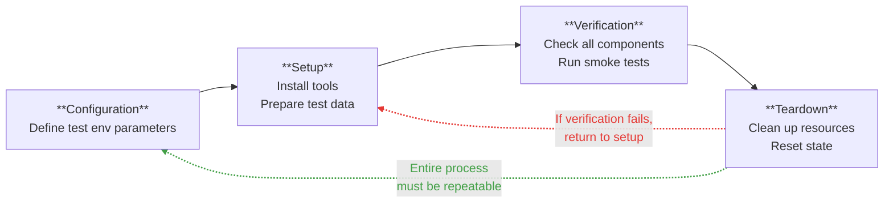
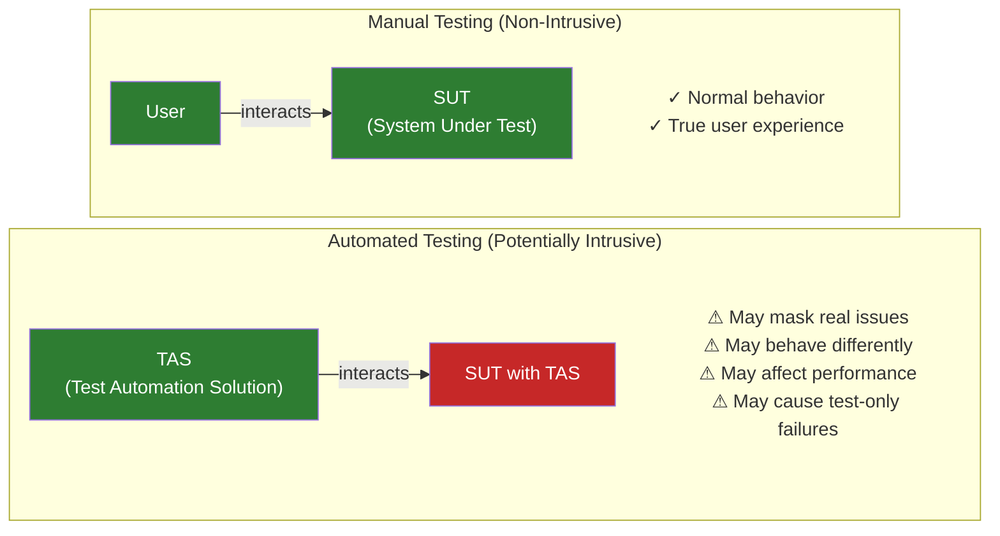
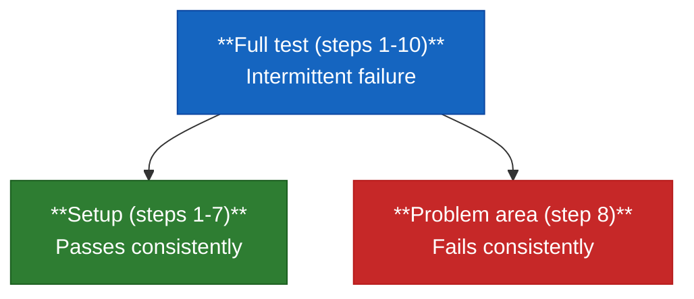
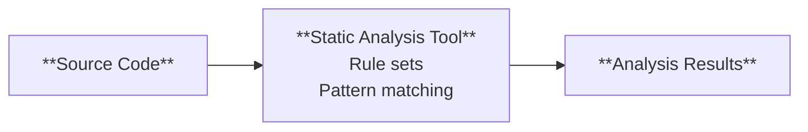

# Synthesis

## Verifying the Test Automation Solution - Introduction

This chapter covers verification of the test automation infrastructure, through four learning objectives:

- TAE-7.1.1 — Plan to Verify the Test Automation Environment Including Test Tool Setup
*How to plan checks on the automation environment before relying on it: tool install/setup/config, setup/teardown repeatability, connectivity, and TAF component testing*
- TAE-7.1.2 — Explain the Correct Behavior for a Given Automated Test Script and/or Test Suite
*How to confirm scripts and suites behave correctly: composition, new TAF features, repeatability, and tool intrusiveness*
- TAE-7.1.3 — Identify Where Test Automation Produces Unexpected Results
*How to find the root cause of unexpected test results: evidence collection, isolation, intermittent failures, resources, logs, assertions, and cross-role help*
- TAE-7.1.4 — Explain How Static Analysis Can Aid Test Automation Code Quality
*How static analysis improves automation code without running it: defect severity, design/quality benefits, security, and DevSecOps integration*

If test automation is the safety net that catches SUT issues, this chapter is about checking the safety net itself.

Sequence: verify the environment and tools (7.1.1), verify script and suite behaviour (7.1.2), diagnose unexpected results (7.1.3), then raise automation-code quality with static analysis (7.1.4).

## TAE-7.1.1 (K3) : Plan to Verify the Test Automation Environment Including Test Tool Setup

Test automation is set up to assure SUT (System Under Test) quality. Building that infrastructure brings its own problems and bugs (incomplete test tool install, blocked permissions, firewall blocking access) leading to unreliable test result. Verifying the TAS (Test Automation Solution) and its environment is therefore crucial to ensuring the test results reliability and avoiding any wasted time on TAS/environment issues.

Principle: plan TAS verification as a repeatable process integrable into every target environment (machine, server, CI/CD pipeline).

### What to verify

Four areas:

1. Test tool installation, setup, configuration, and customization
2. Repeatability in setup/teardown of the test environment
3. Connectivity with internal and external systems/interfaces
4. TAF (Test Automation Framework) component testing

### Tool installation, setup, configuration, and customization

The TAS is made of many parts (executables, function libraries, data and configuration files). While its installation can be automated (scripts, copy from a repository) or manual (placing files in folders), it's crucial to check the availability (install) and function (configuration) of each part.

Recommendation:

- Install from a repository (or with automated scripts) so every SUT target uses the same TAS version and configuration; manage upgrades like development tools.
- Create a small environment smoke test that exercises basic tool functions and confirms connection to the SUT, run before serious automation work.

Example: Selenium WebDriver for UI testing — confirm Selenium  and browser drivers (Chrome, Firefox, etc.) are installed, helper libraries are in place, and path variables are set.

### Repeatability in setup/teardown of the test environment

With the TAS running across many test environments (workstations, servers, CI/CD), it is crucial to build/setup and tear those environments down (e.g. docker container) consistently, without drift, so test conditions stay the same.

Inconsistent setup/teardown risks flaky tests, false failures on dirty rebuilds, and time lost on environment issues instead of SUT defects.



Recommendation:

- Use configuration management for your test automation solution.
- Store all TAS components in version control system (e.g. Git)
- Deploy them with automated scripts
- Write a single script to run the entire test environment setup

### Connectivity with internal and external systems/interfaces

Once the test environment is built, verify that the TAS can reach every needed system and interface, internal and external, before any test execution.

Check:

- **SUT access**: test tools can connect to the System Under Test
- **Dependent services**: databases, web services, APIs are reachable (e.g. payment API, auth service)
- **Network**: permissions and firewalls allow communication
- **Authentication**: credentials work
- **Logging / reporting paths**: permissions between systems allow test logs and reports to be written and shared

Recommendation:

- Create a checklist of all the systems and interfaces your test automation needs to connect to
- Run a short script that checks each connection point before running any tests

Example: UI tests worked in development but all failed in the test environment; tool network requests were blocked by a firewall. A simple rule change fixed it — verifying connectivity up front would have avoided the debug time.

### TAF (Test Automation Framework) component testing

Once the environment is built and connectivity is confirmed, verification that the automation tool works, is crucial. The TAF being itself a software, its components must be tested like any other product.

The TAF is made of the following four components:

- **Test execution engine** (core runner): Verify it executes scripts, handles errors, and controls flow. Example: check that a failing step is reported, not swallowed.
- **Object identification** (locator layer): Verify it finds UI elements or API endpoints across application states. Example: check that a button is still found after a page refresh.
- **Test libraries** (shared helpers and utilities): Verify they implement the expected behaviour. Example: check that a click or field-validation function does what it claims.
- **Logging and reporting** (run record): Verify status and reports match what actually happened. Example: check that a failed run is not shown as passed.

The following test levels apply to these components:

- **Unit Testing**: Verify individual functions/methods within each component
- **Integration Testing**: Verify components work together (e.g. engine + object identification → logging)
- **End-to-end Testing**: Verify the full framework as one cohesive unit through complete scenarios

And the following types of testing:

- **Functional Testing**: Verify components work as expected
- **Non-functional Testing**:
  - **Performance Testing**: Verify the framework does not use excessive resources (also memory leaks, interoperability)
  - **Reliability Testing**: Verify the framework produces the same results under the same conditions
  - **Usability Testing**: Verify the framework stays easy to use for the test team

**Example**: Test report displayed test as "passed", while they "failed", due to the execution engine failing to communicate properly the catched error to the reporting component. The problem was fixed by adding unit test (to check error handling) and integration test (to check communication between component), to ensure proper capture and report.

### Recomandations

- **Create a verification checklist**:
  - Verify test tool install, environment configuration, connectivity for all interfaces and TAF module with tests.
  - Automate the checklist where possible
  - Run it before any serious automation work
- **Implement health checks**:
  - Implement scripts running regularly to check the test environment status
  - Check test tools are available, SUT connectivity, test data present, and reports can be generated/stored
- **Document everything**:
  - Document all test environment to speed up troubleshooting and new team member onboarding
  including:
    - Installation instruction
    - Configuration settings
    - Network requirements
    - Dependencies and other systems
    - Known issues and workarounds

### Conclusion

1. Verify the automation environment before trusting results, so failures point to the SUT rather than tools or setup.
2. Check tool install, setup, configuration, and customization (smoke test included) so every TAS piece is present and usable.
3. Build and tear down environments the same way every time, so test conditions stay stable across hosts and CI rebuilds.
4. Confirm connectivity to the SUT and dependent systems before runs, so network, firewall, and credential issues surface early.
5. Test TAF components thoroughly, and support the whole plan with checklists, health checks, and clear documentation.

## TAE-7.1.2 (K2) : Explain the Correct Behavior for a Given Automated Test Script and/or Test Suite

Automated scripts and suites are complex software, not "set and forget" tools. Verifying them for completeness, consistency, and correct behaviour is essential: without that check there is no certainty in the results. Suites can report false positives and create a false sense of security.

Example: An elaborate suite for a payment processing system showed all tests passing, making the team feel protected. A selector issue stopped a key validation from checking the intended rule, so the suite stayed green with a hole in coverage. That is why the suite itself must be verified before its results can be trusted; otherwise green runs create a false sense of security.

Principle: verify that scripts and suites are fit for use before trusting them, along four axes: composition, new TAF features, repeatability, and intrusiveness.

### Check the composition of the test suite

Verify the test suite composition by checking that:

- Expected results are defined for every test case
- All required test data is present and correct
- The correct TAF (Test Automation Framework) version is in use
- The correct SUT (System Under Test) version is under test

Example checklist:

- [x] Expected results defined
- [x] Test data present and valid
- [x] Correct TAF version
- [x] Correct SUT version
- [x] Oracles working
- [ ] Required fixtures available

### Verify new tests for new TAF features

As new TAF features can introduce bugs, verify and monitor each new feature closely: check it in isolation first, then add it to the main suite. That avoids wasting time diagnosing a TAF issue as if it were a SUT defect.

**Example**: a new Selenium wait function was added to the TAF. Under specific conditions it failed and caused random suite failures. Debugging took several days before the new feature was identified as the root cause.

Isolated checks on that wait feature:

```javascript
function testNewWaitFeature() {
  // Setup a controlled test environment
  const element = createTestElement();

  console.log("Testing new wait feature in isolation ... ");

  // Test case 1: Element appears after 1 second
  setTimeout(() => { element.style.display = "block"; }, 1000);
  const result1 = customWaitForElement(element, 2000);
  assert(result1 === true, "Wait should succeed when element appears within timeout");

  // Test case 2: Element never appears (timeout)
  const hiddenElement = createTestElement(true);
  const result2 = customWaitForElement(hiddenElement, 1000);
  assert(result2 === false, "Wait should timeout when element doesn't appear");

  // Test case 3: Element appears exactly at timeout boundary
  setTimeout(() => { element.style.display = "block"; }, 1000);
  const result3 = customWaitForElement(element, 1000);
  assert(result3 === true, "Wait should handle edge cases at timeout boundary");

  console.log("All verification tests for new wait feature passed!");
}
```

The three cases cover element appearance within timeout, at the timeout boundary, and after timeout. Once they all pass, the new TAF feature can join the main suite. That stops TAF bugs from spreading into full automation runs.

### Consider the repeatability of tests

As test results must be consistent under the same conditions every time, unreliable tests should be tagged as flaky, removed from the active suite, and placed in a separate suite to analyze and fix. That lets you work on them apart and avoids false alarms in the main run.

### Consider the intrusiveness of automated test tools

For compatibility of interactions, the TAS and the SUT are often tightly coupled. That close integration often means both run in the same environment. But the TAS then puts load on the SUT (e.g. RAM, CPU), which can change SUT behavior and test results compared with a manual session, undermining test repeatability. That effect is called TAS intrusiveness.



A high level of intrusion can introduce failures absente in production test, which undermine confidence in the TAS.

### Real-world example: finding the right balance

A financial app suite looked fine in the test environment, yet production issues slipped through. All four axes were weak:

- **Composition**: missing expected results on some edge cases
- **New TAF features**: API tests used a new library that was never verified itself
- **Repeatability**: UI timing made some tests pass when they should fail
- **Intrusiveness**: automation bypassed security checks real users could not bypass

Fixing each area systematically made the suite reliable enough to catch issues before production.

### Conclusion

1. Check suite composition so it is complete (expected results, data, TAF/SUT versions).
2. Verify new tests that use new TAF features in isolation before wide use.
3. Keep only repeatable tests in the active suite; isolate flaky ones.
4. Stay aware of how intrusive the automation is on the SUT.

## TAE-7.1.3 (K2) : Identify Where Test Automation Produces Unexpected Results

Unexpected results are part of automation work: a test fails when it should pass, or passes when it should fail.

This is normal, because the environment is complex (script, SUT, TAF, infrastructure, data, timing) and involves too many variables to control fully; as a result, re-running the test will not resolve the problem.

Therefore, root cause analysis matters: it is a structured process that collects information about the run and its context, then deduces the cause instead of treating symptoms only.

Principle: Route Cause Analysis is a data-driven process. Collect evidence about the run; isolate suspect elements when too many variables blur the picture; repeat executions when results are inconsistent to build correlations. Correlate system resources and logs from the test, SUT, TAF, and environment, and check the script itself (e.g. missing assertions). When progress stalls, ask for complementary expertise.

### Key evidence to collect

When performing root cause analysis, gather the following key evidences from the run:

- **Test logs**: step-by-step execution history, to understand how the test unfolded
- **Performance data**: resource usage over time, to spot saturation periods that caused slowdowns or timeouts
- **Setup and teardown information**: how the environment was prepared and cleaned up; gaps here often drive unexpected results
- **Screenshots or recordings**: visual record of the UI at failure time, when logs are not enough

Example: an e-commerce add-to-cart test failed intermittently. Logs recorded the click on the button, but the cart count did not increase; performance data showed longer response times at peak hours. The test checked the count before the server finished processing. The cause was a timing gap in the test, not an application bug; adding an appropriate wait mechanism resolved it.

### Isolating the problem

Once evidence is collected, the volume of information may be too great, creating noise that complicates analysis. The solution consists of narrowing the execution context before re-execution: re-run only the relevant test or the part of the test that fails, rather than the entire script or the full suite.

Example: if the script is long, split it (e.g. steps 1–7 for setup, step 8 alone for the failure point).



Isolation pinpoints where the issue sits in the test flow, speeds up debugging, and keeps logs and diagnostics easier to read; it is especially useful for complex or intermittent failures.

### Dealing with intermittent failures

Reducing the context does not always clarify the outcome: some tests may remain unclear failing intermittently. Usually hypothetical causes include:

- the test case,
- the SUT,
- the TAF,
- the hardware or infrastructure
- the network.

In that situation, generate enough data to spot patterns (e.g. time of day, load, order of tests): run the test many times and capture diagnostics on each failure.

```javascript
for (let i = 0; i < 50; i++) {
  console.log(`Run #${i + 1}`);
  try {
    runTest('flakyTest');
    console.log(' PASS');
  } catch (error) {
    console.log('X FAIL');
    console.log(`Error: ${error.message}`);
    captureScreenshot(`failure-${i + 1}`);
    logSystemResources();
  }
  wait(2000);
}

analyzeTestRuns();
```

The loop runs the test 50 times. On each failure it records extra diagnostics (error message, screenshot, resource snapshot), so intermittent failures leave more traces to compare and patterns or clues become easier to spot.

### Monitoring system resources

In addition, while a run is in progress, monitor how resources are used. A failure may stem from resource limits rather than a logic defect in the software.

Watch:

- **CPU usage**: a saturated processor slows the run and can lead to timeouts
- **Memory usage**: pressure or exhaustion can stall or abort execution
- **Disk I/O**: slow or heavy disk work can delay steps the test treats as immediate
- **Network traffic**: latency or overload can cause timeouts or failed requests

Example: an automated suite targeted a data-processing application; one test intermittently failed with a timeout. Resource monitoring showed CPU spiking to 100% on those runs, which slowed processing. The trigger was an unusually large dataset; optimizing how the test handled that data removed the timeouts.

### Log file analysis

After collection, read the logs and search for clues:

1. **Error messages**: state the failure directly; they are usually the clearest indicator of what did not work
2. **Warning messages**: flag unexpected outcomes; they often appear before an error and add context
3. **Timing information**: use log timestamps to spot delays or execution times that are unusually long
4. **State changes**: check whether the application passed through the expected states in the expected order

Logs also come from several layers; correlate them to rebuild the run:

1. **Test case logs**: what the automation attempted and reported at each step
2. **SUT logs**: what the application did internally during execution
3. **TAF logs**: what the framework executed (drivers, hooks, retries)
4. **System logs**: OS and infrastructure events that may have affected the run

Debugging may also be needed once evidence points to a narrow area.

### Checking assertions

In some cases, an unexpected test result comes from test automation rather than from the SUT, the test environment, or the supporting infrastructure. It is then relevant to review the automated test scripts, but only after those other layers have been checked. A common issue is missing or incorrect assertions: a true/false verification against a requirement (e.g. after login, the welcome message is shown on the home page). Which can lead to false positives or false negatives.

```javascript
function testLoginWithoutAssertions() {
  navigateToLoginPage();
  enterUsername("user123");
  enterPassword("pass456");
  clickLoginButton();
  // Passes if no step throws errors, even if login failed
}

function testLoginWithAssertions() {
  navigateToLoginPage();
  enterUsername("user123");
  enterPassword("pass456");
  clickLoginButton();

  assert(isWelcomeMessageDisplayed(), "Welcome message should be displayed after login");
  assert(getUsernameFromHeader() === "user123", "Username should appear in header after login");
}
```

The first test only verifies that test steps complete without error, whereas the second also validates the expected post-login result on the home screen. Include assertions on both test steps and expected results so the automated test cannot report pass on incomplete verification.

### Getting help from others

When root cause analysis stalls, ask for help: a fresh view and, where needed, targeted expertise may help unstick the investigation by surfacing facts or angles outside your scope. Useful contacts include:

- **Test analysts**: clarify test objectives and what must be tested and verified
- **Business analysts**: clarify requirements and expected behaviors
- **Developers**: explain SUT internals (design, components, dependencies)
- **System engineers**: assist with test environment and infrastructure issues

Example: a non-regression test failed on Sunday-night; a system engineer linked it to a backup routine running at the same time, which slowed the database and triggered timeouts.

### Conclusion

1. Perform root cause analysis using logs, performance data, and setup/teardown 
information.
2. Isolate the failing test or steps: execute them separately from the rest of the suite or script.
3. For intermittent failures, repeat runs with diagnostics to build correlations.
4. Monitor system resources during execution, and analyse and correlate logs from multiple sources.
5. Verify all assertions on the test script, and ask others for complementary expertise when needed.

The aim is to understand why the result was unexpected, so both the tests and the SUT improve.

## TAE-7.1.4 (K2) : Explain How Static Analysis Can Aid Test Automation Code Quality

After checking the environment, script behaviour, and unexpected results, quality still depends on the automation code itself. Static analysis examines that source code without executing it, unlike dynamic testing. It acts as a proofreader: it finds defects, vulnerabilities, and coding-standard violations before a run.

Principle: apply static analysis to the automation code (and, where relevant, to the SUT) early in the SDLC, so issues are found and prioritized before they affect runs or expose risks.

### How static analysis works

A scan feeds source code into a tool that applies rule sets and pattern matching, then returns analysis results (warnings, errors, suggested fixes).



The same approach applies to both the SUT and the TAF. For an e-commerce site, for example, both the site logic and the test scripts can be scanned. Automated scans therefore catch bugs, bad practices, and security risks early, before they reach production.

### Categorizing defects

Findings are usually ranked by severity so teams can prioritize fixes:

1. **Critical**: major risks (e.g. a hardcoded admin password)
2. **High**: significant issues that need prompt attention (e.g. outdated encryption)
3. **Medium**: important but not urgent (e.g. a deprecated method that still works)
4. **Low**: minor or style issues (e.g. inconsistent naming)

### Benefits for test automation code

For automation code, static analysis supports several quality goals:

1. **Measuring quality**: Code quality metrics such as complexity, maintainability, and coverage highlight areas to improve
2. **Code documentation**: suggestions on comments placement to help long-term understanding
3. **Improved code design**: optimization recommendations on structure, error handling (e.g. try/catch), and efficiency
4. **Removing poor library calls**: flags for deprecated or inefficient APIs, with better alternatives

Some tools also show the offending lines and propose a possible fix.

Example: on a financial-application suite, the analyzer flagged an outdated method for parsing JSON from an API. The method was slower and mishandled some edge cases. Switching to the suggested method made the tests more reliable and about 15% faster.

### Security considerations

Automation code can introduce security vulnerabilities too. Credentials are often needed to log into the SUT, and many suites store usernames and passwords in plaintext in the script.

```javascript
// Bad practice! Don't do this!
function loginToApplication() {
  driver.findElement(By.id("username")).sendKeys("admin");
  driver.findElement(By.id("password")).sendKeys("SuperSecretPassword123");
  driver.findElement(By.id("loginButton")).click();
}
```

Here the credentials are hardcoded. If the script sits in version control (Git), anyone with repository access can read them. Static analysis flags this as a security issue and typically suggests environment variables or a secure vault instead.

Even when automation code is not deployed with the product, exposed secrets remain a risk: privileged access to test or production environments may follow. Therefore the TAE should extend code-analysis practices to automation scripts as well.

### Integration with DevSecOps

DevSecOps embeds security throughout development. Static analysis supplies early feedback by catching vulnerabilities in CI/CD pipelines before production. For that reason, automation code should be included in the security scanning process, not only the SUT.

### Real-life implementation

In practice:

1. **Choose the right tools** (e.g. ESLint or SonarQube for JavaScript; SonarQube or PMD for Java)
2. **Configure rules** to match project needs, rather than accepting defaults only
3. **Integrate with CI/CD** so analysis runs automatically on commits
4. **Review results** and address findings regularly
5. **Improve continuously** by refining rules as the project evolves

When a first scan returns hundreds of warnings, start with critical and high severity, then work down.

### Conclusion

1. Static analysis significantly improves test automation code quality without executing the code.
2. It helps identify vulnerabilities, enforce coding standards, improve maintainability, and strengthen security.
3. Because automation code has privileged access, it must meet standards equal to or higher than production code.
