# Synthesis

## Continuous Improvement Opportunities for Test Automation - Introduction

This chapter covers continuous improvement of the test automation solution, through four learning objectives:

- TAE-8.1.1 — Discover opportunities for improving test cases through data collection and analysis
*How data collection and analysis (histograms, AI/ML, schema validation) reveal where to improve test cases*
- TAE-8.1.2 — Analyze the technical aspects of a deployed test automation solution and provide recommendations for improvement
*How to analyse a deployed TAS technically and recommend improvements across scripting, execution, verification, TAA/TAF, and more*
- TAE-8.1.3 — Restructure the automated testware to align with SUT updates
*How to restructure automated testware when the SUT changes, using an incremental approach*
- TAE-8.1.4 — Summarize opportunities for use of test automation tools
*How to leverage automation tools beyond running tests: environment setup, data aging, screenshots and videos*

Getting the TAS working is only the beginning; this chapter is about making it better over time.

Sequence: discover improvement opportunities from data (8.1.1), analyse and recommend TAS improvements (8.1.2), restructure testware when the SUT changes (8.1.3), then broaden tool use beyond traditional testing (8.1.4).

## TAE-8.1.1 (K3) : Discover Opportunities for Improving Test Cases Through Data Collection and Analysis

Test automation produces large volumes of data on every run. Therefore, collecting and analysing that data is a practical way to find which test cases to improve, retire, or redesign. Three complementary approaches stand out: test histograms, AI/ML support, and schema validation.

### Test Histograms

A test histogram is a visual representation of test data (e.g., pass/fail results, execution times, exception logs, error messages from CI/CD and reporting tools); those data, once exploited, can help to identify trends and patterns (pass/fail rates, average execution duration, error frequency, and flaky tests). Meaning the TAE can take data-driven decisions about which tests to improve, decommission, or redesign (e.g., fix short waits on flaky UI tests, retire a redundant smoke that never fails usefully, or rewrite a slow end-to-end as smaller API checks).

```mermaid
%%{init: {'xyChart': {'showLegend': true}, 'themeVariables': {'plotColorPalette': '#2e7d32, #c62828'}}}%%
xychart-beta
    title "Test Execution Data"
    x-axis ["Week 1", "Week 2", "Week 3", "Week 4", "Week 5", "Week 6", "Week 7"]
    y-axis "Number of test cases" 0 --> 120
    bar "Passed tests" [60, 70, 80, 90, 95, 100, 105]
    bar "Failed tests" [60, 50, 40, 30, 25, 20, 15]
```

Over seven weeks the number of tests stays fixed; green (passed) rises while red (failed) falls, so the pass rate increases, here reflecting SUT quality improving as defects are fixed over time.

Example: on one project, about 14% of tests failed intermittently. The main cause was waits mechanism that were too short, so the rest of the test ran before page components finished loading. After those cases were refactored, the failure rate dropped under 3%.

### Artificial Intelligence and Machine Learning

AI (Artificial Intelligence) and ML (Machine Learning) are increasingly accessible in test automation, as modern tools integrate them directly. In practice this shows up as self-healing tests (UI locators updated automatically when the UI changes), suggestions to improve test scripts, visual testing that flags unexpected UI changes, and prediction algorithms that help the team run the most relevant tests first (most likely to find errors).

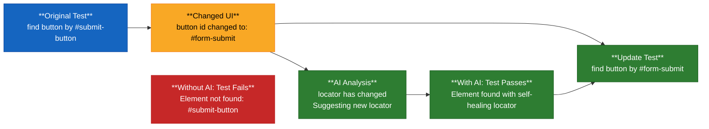

The original test finds a button by `#submit-button`. After the UI changes the id changes to `#form-submit`, the run would have failed without AI. With self-healing mechanism, the tool detects the locator change, suggests the new selector, updates the test, before the execution, allowing the run to pass.

Example: On a project, one team cut test maintenance effort by about 40%, with self-healing test, as they could focus on writing new tests instead of constantly updating selectors by hand.

### Schema Validation

Schema validation applies to data analysis for API (e.g., properties from target endpoints) and database (e.g., allowed data types and value ranges for a field). With it, the TAS checks whether a response matches the business specification for structure and format (mandatory elements present, object types), and replace the need to create several assertions for every case. When a test fails, the TAS will return a clear error message (e.g., "Property 'price' is required but missing") facilitating and speeding up diagnosis.

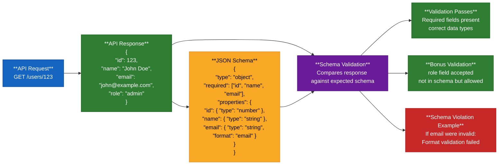

`GET /users/123` returns JSON that is compared to a schema requiring `id` (number), `name` (string), and `email` (email format). The response passes when those fields and types match; an invalid email fails with a clear format error. Extra fields such as `role` can still be accepted when the schema allows them.

Example: initially on a project, each test had a dozen assertions checking fields such as product id, name, and price. Those were replaced by a single schema validation, which made the tests more concise and robust. When the API later added a new field, the tests did not break because the schema allowed additional fields.

### Conclusion

1. Treat test-run data as an input for continuous improvement, not only as a pass/fail record.
2. Use histograms to spot trends and fragile cases worth refactoring.
3. Seize AI/ML features when available into modern tools (self-healing, script suggestions, visual checks, test prioritization) to cut maintenance, focus on higher-value work, and identify pattern.
4. Prefer schema validation for API and database checks for more concise and robust test cases.

## TAE-8.1.2 (K4) : Analyze the Technical Aspects of a Deployed Test Automation Solution and Provide Recommendations for Improvement

Besides ongoing maintenance that keeps the TAS in sync with the SUT, many technical improvements can raise efficiency, usability, capability, and test support. The decision of what to improve depends on which changes add the most value to the project. Typical focus areas include scripting, test execution, verification, TAA, TAF, setup and teardown, documentation, TAS features, and TAF updates and upgrades.

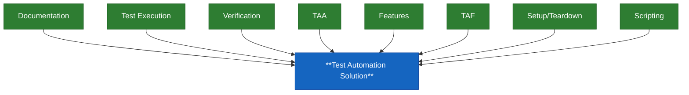

These areas surround the TAS. They are interconnected, so improving one often helps the others. Improvement still needs deliberate analysis and planning.

### Scripting

Improving scripting means working on two fronts at once: the **scripting technique** (how tests are written) and the **implementation** (how steps, waits, and failures are handled). The goal is a more maintainable, reliable, and efficient suite, not the most sophisticated framework possible.

#### Scripting techniques: start simple, level up where it pays

Scripting techniques span from **LS** (Linear Scripting) to **MBT** (Model-Based Testing). They are complementary: each technique adds an abstraction layer rather than replacing everything below.

1. **LS** (Linear Scripting) - sequential scripts, executed step by step, often with hardcoded values and code duplication
2. **DDT** (Data-Driven Testing) - same logic; hardcoded values are replaced by variables fed from data sets (e.g. CSV, Excel)
3. **KDT** (Keyword-Driven Testing) - business-readable keyword layer over the existing code
4. **MBT** (Model-Based Testing) - behaviour modelled; tests generated from the model

How to progress:

- Start simple (often LS), then raise the abstraction level by integrating the next technique as needs grow.
- Each step improves maintainability, and also adds setup and complexity.
- Prefer upgrading new tests, and existing ones only if high maintenance cost.
- A TAS often keeps a mix of approaches rather than rewriting everything at once.


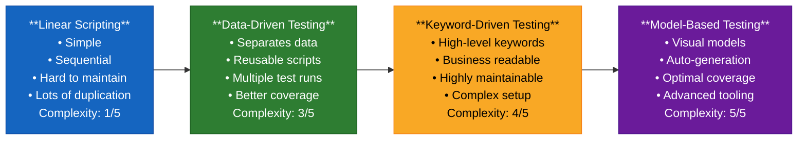

LS is where most people start, because it is easier to adopt; DDT externalises data; KDT abstracts actions as business-readable keywords; MBT abstracts behaviour as a model that generates tests. Raise abstraction step by step, where value justifies the extra complexity.

#### Implementation improvements

Choosing a scripting technique is not enough: how scripts are implemented also matters. Three levers apply at any technique level (LS to MBT):

1. Reduce script overlap
2. Improve wait mechanisms
3. Add failure recovery

**Script overlap**: identical or near-identical action sequences copied across scripts. Extract them into reusable library functions. If steps are similar but not identical, parameterize the differences (typical of keyword-driven design).

Example: 15 scripts each copied the same login. Extracting `loginAsUser(username, password)` left one place to update when login changed.

```javascript
// Before refactor
function testAddProductToCart() {
  // Login steps
  driver.get("https://shop.com/login");
  driver.findElement(By.id("username")).sendKeys("testuser");
  driver.findElement(By.id("password")).sendKeys("password123");
  driver.findElement(By.id("loginBtn")).click();

  // Actual test logic
  driver.get("https://shop.com/products");
  driver.findElement(By.id("product-1")).click();
  driver.findElement(By.id("addToCart")).click();
}

function testUpdateUserProfile() {
  // Same login steps here
  driver.get("https://shop.com/login");
  driver.findElement(By.id("username")).sendKeys("testuser");
  driver.findElement(By.id("password")).sendKeys("password123");
  driver.findElement(By.id("loginBtn")).click();

  // Actual test logic
  driver.get("https://shop.com/profile");
  driver.findElement(By.id("firstName")).sendKeys("John");
}

// After refactor
function loginAsUser(username, password) {
  driver.get("https://shop.com/login");
  driver.findElement(By.id("username")).sendKeys(username);
  driver.findElement(By.id("password")).sendKeys(password);
  driver.findElement(By.id("loginBtn")).click();
  wait.until(ExpectedConditions.presenceOfElementLocated(By.id("welcomeMessage")));
}

function testAddProductToCart() {
  loginAsUser("testuser", "password123"); // Single line!

  driver.get("https://shop.com/products");
  driver.findElement(By.id("product-1")).click();
  driver.findElement(By.id("addToCart")).click();
}

function testUpdateUserProfile() {
  loginAsUser("testuser", "password123"); // Single line!

  driver.get("https://shop.com/profile");
  driver.findElement(By.id("firstName")).sendKeys("John");
}
```

**Wait mechanisms**: how the script waits until the SUT is ready before the next step. Prefer the mechanism that fits the context; always set a timeout. Three approaches:

- Hard-coded waits (fixed ms): simple, often flake when response times vary
- Dynamic waits (polling): wait until a condition is met, only as long as needed
- Event subscription: react to a SUT event; most reliable when language and SUT support it

| Approach | Hard-coded Waits | Dynamic Waits (Polling) | Event Subscription |
|---|---|---|---|
| **Example** | `Thread.sleep(5000);`<br/>// Wait 5 seconds | `wait.until(`<br/>`ExpectedConditions.`<br/>`elementToBeClickable(`<br/>`By.id("submitBtn")));`<br/>// Wait until clickable | `system.subscribe(`<br/>`"onLoginComplete",`<br/>`callback);`<br/>// React to events |
| **Pros** | • Simple to implement<br/>• Guaranteed wait time | • Only waits as needed<br/>• More reliable<br/>• Faster execution<br/>• Built-in timeout | • Most reliable<br/>• No polling overhead<br/>• Immediate response<br/>• Precise timing |
| **Cons** | • Wastes time<br/>• Unreliable<br/>• May still fail if process takes longer than expected | • More complex setup<br/>• CPU overhead from polling | • Requires SUT support<br/>• Complex implementation<br/>• Language dependent |
| **Reliability** | 1/5 (Poor) | 4/5 (Good) | 5/5 (Excellent) |

Example: a suite full of `Thread.sleep(5000)` took 2 hours and still flaked under peak load. After moving to dynamic waits, runtime fell to 45 minutes, with tests waiting only as long as needed.

**Failure recovery**: process that lets the suite continue after a test or SUT failure instead of stopping everything. When the SUT fails, recover if feasible (e.g. a restart):

1. Log the failure
2. Clean up the environment
3. Reset the SUT
4. Continue with the next test

Example: test #15 hits an unexpected popup and crashes the browser; without recovery, tests 16-100 never run.

```javascript
class TestExecutor {
  async executeTest(testCase) {
    let testResult = { name: testCase.name, status: 'NOT_RUN', error: null };

    try {
      await this.setupTestEnvironment();
      testResult.status = 'RUNNING';
      await testCase.execute();
      testResult.status = 'PASSED';
    } catch (error) {
      testResult.status = 'FAILED';
      testResult.error = error.message;

      // Capture evidence for debugging
      const screenshot = await this.takeScreenshot();
      await this.saveBrowserLogs(testCase.name);
    } finally {
      // CRITICAL: Always clean up, regardless of test outcome
      try {
        await this.performCleanup();
      } catch (cleanupError) {
        console.log('Cleanup failed:', cleanupError);
        // Even if cleanup fails, continue with the next test
      }

      await this.logTestResult(testResult);
      return testResult;
    }
  }
}
```

Raise the scripting technique where it pays. Apply the three implementation levers step by step. Do not rebuild everything at once.

### Test Execution

When a regression suite takes too long, it may not finish overnight, feedback arrives late, and CI/CD stays slow. Improvements focus on four levers: parallelization, reducing duplication, optimizing batch jobs / time windows, and CI/CD scheduling.

**Parallelization.** Independent tests run at the same time on several machines or environments. Wall-clock time drops while coverage stays the same. Cases and suites must be independent (no shared state, no order dependency). The trade-off is higher resource use, and more complex test-data and database management.

Example:
Regression suite reduced from 8 hours to 3 hours with parallel execution -- same coverage

```mermaid
gantt
    title Sequential Execution
    dateFormat HH:mm
    axisFormat %H:%M
    section Thread 1
    Login Test       :l1, 00:00, 24m
    Cart Tests       :c1, after l1, 24m
    Payment Tests    :p1, after c1, 24m
    Profile Test     :pr1, after p1, 24m
    Admin Tests      :a1, after pr1, 24m
```

- Single machine/browser
- Total time: 120 minutes
- Resource utilization: Low

```mermaid
gantt
    title Parallel Execution
    dateFormat HH:mm
    axisFormat %H:%M
    section Thread 1
    Login Test       :00:00, 30m
    section Thread 2
    Cart Tests       :00:00, 30m
    section Thread 3
    Payment Tests    :00:00, 30m
    section Thread 4
    Profile Test     :00:00, 30m
    section Thread 5
    Admin Tests      :00:00, 30m
```

- 5 machines/browsers
- Total time: 30 minutes
- Resource utilization: High

In this example, runtime falls from 120 to 30 minutes (75% faster) with the same coverage, using five machines instead of one.

**Reducing duplication.** Tests that cover the same behaviour are removed so the suite is shorter without losing useful coverage.

**Optimizing batch jobs / time windows.** When the target system is unique or too costly for parallel runs, the suite is split into parts executed on different nights or defined time slots.

**CI/CD scheduling.** Batch jobs run in parallel when possible. Pipelines are scheduled (e.g. every morning) to reduce manual triggering and speed up feedback.

When the suite is too long and only one expensive target exists, the practical path is to split runs across nights and remove duplicates, not to drop useful tests or rewrite everything as KDT (Keyword Driven Testing) for speed alone.

### Verification

Verification is how automated tests check that the SUT behaved correctly (asserts, UI/API checks, expected results). A common weakness is copying the same verification logic into many tests: when the SUT changes, every copy must be updated.

Before inventing new helpers, adopt a standard set of reusable verification methods for all automated tests. When checks are similar but not identical, parameterize so one function covers several object types or expected values. A change in one place then updates all callers, and tests stay readable because the method name states the intent.

**Example**:

- 20 tests verifying a product was added to the cart.
- Solution: create a standard, reusable verification method.

```javascript
// BEFORE: Duplicated verification logic across tests
function testAddSingleProduct() {
  // ... test steps to add product

  // Duplicated verification
  const cartIcon = driver.findElement(By.id("cart-icon"));
  const cartCount = cartIcon.getText();
  assert(cartCount === "1", "Cart should show 1 item");

  const cartPage = driver.findElement(By.id("cart-link"));
  cartPage.click();
  const productName = driver.findElement(By.className("cart-item-name")).getText();
  assert(productName === "Expected Product", "Product name should match");
}

function testAddMultipleProducts() {
  // ... test steps to add products

  // Same verification logic duplicated again!
  const cartIcon = driver.findElement(By.id("cart-icon"));
  const cartCount = cartIcon.getText();
  assert(cartCount === "3", "Cart should show 3 items");
  // ... more duplicated verification code
}

// AFTER: Standardized verification methods
class CartVerification {
  static async verifyCartCount(expectedCount) {
    const cartIcon = await driver.findElement(By.id("cart-icon"));
    const cartCount = await cartIcon.getText();
    assert.equal(
      parseInt(cartCount),
      expectedCount,
      `Cart should show ${expectedCount} items, but showed ${cartCount}`
    );
  }

  static async verifyProductInCart(productDetails) {
    const cartLink = await driver.findElement(By.id("cart-link"));
    await cartLink.click();

    const productRows = await driver.findElements(By.className("cart-item"));
    let productFound = false;

    for (let row of productRows) {
      const name = await row.findElement(By.className("cart-item-name")).getText();
      const price = await row.findElement(By.className("cart-item-price")).getText();

      if (name === productDetails.name && price === productDetails.price) {
        productFound = true;
        break;
      }
    }

    assert.isTrue(
      productFound,
      `Product ${productDetails.name} not found in cart with expected details`
    );
  }
}

// IMPROVED TESTS: Using standardized verification
async function testAddSingleProduct() {
  // ... test steps to add product

  await CartVerification.verifyCartCount(1);
  await CartVerification.verifyProductInCart({
    name: "Wireless Headphones",
    price: "$29.99",
  });
}
```

### TAA

The **TAA** (Test Automation Architecture) can also support continuous improvement of automation; mainly by improving **SUT testability**. Doing so may impact the SUT architecture, and/or TAA of the TAS. If the gain can be major, the change and investment are often significant. These choices should therefore be made early in the project / phase of SDLC than later, as they are often costly. For example, exposing test APIs for the SUT will require to refactor the TAS to use them.

### TAF

Improving the **TAF** typically means updating its **core library** and its **tools**. Tool changes may upgrade existing test tools or introduce new ones. That can unlock new capabilities for test cases and/or fix defects, but it also risks breaking existing tests across teams. The change must therefore be managed carefully, then validated before full rollout.

#### Change management and migration strategy

A major core-library version cannot be pushed into the shared dependency list without risking breakage across teams' suites. First run a **pilot** and an **impact analysis**: that is the phase where the new library and tools are checked (breaking changes, affected suites, migration effort). Then an **adoption plan** is defined, with two possible approaches:

- All teams adopt the new core-library version at the same time by updating the dependency in 
the **core-library layer** build file
- Each team decides individually when to upgrade by updating its **business-logic layer**

Only once every team has adopted the new version can the shared core-layer dependencies be updated.

**TAF Core Library Update Strategy**

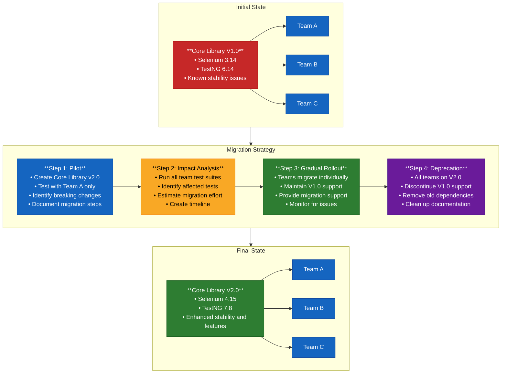

Once all teams are on the new core library (Final State), the upgrade typically brings improved stability, better performance, and a unified toolchain across teams.

#### Validation of the change

Validation happens mainly during the **pilot** and **impact analysis**. Use representative **sample tests** across relevant **SUTs**, **test types**, and **test environments** before full adoption and deployment. A new or upgraded tool may be buggy or may not work as expected, so its capabilities must be confirmed first; otherwise automated results are not reliable or relevant.

### Setup and Teardown

For setup and teardown, improvements mainly focus on raising **maintainability** and **reliability**, by consolidating repeated setup/teardown actions into dedicated methods, so that a later update only needs one place to change.

- **Example**: If 50 tests need a logged-in user, use a setup method instead of duplicating login code.
- Advanced tip: Use web service calls for setup instead of UI interactions
  - Bad approach:
    1. Use UI to register a new user
    2. Use UI to add a credit card to the profile
    3. Use UI to browse products and add one to cart
    4. Now finally test the checkout process
  - Proper approach:
    1. Call user service API to create user account
    2. Call payment service API to add credit card
    3. Call cart service API to add product to cart
    4. Now test the checkout process via UI

### Documentation

Documentation covers every form of TAS-related writing: automation-code guidance (what the code does and how to use it), TAS user documentation, and the test reports and logs the TAS produces. It supports onboarding of new team members and acts as a memory aid for the team when revisiting or extending the automation.

Its improvement starts by checking that the important, relevant information is actually documented; any gap is a candidate improvement.

A solid documentation set typically includes:

- Architecture Overview: how the different components fit together
- Setup Instructions: how to get the automation running on a new machine
- Coding Standards: naming conventions, code organization, etc.
- Test Data Management: how test data is created, managed, and cleaned up
- Troubleshooting Guide: common issues and how to resolve them
- Adding New Tests: step-by-step guide for team members

### TAS Features

For the TAS, improvements usually mean adding **capabilities and functions** such as richer **test reporting**, **test logging**, and **integration with other systems**.

It is essential to stay strategic: prioritize high value-added features, and avoid adding functions that will not be used. Stacking unused capabilities increases complexity and lowers **reliability** and **maintainability**.

Some high-value examples:

- **Enhanced test reporting**: rich reports with screenshots, execution times, error details, and trend analysis to reduce debugging time
- **Integration with other tools**: connect the TAS to CI/CD, test management, defect tracking, and communication platforms (e.g. automatic detailed tickets on failure)
- **Test data management**: tools to create, manage, and clean test data (e.g. API wrappers, database utilities)

### Conclusion

1. Analyse the deployed TAS by area (scripting, execution, verification, architecture, framework, lifecycle support).
2. Prefer reusable scripts, robust waits, and failure recovery over brittle linear design.
3. Shorten execution with parallelisation, de-duplication, and scheduled CI batches.
4. Standardise verification, plan TAA/testability early, and migrate TAF libraries via pilot and impact analysis.
5. Keep setup/teardown, documentation, features, and upgrades purposeful so value rises without unnecessary complexity.

## TAE-8.1.3 (K3) : Restructure the Automated Testware to Align with SUT Updates

Any SUT change (large or small) can impact the TAS, especially its **reliability** and **performance**. The TAS must therefore evolve with the SUT. These updates should be deliberate: analyse the situation first, then repair and improve. Do not rush into a big rewrite.

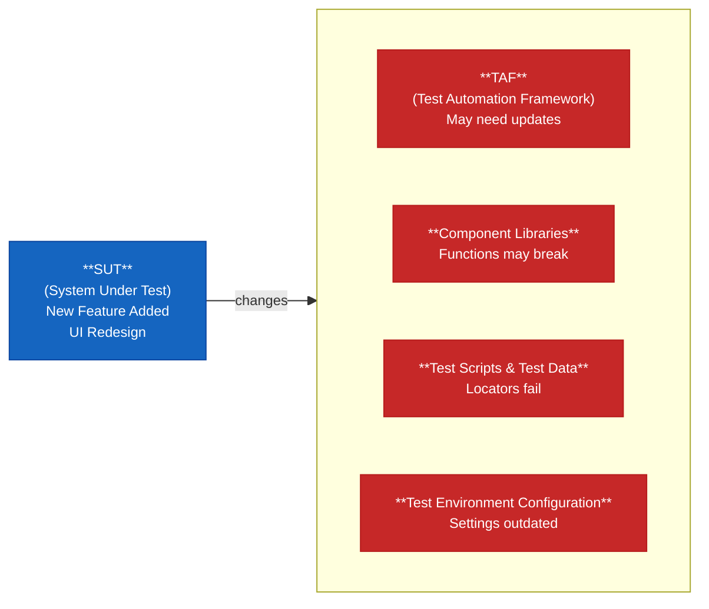

Left untreated, that impact shows up usually as unexpected failures, more false positives, rising maintenance, coverage gaps, and degraded performance.

Repair and improve the TAS, but do it step by step. A progressive approach avoids drowning the team in one huge restructuring effort.

### Incremental approach

Use a minimum-viable mindset: small updates, limited checks, then full rollout only when side effects are absent.

```mermaid
flowchart LR
    IC["**1. Identify Changes**<br/>• Analyze SUT updates<br/>• List affected areas"]
    PU["**2. Prioritize Updates**<br/>• Critical tests first<br/>• High-value features"]
    MS["**3. Make Small Changes**<br/>• Update one module<br/>• Minimal code changes"]
    TL["**4. Test Limited Scope**<br/>• Run affected tests<br/>• Verify no side effects"]
    MI["**5. Measure Impact**<br/>• Check performance<br/>• Monitor stability"]
    FR["**6. Full Regression**<br/>• Run complete suite<br/>• Verify all tests pass"]

    IC --> PU --> MS --> TL --> MI --> FR

    style IC fill:#1565c0,color:#fff,stroke:#0d47a1
    style PU fill:#2e7d32,color:#fff,stroke:#1b5e20
    style MS fill:#f9a825,color:#000,stroke:#f57f17
    style TL fill:#6a1b9a,color:#fff,stroke:#4a148c
    style MI fill:#00838f,color:#fff,stroke:#006064
    style FR fill:#c62828,color:#fff,stroke:#b71c1c
```

If failures appear during full regression, root-cause analysis (reports, logs, test data) must confirm they do not come from the restructuring itself.

**Real Example**: Login Page Redesign

- Week 1: Update login button locator (from CSS to ID selector)
- Week 2: Modify username/password field interactions
- Week 3: Update error message validation
- Week 4: Refactor entire login test module with new patterns
- Result: Zero test failures, minimal disruption to CI/CD pipeline.

### Identifying changes in test environment components

First evaluate what must change so automated tests stay effective. Typical targets:

- Testware
- Custom function libraries
- Operating system

Each of these affects TAS performance.

Example: upgrading from Java 8 to Java 11 caused compatibility issues.

### Improve core function libraries

As a TAS matures, better ways to perform tasks appear (for example optimised waits, more reliable handling of dynamic content, or new OS libraries). These techniques should be integrated into the **core function libraries**, so the current project and future ones benefit.

One concrete way to raise that efficiency is to consolidate overlapping helpers.

### Consolidate functions on the same control type

Much UI automation queries controls for state (visible/enabled, size, data) before acting. Several specialised or general functions may do similar work on the **same control type**. Merge them into fewer, more flexible functions: same outcomes, fewer maintenance points.

```javascript
// === Before: Multiple Specific Functions === 
clickButtonById(String id)
// Only works with ID attribute

clickButtonByClass(String className)
// Only works with class attribute

clickButtonByXpath(String xpath)
// Only works with XPath

clickLinkById(String id)
// Separate function for links

clickLinkByText(String text)
// Another link-specific function

// === After: Consolidated Generic Function === 
clickElement(By locator, ElementType type)
// Works with any locator strategy:
// - By.id("elementId")
// - By.className("class")
// - By.xpath("//xpath")
```

This leaves one function to maintain, with flexible locators and less duplication: about 70% fewer lines of code (150 → 45) and 80% fewer maintenance points (5 functions → 1).

### Refactor the TAA to Accommodate Changes in the SUT

As the SUT evolves, the TAA must evolve so capacity stays aligned. New capabilities should not be bolted on ad hoc; they should be analysed and placed in the architecture. Then, when new SUT features need more scripts, compatible components are already in place.

Example: A team started with UI tests using Selenium WebDriver
When a mobile app and API layer were added, they refactored the architecture to support multiple test types.

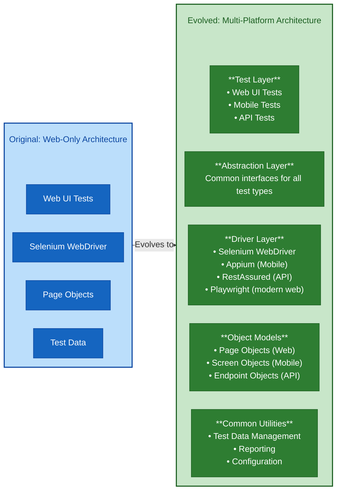

**Example**

An e-commerce company migrated from a monolith to microservices. Automation was tightly coupled to the old system: tests hit the database directly and assumed internal structures that no longer held. Restructuring took about six months, we:

1. Identify all tests that accessed the database directly
2. Create an API layer for test data setup and verification
3. Gradually migrate those tests from database access to API calls
4. Restructure page objects to support both old and new UI during the transition
5. Add feature toggles in tests for features still being migrated

The suite became more maintainable and faster, and found more bugs, because tests used the same interfaces as real users.

### Naming Conventions and Standardization

A naming convention **should** already be defined for automation code and function libraries. Whether you create new scripts or restructure existing ones, apply that same convention so the suite stays consistent.

If no convention exists yet, establish one during restructuring and align the code to it. If one already exists, keep new and updated names aligned with it. Otherwise readability and maintainability drop, even when behaviour is correct.

Example: if the team standard is camelCase (e.g. `clickLoginButton()`), keep using it; mixing styles makes the code harder to read and maintain.

### Evaluating and Optimizing Existing Test Scripts

Any addition or modification to the TAS should include an analysis of existing scripts to evaluate their usage and ongoing value. That gives a clear picture of the script base before new work lands, and it supports lower complexity and higher maintainability.

Typical outcomes of that analysis:

- Split oversized or long-running scripts into smaller ones
- Decommission unused or rarely run scripts

The following matrix (business value × maintenance effort) can guide what to eliminate, refactor, monitor, or keep and enhance.

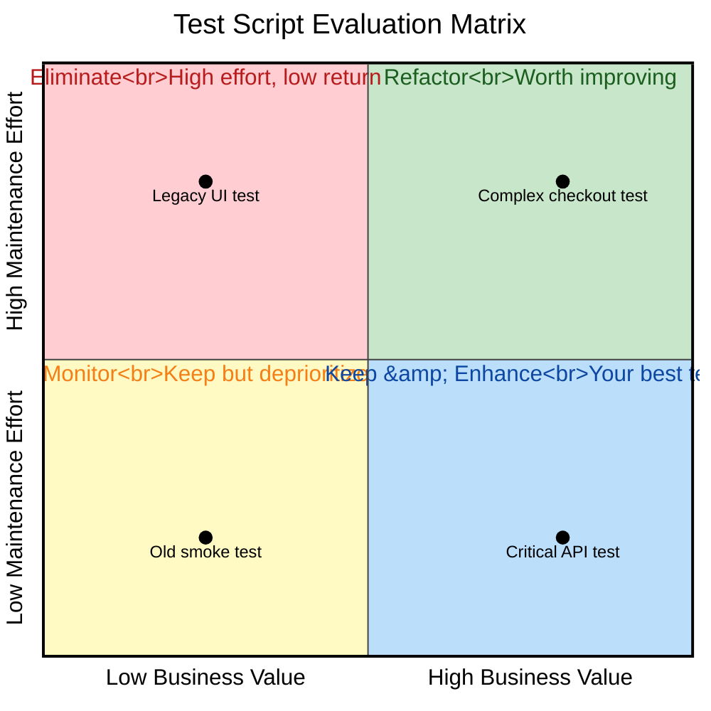

### Conclusion

1. Treat SUT updates as a trigger to restructure testware, not only to patch failing locators.
2. Change incrementally, measure limited scope, then regress fully and analyse any new failures.
3. Improve core libraries and consolidate overlapping control helpers to reduce maintenance.
4. Refactor the TAA thoughtfully, keep naming standards, and retire or revise scripts that no longer earn their keep.

## TAE-8.1.4 (K2) : Summarize Opportunities for Use of Test Automation Tools

Beyond running test cases, the same automation tools can be repurposed to support other useful activities, creating additional value. Three typical opportunities are:

- environment setup and control, 
- data aging, 
- and screenshot or video generation.

### Environment Setup and Control

Test scripts used for data creation can also prepare a fresh, **controlled** environment (e.g. registering users with different profiles via a web-service endpoint, loading catalogues, configuring shipping or tax rules, creating sample orders). The same automation can set up test infrastructure and clean up after runs, so the right users and data are present every time. Logs and other testware can be removed automatically, which keeps environments usable and saves setup time.

**Example**
On a e-commerce plateform, every fresh test run needed the same heavy setup: 50 user accounts across roles (customers, vendors, administrators), product catalogues with specific pricing, shipping zones and tax rules, plus sample orders in different states.

<table>
<tr>
<th>Manual (about 2–3 hours)</th>
<th>Automated (about 15 minutes)</th>
</tr>
<tr>
<td>

1. Create 50 user accounts manually
2. Configure products one by one
3. Set up shipping zones manually
4. Create sample orders individually

</td>
<td>

```javascript
automation_script.run() {
  createUsers(50);
  setupProducts(catalog);
  configureShipping();
  generateOrders();
  cleanupOldData();
}
```

</td>
</tr>
</table>

The manual path is slow and laborious, and hard to repeat the same way. The automated path is much faster (~87% less setup time), consistent, and less error-prone, as long as the script stays maintainable and includes cleanup.

### Data Aging

Automation can manipulate test data in the environment so time-based behaviour is testable without waiting. In databases, date fields can be checked and adjusted (for example kept consistent year to year, or aged forward). Expiry, renewals, interest, grace periods, or leave accrual then become immediate, consistent, and repeatable.

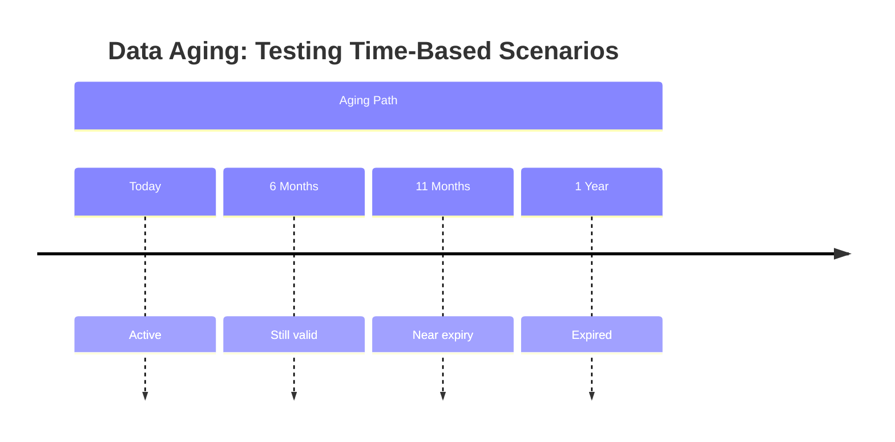

Without automated data aging, teams face two poor options:

- **Wait** for real time to pass → testing is blocked for the duration
- **Edit dates by hand** in the database → tedious, error-prone, and often banned in highly regulated settings (e.g. banking or finance)

Automated aging avoids both problems and runs the same scenarios in minutes.

```javascript
// Example: Age subscription data
subscription.startDate = "2024-01-01";
automation.ageData(subscription, 365); // Age by 365 days
// Now test expiry scenarios
```

The same idea applies across many domains, for example:

- **Finance:** interest, loan maturity, investment returns
- **Healthcare:** prescription renewals, appointment reminders, vaccination schedules
- **E-learning:** course expiry, certification renewals, progress over time
- **HR:** anniversaries, performance-review cycles, leave accrual

### Screenshot and Video Generation

UI automation tools already capture screenshots and videos, usually to record failures or evidence during a test run. The same capability can be **repurposed** for a different goal: producing documentation, training material, or marketing assets from real application usage. Capture and store under defined conditions, then re-run the scripts when the UI changes to refresh the content instead of rebuilding it by hand.

Without automation, documentation work usually means:

1. Navigate the application manually
2. Take a screenshot
3. Edit it (arrows, highlights, etc.)
4. Repeat for every screen or feature

That process is slow, and every UI change forces a full redo. With automation, a script walks the key journeys, captures at each step, can run per language, and organises the outputs by feature.

**Example**

A software company needed documentation in five languages. After each release, the docs team updated screenshots by hand: navigate each feature, capture each step, repeat for every language, then organise the files. That work took weeks. With capture scripts doing the same steps unattended, it finished in a few hours.

Other uses include:

- Release-note screenshots of new features
- A/B UI comparison
- Failure videos for bug reproduction
- Compliance evidence of workflows
- UI snapshots under load

### Practices and Pitfalls

These non-testing scripts deserve the same care as test automation. Useful practices:

1. **Start small:** pick one area (e.g. environment setup), make it solid, then widen the scope
2. **Keep scripts maintainable:** clear structure, comments, and coding standards
3. **Version-control** setup, data-aging, and documentation scripts
4. **Document** how to run and change them so others can take over
5. **Protect secrets:** use secure storage; never hardcode passwords or API keys

Common pitfalls to avoid:

1. **Over-complicating:** if the script is harder to maintain than the manual work, simplify it
2. **Ignoring errors:** handle unexpected states so a partial run does not leave a broken environment
3. **Ignoring performance:** a three-hour setup script barely saves time
4. **Skipping cleanup:** always tear down leftover data and artefacts to avoid buildup

### Conclusion

1. Reuse automation for environment preparation and cleanup to gain speed and consistency.
2. Use data aging to exercise time-based behaviour without real waiting.
3. Generate screenshots and videos for documentation, training, or marketing, and refresh them by re-running scripts when the UI changes.
4. Treat non-testing scripts like test assets: start small, keep them maintainable, and avoid complexity, silent failures, slow runs, and missing cleanup.
